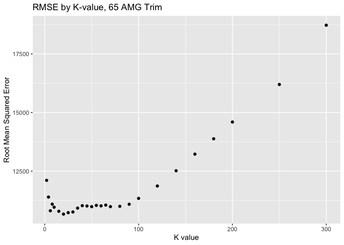

## Exercise 1: Data visualization - flights at ABIA

*Your task is to create a figure, or set of related figures, that tell
an interesting story about flights into and out of Austin. You should
annotate your figure(s), of course, but strive to make them as easy to
understand as possible at a quick glance.*

    ## 
    ## Call:
    ## lm(formula = LateAircraftDelay ~ CRSDepTime, data = ABIA)
    ## 
    ## Residuals:
    ##    Min     1Q Median     3Q    Max 
    ## -40.20 -20.70 -10.47   5.44 424.51 
    ## 
    ## Coefficients:
    ##               Estimate Std. Error t value Pr(>|t|)    
    ## (Intercept) -5.9525262  0.9883027  -6.023 1.74e-09 ***
    ## CRSDepTime   0.0196710  0.0006458  30.462  < 2e-16 ***
    ## ---
    ## Signif. codes:  0 '***' 0.001 '**' 0.01 '*' 0.05 '.' 0.1 ' ' 1
    ## 
    ## Residual standard error: 38.6 on 19745 degrees of freedom
    ##   (79513 observations deleted due to missingness)
    ## Multiple R-squared:  0.04489,    Adjusted R-squared:  0.04484 
    ## F-statistic: 927.9 on 1 and 19745 DF,  p-value: < 2.2e-16

    ## `geom_smooth()` using formula = 'y ~ x'

    ## Warning: Removed 79513 rows containing non-finite values (`stat_smooth()`).

    ## Warning: Computation failed in `stat_smooth()`
    ## Caused by error in `get()`:
    ## ! object 'lm1' of mode 'function' was not found

    ## Warning: Removed 79513 rows containing missing values (`geom_point()`).

*Notes go here*

 

## Exercise 2: Wrangling the Olympics

### A) What is the 95th percentile of heights for female competitors across all Athletics events (i.e., track and field)?

 

### B) Which single women’s event had the greatest variability in competitor’s heights across the entire history of the Olympics, as measured by the standard deviation?

 

### C) How has the average age of Olympic swimmers changed over time? Does the trend look different for male swimmers relative to female swimmers? Create a data frame that can allow you to visualize these trends over time, then plot the data with a line graph with separate lines for male and female competitors. Give the plot an informative caption answering the two questions just posed.

 

## Exercise 3

*Your goal is to use K-nearest neighbors to build a predictive model for
price, given mileage, separately for each of two trim levels: 350 and 65
AMG…That is, you’ll be treating the 350’s and the 65 AMG’s as two
separate data sets.*

*For each of these two trim levels:*

*1. Split the data into a training and a testing set.* *2. Run
K-nearest-neighbors, for many different values of K, starting at K=2 and
going as high as you need to. For each value of K, fit the model to the
training set and make predictions on your test set.* *3. Calculate the
out-of-sample root mean-squared error (RMSE) for each value of K.*

*For each trim, make a plot of RMSE versus K, so that we can see where
it bottoms out. Then for the optimal value of K, show a plot of the
fitted model, i.e. predictions vs. x. (Again, separately for each of the
two trim levels.)*

*Which trim yields a larger optimal value of K? Why do you think this
is?*

 

    ## [1] 8519.621

    ## [1] 19259.85

 

RMSE is minimized for the 350 trim at K = 35, with an RMSE value of
9,290.

For the 65 AMG trim, RMSE is minimized at K = 20, with a value of
20,941.

The 350 trim yields a larger optimal value of K, 35 vs. 20. This is
likely due to a larger sample size. The dataset contains 417 vehicles
with the 350 trim, but only 292 vehicles with the 65 AMG trim. With more
data points nearby, we can afford a higher K-value, since the bias is
offset by the higher concentration of data points in each
“neighborhood.”
