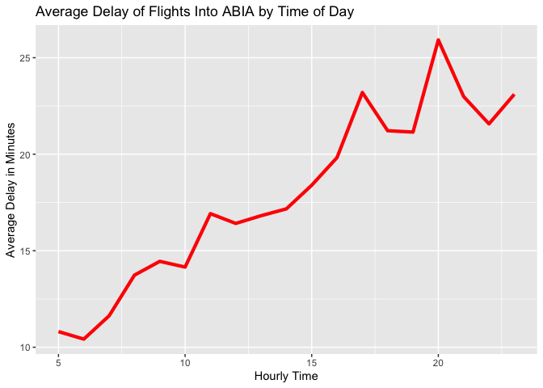
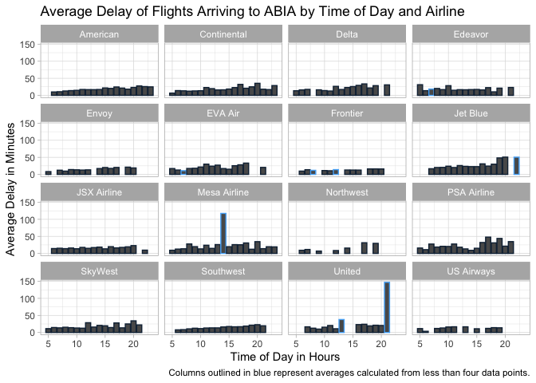
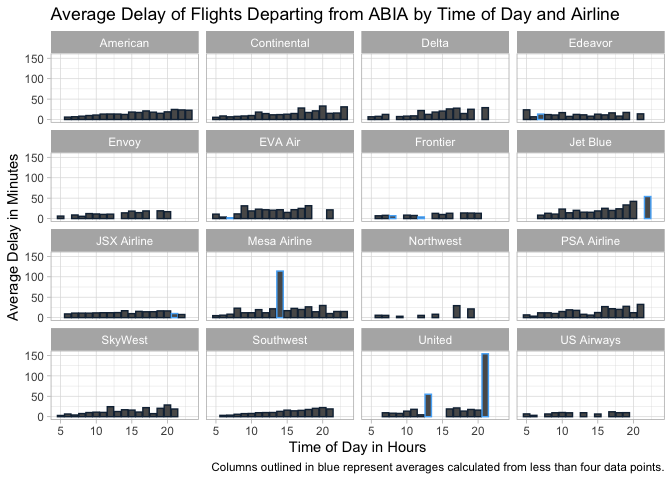
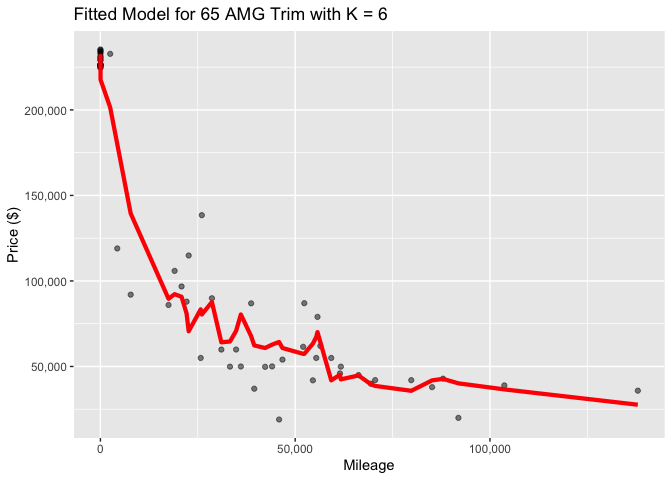

## Exercise 1: Data visualization - flights at ABIA

*Your task is to create a figure, or set of related figures, that tell
an interesting story about flights into and out of Austin. You should
annotate your figure(s), of course, but strive to make them as easy to
understand as possible at a quick glance.*

    ## # A tibble: 6 × 2
    ##   hourly_time AvgArrDel
    ##         <dbl>     <dbl>
    ## 1           6      10.4
    ## 2           5      10.8
    ## 3           7      11.6
    ## 4           8      13.7
    ## 5          10      14.2
    ## 6           9      14.5

    ## # A tibble: 6 × 2
    ##   hourly_time AvgDepDel
    ##         <dbl>     <dbl>
    ## 1           6      5.50
    ## 2           7      6.44
    ## 3           5      6.95
    ## 4           8      8.55
    ## 5           9      9.21
    ## 6          10     10.7

 

Here we show the average delays for both arriving flights into ABIA and
departing flights from ABIA, plotted by hour of the day. It is best to
both arrive at and depart from ABIA in the 6:00 AM hour for the smallest
delays; in general, mornings see small delays for both incoming and
departing flights relative to evenings. The 8:00 PM hour sees both the
largest departure delays from ABIA and arrival delays into ABIA. In
general, arrival delays are higher than departure delays across hours.

 

    ## `summarise()` has grouped output by 'UniqueCarrier'. You can override using the
    ## `.groups` argument.

    ## `summarise()` has grouped output by 'UniqueCarrier'. You can override using the
    ## `.groups` argument.

Here we plot average arrival and departure delays by time of day for
each airline flying into and out of ABIA. We noticed some times on some
airlines featured outlying average delays, so we isolated low
observation counts (&lt;4 data points) for each airline at each hour.
The outlying delay times all come from such low observation count
flights. This implies possible poor accuracy in calculating delays from
those airlines at those times.

 

## Exercise 2: Wrangling the Olympics

### A) What is the 95th percentile of heights for female competitors across all Athletics events (i.e., track and field)?

    ## # A tibble: 132 × 2
    ##    event                                       quant95
    ##    <chr>                                         <dbl>
    ##  1 Athletics Women's 1,500 metres                 172 
    ##  2 Athletics Women's 10 kilometres Walk           170 
    ##  3 Athletics Women's 10,000 metres                168.
    ##  4 Athletics Women's 100 metres                   180.
    ##  5 Athletics Women's 100 metres Hurdles           176 
    ##  6 Athletics Women's 20 kilometres Walk           173 
    ##  7 Athletics Women's 200 metres                   180 
    ##  8 Athletics Women's 3,000 metres                 170 
    ##  9 Athletics Women's 3,000 metres Steeplechase    177.
    ## 10 Athletics Women's 4 x 100 metres Relay         176 
    ## # … with 122 more rows

    ##   quant95
    ## 1     186

The table provides the 95th quantile of height for female competitors
within each Athletics event. The 95th quantile of height for female
competitors across all Athletics events is 186 cm.

 

### B) Which single women’s event had the greatest variability in competitor’s heights across the entire history of the Olympics, as measured by the standard deviation?

    ## # A tibble: 132 × 2
    ##    event                                          sd
    ##    <chr>                                       <dbl>
    ##  1 Athletics Women's 1,500 metres               5.03
    ##  2 Athletics Women's 10 kilometres Walk         4.31
    ##  3 Athletics Women's 10,000 metres              5.41
    ##  4 Athletics Women's 100 metres                 6.29
    ##  5 Athletics Women's 100 metres Hurdles         4.68
    ##  6 Athletics Women's 20 kilometres Walk         5.28
    ##  7 Athletics Women's 200 metres                 5.14
    ##  8 Athletics Women's 3,000 metres               5.48
    ##  9 Athletics Women's 3,000 metres Steeplechase  6.06
    ## 10 Athletics Women's 4 x 100 metres Relay       5.57
    ## # … with 122 more rows

Women’s Rowing Coxed Fours was the most variable event, with a standard
deviation of 10.87.

 

### C) How has the average age of Olympic swimmers changed over time? Does the trend look different for male swimmers relative to female swimmers? Create a data frame that can allow you to visualize these trends over time, then plot the data with a line graph with separate lines for male and female competitors. Give the plot an informative caption answering the two questions just posed.

    ## `summarise()` has grouped output by 'sex'. You can override using the `.groups`
    ## argument.

    ## # A tibble: 6 × 3
    ##   sex    year  mean
    ##   <chr> <int> <dbl>
    ## 1 F      1924  18  
    ## 2 F      1952  17  
    ## 3 F      1956  17.7
    ## 4 F      1960  17.3
    ## 5 F      1964  17.5
    ## 6 F      1968  17.5

 

    ## `summarise()` has grouped output by 'sex'. You can override using the `.groups`
    ## argument.

## Exercise 3

*Your goal is to use K-nearest neighbors to build a predictive model for
price, given mileage, separately for each of two trim levels: 350 and 65
AMG…That is, you’ll be treating the 350’s and the 65 AMG’s as two
separate data sets.*

*For each of these two trim levels:*

*1. Split the data into a training and a testing set.* *2. Run
K-nearest-neighbors, for many different values of K, starting at K=2 and
going as high as you need to. For each value of K, fit the model to the
training set and make predictions on your test set.* *3. Calculate the
out-of-sample root mean-squared error (RMSE) for each value of K.*

*For each trim, make a plot of RMSE versus K, so that we can see where
it bottoms out. Then for the optimal value of K, show a plot of the
fitted model, i.e. predictions vs. x. (Again, separately for each of the
two trim levels.)*

*Which trim yields a larger optimal value of K? Why do you think this
is?*

 

    ## [1] 9750.549

    ## [1] 28103.78

 

RMSE is minimized for the 350 trim at K = 15.

For the 65 AMG trim, RMSE is minimized at K = 6.

The 350 trim yields a larger optimal value of K. This is likely due to a
larger sample size. The dataset contains 417 vehicles with the 350 trim,
but only 292 vehicles with the 65 AMG trim. With more data points
nearby, we can afford a higher K-value, since the bias is offset by the
higher concentration of data points in each “neighborhood.”

*NOTE: Different values of K were optimal upon repeatedly running
different train-test splits for both the 350 and 65 AMG trims. We chose
the values of K that most commonly occurred as optimal.*
