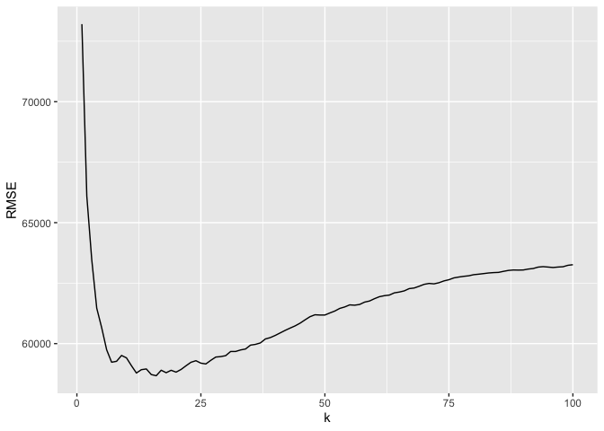

## Exercise 1: Saratoga house prices

*Build the best linear model for price that you can.*

<table>
<caption>RMSE of each model, first pass</caption>
<thead>
<tr class="header">
<th style="text-align: left;">model</th>
<th style="text-align: right;">RMSE</th>
</tr>
</thead>
<tbody>
<tr class="odd">
<td style="text-align: left;">lm1</td>
<td style="text-align: right;">66695.65</td>
</tr>
<tr class="even">
<td style="text-align: left;">lm2</td>
<td style="text-align: right;">58250.12</td>
</tr>
<tr class="odd">
<td style="text-align: left;">lm3</td>
<td style="text-align: right;">56741.83</td>
</tr>
</tbody>
</table>

RMSE of each model, first pass

<table>
<caption>Average RMSE through 100 train/test splits</caption>
<thead>
<tr class="header">
<th style="text-align: left;">model</th>
<th style="text-align: right;">RMSE</th>
</tr>
</thead>
<tbody>
<tr class="odd">
<td style="text-align: left;">lm1</td>
<td style="text-align: right;">66621.65</td>
</tr>
<tr class="even">
<td style="text-align: left;">lm2</td>
<td style="text-align: right;">59183.64</td>
</tr>
<tr class="odd">
<td style="text-align: left;">lm3</td>
<td style="text-align: right;">57975.44</td>
</tr>
</tbody>
</table>

Average RMSE through 100 train/test splits

    ## 
    ## Call:
    ## lm(formula = price ~ newConstruction * landValue + age * pctCollege + 
    ##     age * (landValue + livingArea) * (centralAir) + (livingArea) * 
    ##     (centralAir) + (bedrooms + bathrooms) * (heating) - landValue - 
    ##     age * livingArea - landValue * age * centralAir - heating - 
    ##     age * lotSize, data = saratoga_train)
    ## 
    ## Residuals:
    ##     Min      1Q  Median      3Q     Max 
    ## -240633  -34410   -6080   26259  439092 
    ## 
    ## Coefficients:
    ##                                    Estimate Std. Error t value Pr(>|t|)    
    ## (Intercept)                       1.965e+04  1.637e+04   1.200 0.230219    
    ## newConstructionNo                 1.346e+04  1.242e+04   1.084 0.278754    
    ## pctCollege                       -5.279e+02  1.835e+02  -2.877 0.004071 ** 
    ## bedrooms                         -7.761e+03  3.015e+03  -2.574 0.010157 *  
    ## bathrooms                         2.756e+04  4.301e+03   6.408 2.03e-10 ***
    ## newConstructionYes:landValue      3.651e-01  1.228e-01   2.972 0.003006 ** 
    ## newConstructionNo:landValue       1.044e+00  5.602e-02  18.632  < 2e-16 ***
    ## age:pctCollege                    8.570e+00  2.623e+00   3.267 0.001114 ** 
    ## livingArea:centralAirYes          9.274e+01  5.243e+00  17.688  < 2e-16 ***
    ## livingArea:centralAirNo           8.341e+01  5.297e+00  15.748  < 2e-16 ***
    ## bedrooms:heatinghot water/steam   2.741e+03  4.140e+03   0.662 0.508011    
    ## bedrooms:heatingelectric          1.614e+04  5.205e+03   3.100 0.001973 ** 
    ## bathrooms:heatinghot water/steam -1.114e+04  7.143e+03  -1.559 0.119222    
    ## bathrooms:heatingelectric        -3.038e+04  8.634e+03  -3.519 0.000448 ***
    ## age:livingArea:centralAirYes     -5.405e-01  1.185e-01  -4.563 5.50e-06 ***
    ## age:livingArea:centralAirNo      -2.818e-01  7.225e-02  -3.900 0.000101 ***
    ## ---
    ## Signif. codes:  0 '***' 0.001 '**' 0.01 '*' 0.05 '.' 0.1 ' ' 1
    ## 
    ## Residual standard error: 58820 on 1366 degrees of freedom
    ## Multiple R-squared:  0.6555, Adjusted R-squared:  0.6517 
    ## F-statistic: 173.3 on 15 and 1366 DF,  p-value: < 2.2e-16

 

*Now build the best K-nearest-neighbor regression model for price that
you can.*

 

*Which model seems to do better at achieving lower out-of-sample
mean-squared error? Write a report on your findings as if you were
describing your price-modeling strategies for a local taxing authority,
who needs to form predicted market values for properties in order to
know how much to tax them. Keep the main focus on the conclusions and
model performance; any relevant technical details should be put in an
appendix.*

In attempting to develop a model for pricing real estate in Saratoga,
NY, we worked with a data set comprising features including lot size,
land value, age of construction, quantity of bed and bathrooms, among
others, for 1,728 houses in the area with known sale prices. In order to
form estimations of the likely out-of-sample performance of each model,
we split the data into multiple testing and training sets. The root mean
squared error (RMSE) values quoted below are averages from many training
and testing iterations for each model and represent how far away from
the true value of the home in dollars that we expect the given model to
be on average if used to predict real-world data.

We first fitted linear, ordinary least squares models. These models
attempt to establish linear relationships between given factors in the
data, and/or given interactions between the factors, and the prediction
variable, in this case, price. Of the models we tested, the best linear
model utilized 16 different factors and interactions, with an average
RMSE of approximately 58,000.

We also fitted predictive models using K-nearest-neighbor regression.
This form of model uses the given factors from the data to form a
measure of similarity, and predicts the price of an unknown home by
calculating the average price of the “K” most similar known home prices.
We tested values of K from 5 to 30 and compiled the graph below:

The best model is found at k = 18, with an RMSE of just above 56,000.
This also outperforms our best linear model, therefore we believe that
K-nearest-neighbor regression should be used to predict taxable market
values.

 

## Exercise 2: Classification and retrospective sampling

*Make a bar plot of default probability by credit history.*

 

*Build a logistic regression model for predicting default probability,
using the variables duration + amount + installment + age + history +
purpose + foreign.*

    ## 
    ## Call:
    ## glm(formula = Default ~ duration + amount + installment + age + 
    ##     history + purpose + foreign, family = "binomial", data = GC)
    ## 
    ## Deviance Residuals: 
    ##     Min       1Q   Median       3Q      Max  
    ## -2.3464  -0.8050  -0.5751   1.0250   2.4767  
    ## 
    ## Coefficients:
    ##                       Estimate Std. Error z value Pr(>|z|)    
    ## (Intercept)         -7.075e-01  4.726e-01  -1.497  0.13435    
    ## duration             2.526e-02  8.100e-03   3.118  0.00182 ** 
    ## amount               9.596e-05  3.650e-05   2.629  0.00856 ** 
    ## installment          2.216e-01  7.626e-02   2.906  0.00366 ** 
    ## age                 -2.018e-02  7.224e-03  -2.794  0.00521 ** 
    ## historypoor         -1.108e+00  2.473e-01  -4.479 7.51e-06 ***
    ## historyterrible     -1.885e+00  2.822e-01  -6.679 2.41e-11 ***
    ## purposeedu           7.248e-01  3.707e-01   1.955  0.05058 .  
    ## purposegoods/repair  1.049e-01  2.573e-01   0.408  0.68346    
    ## purposenewcar        8.545e-01  2.773e-01   3.081  0.00206 ** 
    ## purposeusedcar      -7.959e-01  3.598e-01  -2.212  0.02694 *  
    ## foreigngerman       -1.265e+00  5.773e-01  -2.191  0.02849 *  
    ## ---
    ## Signif. codes:  0 '***' 0.001 '**' 0.01 '*' 0.05 '.' 0.1 ' ' 1
    ## 
    ## (Dispersion parameter for binomial family taken to be 1)
    ## 
    ##     Null deviance: 1221.7  on 999  degrees of freedom
    ## Residual deviance: 1070.0  on 988  degrees of freedom
    ## AIC: 1094
    ## 
    ## Number of Fisher Scoring iterations: 4

 

*What do you notice about the history variable vis-a-vis predicting
defaults? What do you think is going on here? In light of what you see
here, do you think this data set is appropriate for building a
predictive model of defaults, if the purpose of the model is to screen
prospective borrowers to classify them into “high” versus “low”
probability of default? Why or why not—and if not, would you recommend
any changes to the bank’s sampling scheme?*

The coefficients on historypoor and historyterrible are significant and
negative. This implies that borrowers with poor or terrible credit
histories are less likely to default, on average, than borrowers with
good credit histories. This is strange, because the purpose of credit
history is to help banks determine the likelihood of default: people
with good credit should default at much lower rates than people with
poor or terrible credit, not the other way around.

I don’t think this dataset is appropriate for building a predictive
model of defaults. Instead, I would recommend the bank use a dataset
consisting of a random sample of loans in the bank’s overall portfolio.

 

## Exercise 3: Children and hotel reservations

### 3.A: Model building

<table>
<caption>RMSE of each model, first pass</caption>
<thead>
<tr class="header">
<th style="text-align: left;">model</th>
<th style="text-align: right;">RMSE</th>
</tr>
</thead>
<tbody>
<tr class="odd">
<td style="text-align: left;">lm1</td>
<td style="text-align: right;">0.2685675</td>
</tr>
<tr class="even">
<td style="text-align: left;">lm2</td>
<td style="text-align: right;">0.2325764</td>
</tr>
<tr class="odd">
<td style="text-align: left;">lm3</td>
<td style="text-align: right;">0.2318225</td>
</tr>
<tr class="even">
<td style="text-align: left;">lm4</td>
<td style="text-align: right;">0.2251520</td>
</tr>
<tr class="odd">
<td style="text-align: left;">lm5</td>
<td style="text-align: right;">0.2245874</td>
</tr>
<tr class="even">
<td style="text-align: left;">lm_lasso</td>
<td style="text-align: right;">0.2245804</td>
</tr>
</tbody>
</table>

RMSE of each model, first pass

<table>
<caption>Average RMSE of three best models through 10 train/test
splits</caption>
<thead>
<tr class="header">
<th style="text-align: left;">model</th>
<th style="text-align: right;">RMSE</th>
</tr>
</thead>
<tbody>
<tr class="odd">
<td style="text-align: left;">lm4</td>
<td style="text-align: right;">0.2245480</td>
</tr>
<tr class="even">
<td style="text-align: left;">lm5</td>
<td style="text-align: right;">0.2239337</td>
</tr>
<tr class="odd">
<td style="text-align: left;">lm_lasso</td>
<td style="text-align: right;">0.2239382</td>
</tr>
</tbody>
</table>

Average RMSE of three best models through 10 train/test splits

    ## 
    ## Call:
    ## lm(formula = children ~ . + lead_time * stays_in_weekend_nights + 
    ##     lead_time * stays_in_week_nights + stays_in_weekend_nights * 
    ##     stays_in_week_nights + hotel:reserved_room_type + adults:assigned_room_type + 
    ##     hotel:assigned_room_type + reserved_room_type:assigned_room_type + 
    ##     booking_changes:assigned_room_type + booking_changes:meal, 
    ##     data = Hdev_train)
    ## 
    ## Residuals:
    ##      Min       1Q   Median       3Q      Max 
    ## -1.05576 -0.07996 -0.03234  0.01077  1.06813 
    ## 
    ## Coefficients: (27 not defined because of singularities)
    ##                                                Estimate Std. Error t value
    ## (Intercept)                                  -4.775e-02  2.644e-02  -1.806
    ## hotelResort_Hotel                            -4.722e-03  4.107e-03  -1.150
    ## lead_time                                    -1.477e-06  2.565e-05  -0.058
    ## stays_in_weekend_nights                       3.008e-03  2.618e-03   1.149
    ## stays_in_week_nights                          5.231e-04  1.299e-03   0.403
    ## adults                                       -1.933e-02  3.759e-03  -5.142
    ## mealFB                                        4.871e-02  2.109e-02   2.310
    ## mealHB                                        7.813e-04  4.425e-03   0.177
    ## mealSC                                       -4.861e-02  4.873e-03  -9.976
    ## mealUndefined                                 1.109e-02  1.412e-02   0.786
    ## market_segmentComplementary                   1.512e-02  2.883e-02   0.525
    ## market_segmentCorporate                       1.946e-02  2.440e-02   0.798
    ## market_segmentDirect                          4.277e-02  2.632e-02   1.625
    ## market_segmentGroups                          2.648e-02  2.558e-02   1.035
    ## market_segmentOffline_TA/TO                   4.177e-02  2.565e-02   1.628
    ## market_segmentOnline_TA                       4.115e-02  2.559e-02   1.608
    ## distribution_channelDirect                    8.961e-03  1.107e-02   0.809
    ## distribution_channelGDS                      -5.446e-02  2.763e-02  -1.971
    ## distribution_channelTA/TO                    -4.602e-03  9.303e-03  -0.495
    ## is_repeated_guest                            -3.126e-02  6.992e-03  -4.471
    ## previous_cancellations                        2.208e-03  4.648e-03   0.475
    ## previous_bookings_not_canceled               -2.088e-03  8.381e-04  -2.492
    ## reserved_room_typeB                           2.539e-01  3.137e-02   8.092
    ## reserved_room_typeC                          -3.359e-01  1.748e-01  -1.921
    ## reserved_room_typeD                          -3.264e-02  1.902e-02  -1.716
    ## reserved_room_typeE                          -5.983e-02  1.007e-01  -0.594
    ## reserved_room_typeF                           7.378e-01  1.597e-01   4.620
    ## reserved_room_typeG                          -9.333e-02  1.591e-01  -0.587
    ## reserved_room_typeH                           8.219e-01  1.689e-01   4.867
    ## reserved_room_typeL                          -7.270e-02  2.249e-01  -0.323
    ## assigned_room_typeB                           4.274e-01  2.557e-02  16.714
    ## assigned_room_typeC                           1.620e-01  3.811e-02   4.250
    ## assigned_room_typeD                           1.378e-01  1.193e-02  11.548
    ## assigned_room_typeE                           7.839e-02  2.236e-02   3.505
    ## assigned_room_typeF                           2.825e-01  3.661e-02   7.719
    ## assigned_room_typeG                           1.382e-01  4.312e-02   3.204
    ## assigned_room_typeH                          -9.426e-02  5.858e-02  -1.609
    ## assigned_room_typeI                           2.089e-02  6.651e-02   0.314
    ## assigned_room_typeK                          -1.320e-02  4.172e-02  -0.316
    ## booking_changes                               1.838e-02  2.585e-03   7.110
    ## deposit_typeNon_Refund                       -6.851e-03  3.227e-02  -0.212
    ## deposit_typeRefundable                        1.512e-02  2.826e-02   0.535
    ## days_in_waiting_list                          7.572e-05  8.476e-05   0.893
    ## customer_typeGroup                            3.033e-03  1.554e-02   0.195
    ## customer_typeTransient                        1.491e-02  6.786e-03   2.197
    ## customer_typeTransient-Party                 -1.732e-02  7.341e-03  -2.359
    ## average_daily_rate                            6.966e-04  3.770e-05  18.476
    ## required_car_parking_spacesparking            6.469e-03  4.221e-03   1.532
    ## total_of_special_requests                     3.305e-02  1.624e-03  20.354
    ## wday2                                        -3.343e-03  4.872e-03  -0.686
    ## wday3                                        -6.602e-03  6.309e-03  -1.046
    ## wday4                                        -8.103e-03  6.112e-03  -1.326
    ## wday5                                        -4.983e-03  5.706e-03  -0.873
    ## wday6                                        -9.874e-03  5.230e-03  -1.888
    ## wday7                                         6.300e-03  4.765e-03   1.322
    ## month2                                        2.161e-02  6.755e-03   3.199
    ## month3                                       -3.224e-03  6.521e-03  -0.494
    ## month4                                       -2.181e-03  6.641e-03  -0.328
    ## month5                                       -3.145e-02  6.637e-03  -4.738
    ## month6                                       -2.976e-02  6.936e-03  -4.291
    ## month7                                        2.520e-02  6.792e-03   3.710
    ## month8                                        1.574e-02  6.807e-03   2.313
    ## month9                                       -3.945e-02  6.865e-03  -5.746
    ## month10                                      -1.940e-02  6.613e-03  -2.934
    ## month11                                      -2.177e-02  6.969e-03  -3.124
    ## month12                                       9.118e-03  7.083e-03   1.287
    ## lead_time:stays_in_weekend_nights             2.261e-06  1.500e-05   0.151
    ## lead_time:stays_in_week_nights                1.444e-05  7.797e-06   1.852
    ## stays_in_weekend_nights:stays_in_week_nights -5.566e-04  1.890e-04  -2.945
    ## hotelResort_Hotel:reserved_room_typeB        -7.858e-02  2.272e-01  -0.346
    ## hotelResort_Hotel:reserved_room_typeC         4.840e-01  1.455e-01   3.327
    ## hotelResort_Hotel:reserved_room_typeD         1.084e-01  9.416e-03  11.514
    ## hotelResort_Hotel:reserved_room_typeE        -8.134e-02  1.858e-02  -4.377
    ## hotelResort_Hotel:reserved_room_typeF        -6.044e-01  2.748e-02 -21.994
    ## hotelResort_Hotel:reserved_room_typeG         1.361e-01  3.790e-02   3.591
    ## hotelResort_Hotel:reserved_room_typeH                NA         NA      NA
    ## hotelResort_Hotel:reserved_room_typeL                NA         NA      NA
    ## adults:assigned_room_typeB                   -2.296e-01  1.332e-02 -17.242
    ## adults:assigned_room_typeC                   -7.573e-02  1.536e-02  -4.931
    ## adults:assigned_room_typeD                   -2.305e-02  5.797e-03  -3.977
    ## adults:assigned_room_typeE                   -7.080e-03  9.910e-03  -0.714
    ## adults:assigned_room_typeF                   -1.006e-01  1.693e-02  -5.943
    ## adults:assigned_room_typeG                   -3.120e-02  1.806e-02  -1.728
    ## adults:assigned_room_typeH                    8.704e-02  2.692e-02   3.233
    ## adults:assigned_room_typeI                    1.048e-02  3.744e-02   0.280
    ## adults:assigned_room_typeK                    5.381e-02  2.408e-02   2.235
    ## hotelResort_Hotel:assigned_room_typeB        -9.244e-03  2.997e-02  -0.308
    ## hotelResort_Hotel:assigned_room_typeC         4.787e-02  2.747e-02   1.742
    ## hotelResort_Hotel:assigned_room_typeD        -9.099e-02  8.413e-03 -10.815
    ## hotelResort_Hotel:assigned_room_typeE        -5.993e-02  1.586e-02  -3.778
    ## hotelResort_Hotel:assigned_room_typeF        -1.084e-01  2.388e-02  -4.539
    ## hotelResort_Hotel:assigned_room_typeG        -4.575e-02  3.276e-02  -1.397
    ## hotelResort_Hotel:assigned_room_typeH                NA         NA      NA
    ## hotelResort_Hotel:assigned_room_typeI                NA         NA      NA
    ## hotelResort_Hotel:assigned_room_typeK                NA         NA      NA
    ## reserved_room_typeB:assigned_room_typeB      -1.194e-01  3.571e-02  -3.344
    ## reserved_room_typeC:assigned_room_typeB      -2.092e-01  2.380e-01  -0.879
    ## reserved_room_typeD:assigned_room_typeB       5.846e-02  6.413e-02   0.912
    ## reserved_room_typeE:assigned_room_typeB       7.752e-01  2.468e-01   3.141
    ## reserved_room_typeF:assigned_room_typeB      -5.084e-01  1.895e-01  -2.683
    ## reserved_room_typeG:assigned_room_typeB              NA         NA      NA
    ## reserved_room_typeH:assigned_room_typeB              NA         NA      NA
    ## reserved_room_typeL:assigned_room_typeB              NA         NA      NA
    ## reserved_room_typeB:assigned_room_typeC              NA         NA      NA
    ## reserved_room_typeC:assigned_room_typeC       3.730e-01  1.750e-01   2.132
    ## reserved_room_typeD:assigned_room_typeC       9.007e-02  7.472e-02   1.205
    ## reserved_room_typeE:assigned_room_typeC       4.689e-01  1.891e-01   2.479
    ## reserved_room_typeF:assigned_room_typeC              NA         NA      NA
    ## reserved_room_typeG:assigned_room_typeC       3.226e-01  2.263e-01   1.426
    ## reserved_room_typeH:assigned_room_typeC              NA         NA      NA
    ## reserved_room_typeL:assigned_room_typeC              NA         NA      NA
    ## reserved_room_typeB:assigned_room_typeD      -4.627e-01  1.622e-01  -2.853
    ## reserved_room_typeC:assigned_room_typeD       1.518e-01  2.179e-01   0.697
    ## reserved_room_typeD:assigned_room_typeD      -8.837e-02  2.003e-02  -4.411
    ## reserved_room_typeE:assigned_room_typeD       9.353e-02  1.319e-01   0.709
    ## reserved_room_typeF:assigned_room_typeD              NA         NA      NA
    ## reserved_room_typeG:assigned_room_typeD              NA         NA      NA
    ## reserved_room_typeH:assigned_room_typeD      -9.565e-01  2.818e-01  -3.394
    ## reserved_room_typeL:assigned_room_typeD              NA         NA      NA
    ## reserved_room_typeB:assigned_room_typeE      -3.093e-01  2.275e-01  -1.360
    ## reserved_room_typeC:assigned_room_typeE       2.138e-01  2.368e-01   0.903
    ## reserved_room_typeD:assigned_room_typeE      -6.823e-02  2.564e-02  -2.661
    ## reserved_room_typeE:assigned_room_typeE       1.092e-01  1.016e-01   1.075
    ## reserved_room_typeF:assigned_room_typeE      -2.224e-01  1.739e-01  -1.279
    ## reserved_room_typeG:assigned_room_typeE       4.196e-01  2.264e-01   1.853
    ## reserved_room_typeH:assigned_room_typeE              NA         NA      NA
    ## reserved_room_typeL:assigned_room_typeE              NA         NA      NA
    ## reserved_room_typeB:assigned_room_typeF       5.078e-01  2.284e-01   2.223
    ## reserved_room_typeC:assigned_room_typeF       7.988e-01  2.856e-01   2.797
    ## reserved_room_typeD:assigned_room_typeF      -3.537e-02  3.588e-02  -0.986
    ## reserved_room_typeE:assigned_room_typeF       1.585e-01  1.041e-01   1.522
    ## reserved_room_typeF:assigned_room_typeF      -1.064e-01  1.603e-01  -0.664
    ## reserved_room_typeG:assigned_room_typeF       4.952e-01  1.820e-01   2.721
    ## reserved_room_typeH:assigned_room_typeF              NA         NA      NA
    ## reserved_room_typeL:assigned_room_typeF      -2.316e-02  3.186e-01  -0.073
    ## reserved_room_typeB:assigned_room_typeG       3.308e-01  1.205e-01   2.744
    ## reserved_room_typeC:assigned_room_typeG       6.955e-01  2.382e-01   2.920
    ## reserved_room_typeD:assigned_room_typeG      -3.205e-02  4.900e-02  -0.654
    ## reserved_room_typeE:assigned_room_typeG       7.880e-02  1.099e-01   0.717
    ## reserved_room_typeF:assigned_room_typeG      -1.031e-01  1.645e-01  -0.627
    ## reserved_room_typeG:assigned_room_typeG       4.714e-01  1.630e-01   2.891
    ## reserved_room_typeH:assigned_room_typeG      -4.258e-01  2.051e-01  -2.076
    ## reserved_room_typeL:assigned_room_typeG              NA         NA      NA
    ## reserved_room_typeB:assigned_room_typeH              NA         NA      NA
    ## reserved_room_typeC:assigned_room_typeH       5.513e-01  1.952e-01   2.825
    ## reserved_room_typeD:assigned_room_typeH       6.685e-02  1.358e-01   0.492
    ## reserved_room_typeE:assigned_room_typeH      -3.737e-02  1.682e-01  -0.222
    ## reserved_room_typeF:assigned_room_typeH      -3.005e-01  2.278e-01  -1.319
    ## reserved_room_typeG:assigned_room_typeH       2.247e-01  2.014e-01   1.116
    ## reserved_room_typeH:assigned_room_typeH      -2.935e-01  1.743e-01  -1.684
    ## reserved_room_typeL:assigned_room_typeH              NA         NA      NA
    ## reserved_room_typeB:assigned_room_typeI              NA         NA      NA
    ## reserved_room_typeC:assigned_room_typeI       8.492e-01  2.196e-01   3.868
    ## reserved_room_typeD:assigned_room_typeI      -1.951e-02  5.179e-02  -0.377
    ## reserved_room_typeE:assigned_room_typeI       1.202e-01  1.177e-01   1.021
    ## reserved_room_typeF:assigned_room_typeI      -8.618e-02  1.809e-01  -0.476
    ## reserved_room_typeG:assigned_room_typeI       5.857e-01  1.863e-01   3.143
    ## reserved_room_typeH:assigned_room_typeI              NA         NA      NA
    ## reserved_room_typeL:assigned_room_typeI              NA         NA      NA
    ## reserved_room_typeB:assigned_room_typeK      -2.720e-01  2.298e-01  -1.184
    ## reserved_room_typeC:assigned_room_typeK              NA         NA      NA
    ## reserved_room_typeD:assigned_room_typeK       1.666e-02  6.749e-02   0.247
    ## reserved_room_typeE:assigned_room_typeK      -1.139e-02  1.277e-01  -0.089
    ## reserved_room_typeF:assigned_room_typeK       4.728e-02  2.774e-01   0.170
    ## reserved_room_typeG:assigned_room_typeK       4.602e-01  2.269e-01   2.028
    ## reserved_room_typeH:assigned_room_typeK              NA         NA      NA
    ## reserved_room_typeL:assigned_room_typeK              NA         NA      NA
    ## assigned_room_typeB:booking_changes           1.645e-02  9.374e-03   1.754
    ## assigned_room_typeC:booking_changes           2.876e-02  8.971e-03   3.206
    ## assigned_room_typeD:booking_changes           1.225e-02  4.180e-03   2.930
    ## assigned_room_typeE:booking_changes          -2.492e-03  6.110e-03  -0.408
    ## assigned_room_typeF:booking_changes          -3.292e-02  8.106e-03  -4.061
    ## assigned_room_typeG:booking_changes          -3.372e-02  9.432e-03  -3.575
    ## assigned_room_typeH:booking_changes          -3.809e-02  1.787e-02  -2.132
    ## assigned_room_typeI:booking_changes          -1.515e-02  1.178e-02  -1.287
    ## assigned_room_typeK:booking_changes          -9.263e-03  9.767e-03  -0.948
    ## mealFB:booking_changes                        6.057e-03  1.385e-02   0.437
    ## mealHB:booking_changes                        5.634e-03  4.609e-03   1.222
    ## mealSC:booking_changes                        3.831e-03  6.785e-03   0.565
    ## mealUndefined:booking_changes                 1.172e-03  1.670e-02   0.070
    ##                                              Pr(>|t|)    
    ## (Intercept)                                  0.070922 .  
    ## hotelResort_Hotel                            0.250231    
    ## lead_time                                    0.954086    
    ## stays_in_weekend_nights                      0.250632    
    ## stays_in_week_nights                         0.687265    
    ## adults                                       2.73e-07 ***
    ## mealFB                                       0.020916 *  
    ## mealHB                                       0.859859    
    ## mealSC                                        < 2e-16 ***
    ## mealUndefined                                0.432048    
    ## market_segmentComplementary                  0.599929    
    ## market_segmentCorporate                      0.425111    
    ## market_segmentDirect                         0.104183    
    ## market_segmentGroups                         0.300624    
    ## market_segmentOffline_TA/TO                  0.103451    
    ## market_segmentOnline_TA                      0.107859    
    ## distribution_channelDirect                   0.418378    
    ## distribution_channelGDS                      0.048763 *  
    ## distribution_channelTA/TO                    0.620822    
    ## is_repeated_guest                            7.83e-06 ***
    ## previous_cancellations                       0.634746    
    ## previous_bookings_not_canceled               0.012715 *  
    ## reserved_room_typeB                          6.05e-16 ***
    ## reserved_room_typeC                          0.054714 .  
    ## reserved_room_typeD                          0.086185 .  
    ## reserved_room_typeE                          0.552290    
    ## reserved_room_typeF                          3.85e-06 ***
    ## reserved_room_typeG                          0.557378    
    ## reserved_room_typeH                          1.14e-06 ***
    ## reserved_room_typeL                          0.746459    
    ## assigned_room_typeB                           < 2e-16 ***
    ## assigned_room_typeC                          2.14e-05 ***
    ## assigned_room_typeD                           < 2e-16 ***
    ## assigned_room_typeE                          0.000456 ***
    ## assigned_room_typeF                          1.21e-14 ***
    ## assigned_room_typeG                          0.001355 ** 
    ## assigned_room_typeH                          0.107628    
    ## assigned_room_typeI                          0.753436    
    ## assigned_room_typeK                          0.751765    
    ## booking_changes                              1.18e-12 ***
    ## deposit_typeNon_Refund                       0.831887    
    ## deposit_typeRefundable                       0.592734    
    ## days_in_waiting_list                         0.371642    
    ## customer_typeGroup                           0.845257    
    ## customer_typeTransient                       0.028005 *  
    ## customer_typeTransient-Party                 0.018309 *  
    ## average_daily_rate                            < 2e-16 ***
    ## required_car_parking_spacesparking           0.125419    
    ## total_of_special_requests                     < 2e-16 ***
    ## wday2                                        0.492530    
    ## wday3                                        0.295399    
    ## wday4                                        0.184919    
    ## wday5                                        0.382471    
    ## wday6                                        0.059070 .  
    ## wday7                                        0.186058    
    ## month2                                       0.001382 ** 
    ## month3                                       0.621014    
    ## month4                                       0.742646    
    ## month5                                       2.17e-06 ***
    ## month6                                       1.78e-05 ***
    ## month7                                       0.000208 ***
    ## month8                                       0.020755 *  
    ## month9                                       9.21e-09 ***
    ## month10                                      0.003347 ** 
    ## month11                                      0.001784 ** 
    ## month12                                      0.197988    
    ## lead_time:stays_in_weekend_nights            0.880214    
    ## lead_time:stays_in_week_nights               0.064079 .  
    ## stays_in_weekend_nights:stays_in_week_nights 0.003234 ** 
    ## hotelResort_Hotel:reserved_room_typeB        0.729450    
    ## hotelResort_Hotel:reserved_room_typeC        0.000878 ***
    ## hotelResort_Hotel:reserved_room_typeD         < 2e-16 ***
    ## hotelResort_Hotel:reserved_room_typeE        1.21e-05 ***
    ## hotelResort_Hotel:reserved_room_typeF         < 2e-16 ***
    ## hotelResort_Hotel:reserved_room_typeG        0.000330 ***
    ## hotelResort_Hotel:reserved_room_typeH              NA    
    ## hotelResort_Hotel:reserved_room_typeL              NA    
    ## adults:assigned_room_typeB                    < 2e-16 ***
    ## adults:assigned_room_typeC                   8.22e-07 ***
    ## adults:assigned_room_typeD                   7.01e-05 ***
    ## adults:assigned_room_typeE                   0.474958    
    ## adults:assigned_room_typeF                   2.82e-09 ***
    ## adults:assigned_room_typeG                   0.084075 .  
    ## adults:assigned_room_typeH                   0.001225 ** 
    ## adults:assigned_room_typeI                   0.779601    
    ## adults:assigned_room_typeK                   0.025451 *  
    ## hotelResort_Hotel:assigned_room_typeB        0.757711    
    ## hotelResort_Hotel:assigned_room_typeC        0.081467 .  
    ## hotelResort_Hotel:assigned_room_typeD         < 2e-16 ***
    ## hotelResort_Hotel:assigned_room_typeE        0.000158 ***
    ## hotelResort_Hotel:assigned_room_typeF        5.66e-06 ***
    ## hotelResort_Hotel:assigned_room_typeG        0.162542    
    ## hotelResort_Hotel:assigned_room_typeH              NA    
    ## hotelResort_Hotel:assigned_room_typeI              NA    
    ## hotelResort_Hotel:assigned_room_typeK              NA    
    ## reserved_room_typeB:assigned_room_typeB      0.000825 ***
    ## reserved_room_typeC:assigned_room_typeB      0.379459    
    ## reserved_room_typeD:assigned_room_typeB      0.361927    
    ## reserved_room_typeE:assigned_room_typeB      0.001682 ** 
    ## reserved_room_typeF:assigned_room_typeB      0.007299 ** 
    ## reserved_room_typeG:assigned_room_typeB            NA    
    ## reserved_room_typeH:assigned_room_typeB            NA    
    ## reserved_room_typeL:assigned_room_typeB            NA    
    ## reserved_room_typeB:assigned_room_typeC            NA    
    ## reserved_room_typeC:assigned_room_typeC      0.033020 *  
    ## reserved_room_typeD:assigned_room_typeC      0.228051    
    ## reserved_room_typeE:assigned_room_typeC      0.013183 *  
    ## reserved_room_typeF:assigned_room_typeC            NA    
    ## reserved_room_typeG:assigned_room_typeC      0.154013    
    ## reserved_room_typeH:assigned_room_typeC            NA    
    ## reserved_room_typeL:assigned_room_typeC            NA    
    ## reserved_room_typeB:assigned_room_typeD      0.004327 ** 
    ## reserved_room_typeC:assigned_room_typeD      0.485961    
    ## reserved_room_typeD:assigned_room_typeD      1.03e-05 ***
    ## reserved_room_typeE:assigned_room_typeD      0.478161    
    ## reserved_room_typeF:assigned_room_typeD            NA    
    ## reserved_room_typeG:assigned_room_typeD            NA    
    ## reserved_room_typeH:assigned_room_typeD      0.000688 ***
    ## reserved_room_typeL:assigned_room_typeD            NA    
    ## reserved_room_typeB:assigned_room_typeE      0.173896    
    ## reserved_room_typeC:assigned_room_typeE      0.366520    
    ## reserved_room_typeD:assigned_room_typeE      0.007788 ** 
    ## reserved_room_typeE:assigned_room_typeE      0.282509    
    ## reserved_room_typeF:assigned_room_typeE      0.200863    
    ## reserved_room_typeG:assigned_room_typeE      0.063828 .  
    ## reserved_room_typeH:assigned_room_typeE            NA    
    ## reserved_room_typeL:assigned_room_typeE            NA    
    ## reserved_room_typeB:assigned_room_typeF      0.026241 *  
    ## reserved_room_typeC:assigned_room_typeF      0.005156 ** 
    ## reserved_room_typeD:assigned_room_typeF      0.324308    
    ## reserved_room_typeE:assigned_room_typeF      0.128002    
    ## reserved_room_typeF:assigned_room_typeF      0.506827    
    ## reserved_room_typeG:assigned_room_typeF      0.006516 ** 
    ## reserved_room_typeH:assigned_room_typeF            NA    
    ## reserved_room_typeL:assigned_room_typeF      0.942051    
    ## reserved_room_typeB:assigned_room_typeG      0.006065 ** 
    ## reserved_room_typeC:assigned_room_typeG      0.003506 ** 
    ## reserved_room_typeD:assigned_room_typeG      0.513037    
    ## reserved_room_typeE:assigned_room_typeG      0.473279    
    ## reserved_room_typeF:assigned_room_typeG      0.530932    
    ## reserved_room_typeG:assigned_room_typeG      0.003840 ** 
    ## reserved_room_typeH:assigned_room_typeG      0.037947 *  
    ## reserved_room_typeL:assigned_room_typeG            NA    
    ## reserved_room_typeB:assigned_room_typeH            NA    
    ## reserved_room_typeC:assigned_room_typeH      0.004736 ** 
    ## reserved_room_typeD:assigned_room_typeH      0.622477    
    ## reserved_room_typeE:assigned_room_typeH      0.824197    
    ## reserved_room_typeF:assigned_room_typeH      0.187244    
    ## reserved_room_typeG:assigned_room_typeH      0.264571    
    ## reserved_room_typeH:assigned_room_typeH      0.092212 .  
    ## reserved_room_typeL:assigned_room_typeH            NA    
    ## reserved_room_typeB:assigned_room_typeI            NA    
    ## reserved_room_typeC:assigned_room_typeI      0.000110 ***
    ## reserved_room_typeD:assigned_room_typeI      0.706359    
    ## reserved_room_typeE:assigned_room_typeI      0.307148    
    ## reserved_room_typeF:assigned_room_typeI      0.633872    
    ## reserved_room_typeG:assigned_room_typeI      0.001671 ** 
    ## reserved_room_typeH:assigned_room_typeI            NA    
    ## reserved_room_typeL:assigned_room_typeI            NA    
    ## reserved_room_typeB:assigned_room_typeK      0.236546    
    ## reserved_room_typeC:assigned_room_typeK            NA    
    ## reserved_room_typeD:assigned_room_typeK      0.805065    
    ## reserved_room_typeE:assigned_room_typeK      0.928925    
    ## reserved_room_typeF:assigned_room_typeK      0.864652    
    ## reserved_room_typeG:assigned_room_typeK      0.042536 *  
    ## reserved_room_typeH:assigned_room_typeK            NA    
    ## reserved_room_typeL:assigned_room_typeK            NA    
    ## assigned_room_typeB:booking_changes          0.079375 .  
    ## assigned_room_typeC:booking_changes          0.001349 ** 
    ## assigned_room_typeD:booking_changes          0.003394 ** 
    ## assigned_room_typeE:booking_changes          0.683379    
    ## assigned_room_typeF:booking_changes          4.89e-05 ***
    ## assigned_room_typeG:booking_changes          0.000351 ***
    ## assigned_room_typeH:booking_changes          0.033046 *  
    ## assigned_room_typeI:booking_changes          0.198259    
    ## assigned_room_typeK:booking_changes          0.342935    
    ## mealFB:booking_changes                       0.661927    
    ## mealHB:booking_changes                       0.221631    
    ## mealSC:booking_changes                       0.572276    
    ## mealUndefined:booking_changes                0.944074    
    ## ---
    ## Signif. codes:  0 '***' 0.001 '**' 0.01 '*' 0.05 '.' 0.1 ' ' 1
    ## 
    ## Residual standard error: 0.2247 on 35847 degrees of freedom
    ## Multiple R-squared:  0.3277, Adjusted R-squared:  0.3248 
    ## F-statistic: 114.9 on 152 and 35847 DF,  p-value: < 2.2e-16

### 3.B: Model validation step 1

    ## integer(0)

 

### 3.C: Model validation step 2

<table>
<thead>
<tr class="header">
<th style="text-align: right;">Fold</th>
<th style="text-align: right;">Expected_Children</th>
<th style="text-align: right;">Actual_Children</th>
<th style="text-align: right;">Difference</th>
</tr>
</thead>
<tbody>
<tr class="odd">
<td style="text-align: right;">1</td>
<td style="text-align: right;">25.74</td>
<td style="text-align: right;">23</td>
<td style="text-align: right;">2.74</td>
</tr>
<tr class="even">
<td style="text-align: right;">2</td>
<td style="text-align: right;">23.89</td>
<td style="text-align: right;">27</td>
<td style="text-align: right;">-3.11</td>
</tr>
<tr class="odd">
<td style="text-align: right;">3</td>
<td style="text-align: right;">17.16</td>
<td style="text-align: right;">18</td>
<td style="text-align: right;">-0.84</td>
</tr>
<tr class="even">
<td style="text-align: right;">4</td>
<td style="text-align: right;">18.66</td>
<td style="text-align: right;">12</td>
<td style="text-align: right;">6.66</td>
</tr>
<tr class="odd">
<td style="text-align: right;">5</td>
<td style="text-align: right;">19.93</td>
<td style="text-align: right;">17</td>
<td style="text-align: right;">2.93</td>
</tr>
<tr class="even">
<td style="text-align: right;">6</td>
<td style="text-align: right;">24.20</td>
<td style="text-align: right;">23</td>
<td style="text-align: right;">1.20</td>
</tr>
<tr class="odd">
<td style="text-align: right;">7</td>
<td style="text-align: right;">18.16</td>
<td style="text-align: right;">17</td>
<td style="text-align: right;">1.16</td>
</tr>
<tr class="even">
<td style="text-align: right;">8</td>
<td style="text-align: right;">19.57</td>
<td style="text-align: right;">22</td>
<td style="text-align: right;">-2.43</td>
</tr>
<tr class="odd">
<td style="text-align: right;">9</td>
<td style="text-align: right;">20.61</td>
<td style="text-align: right;">18</td>
<td style="text-align: right;">2.61</td>
</tr>
<tr class="even">
<td style="text-align: right;">10</td>
<td style="text-align: right;">21.16</td>
<td style="text-align: right;">18</td>
<td style="text-align: right;">3.16</td>
</tr>
<tr class="odd">
<td style="text-align: right;">11</td>
<td style="text-align: right;">18.81</td>
<td style="text-align: right;">16</td>
<td style="text-align: right;">2.81</td>
</tr>
<tr class="even">
<td style="text-align: right;">12</td>
<td style="text-align: right;">22.07</td>
<td style="text-align: right;">27</td>
<td style="text-align: right;">-4.93</td>
</tr>
<tr class="odd">
<td style="text-align: right;">13</td>
<td style="text-align: right;">20.25</td>
<td style="text-align: right;">20</td>
<td style="text-align: right;">0.25</td>
</tr>
<tr class="even">
<td style="text-align: right;">14</td>
<td style="text-align: right;">24.18</td>
<td style="text-align: right;">23</td>
<td style="text-align: right;">1.18</td>
</tr>
<tr class="odd">
<td style="text-align: right;">15</td>
<td style="text-align: right;">20.66</td>
<td style="text-align: right;">18</td>
<td style="text-align: right;">2.66</td>
</tr>
<tr class="even">
<td style="text-align: right;">16</td>
<td style="text-align: right;">20.69</td>
<td style="text-align: right;">23</td>
<td style="text-align: right;">-2.31</td>
</tr>
<tr class="odd">
<td style="text-align: right;">17</td>
<td style="text-align: right;">18.15</td>
<td style="text-align: right;">15</td>
<td style="text-align: right;">3.15</td>
</tr>
<tr class="even">
<td style="text-align: right;">18</td>
<td style="text-align: right;">22.23</td>
<td style="text-align: right;">19</td>
<td style="text-align: right;">3.23</td>
</tr>
<tr class="odd">
<td style="text-align: right;">19</td>
<td style="text-align: right;">19.61</td>
<td style="text-align: right;">19</td>
<td style="text-align: right;">0.61</td>
</tr>
<tr class="even">
<td style="text-align: right;">20</td>
<td style="text-align: right;">25.40</td>
<td style="text-align: right;">27</td>
<td style="text-align: right;">-1.60</td>
</tr>
</tbody>
</table>

    ##    Min. 1st Qu.  Median    Mean 3rd Qu.    Max. 
    ## -4.9263 -1.0335  1.1884  0.9565  2.8414  6.6600

    ## # A tibble: 2 × 2
    ##   `c("mean", "standard deviation")` `c(mean(diff_children), sd(diff_children))`
    ##   <chr>                                                                   <dbl>
    ## 1 mean                                                                    0.956
    ## 2 standard deviation                                                      2.79

Our model predicts the number of bookings with children in a group of
250 bookings quite well. The mean difference between predicted and
actual number of bookings with children is just under 1, with a standard
deviation just under 2.5. With our model, we predict the number of
bookings with children accurately within a range of (-4, +4) for all 20
folds with 250 bookings.
