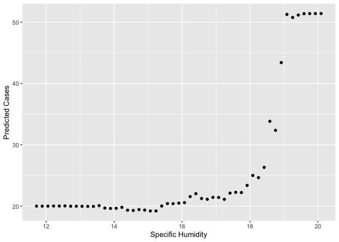
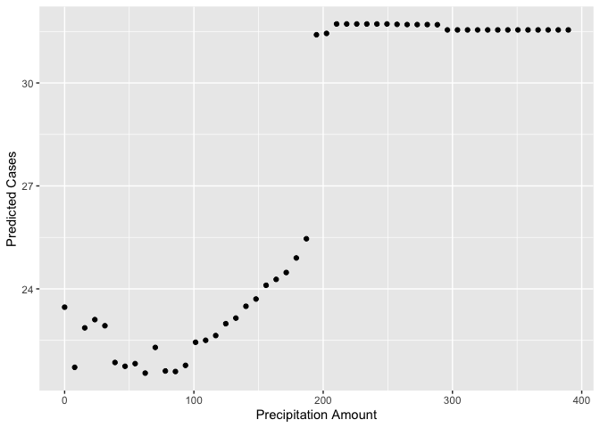

## Question 1: What causes what?

### A) Why can’t I just get data from a few different cities and run the regression of “Crime” on “Police” to understand how more cops in the streets affect crime?

The most obvious reason that we can’t simnply regress crime on police to
understand the causal effect of police on crime is that causation could
very well go the other way. It’s not a stretch to hypothesize that
neighborhoods with higher crime rates see more police activity *because*
of the higher crime rates - not the other way around. But if we ran the
crime on police regression, we might find that there is a significant
positive effect of police on crime, ie. having more police presence
increases rather than decreases crime. This would be akin to regressing
health outcomes on hospital visits, then saying that hospitals cause
worse health outcomes - people go to the hospital because they are
unhealthy! So there is obvious selection bias in this example.

There could also be confounder bias; something that causes both high
crime and high police rates, whose causal effect we would be able to
tease out with the simple regression above. For instance, consider a
college neighborhood like West Campus in Austin. We might see higher
crime rates there because younger people are more likely to commit
crimes than older people and younger people are a higher percentage of
the neighborhood’s residents; we might also see more police there
because the university has its own police system. So being near the
college could have causal effects on both crime and police presence that
make it much harder to estimate the effect of police presence on crime.

 

### B) How were the researchers from UPenn able to isolate this effect? Briefly describe their approach and discuss their result in the “Table 2” below, from the researchers’ paper.

The researchers from UPenn took advantage of a Terrorist Alert warning
system. Since Washington, D.C. is at a high risk of terrorist attacks
relative to other cities, the District of Columbia puts more uniformed
officers on the streets on days with a higher threat level (Orange) of
terrorist attack. Therefore, there was almost a natural experiment such
that the increased level of police presence was uncorrelated with local
crime (terrorist attack risk being a different, uncorrelated conceptual
category). They then seek to determine whether street crime goes down on
Orange alert days, with the most obvious causal interpretation for such
a result being the increased police presence.

The results table contains two columns; column 1) gives the effect of an
Orange alert day on crime rates. The researchers find a reduction of, on
average, 7.316 total crimes in DC on Orange alert days (HAEC), a result
that is significant at the 5% level. In column 2), the researchers
control for log midday Metro ridership to test whether the reduction in
crime was a result of fewer people out in public. They found a
significant negative relationship again, -6.046, meaning that the
reduction in crime was still explained well by increased police presence
instead of reduced ridership. (The coefficient on log midday Metro
ridership gives the average increase in crime, 17.341 per day, for a
100% increase in Metro ridership.)

 

### C) Why did they have to control for Metro ridership? What was that trying to capture?

The researchers control for Metro ridership because they wanted to test
whether the reduction in crime noted on Orange alert days was
explainable by a reduction in people out in public on those days. They
find that there is in fact no reduction in Metro ridership on Orange
alert days; thus, the hypothesis that fewer people in public was driving
the reduction in crime rates could be ruled out, making the increased
police presence explanation more likely.

 

### D) Below I am showing you “Table 4” from the researchers’ paper. Just focus on the first column of the table. Can you describe the model being estimated here? What is the conclusion?

The model estimated in this table further disaggregates by location in
DC - the first row represents average crime reduction in District 1 on
Orange Alert days, the second row represents average crime reduction in
all other districts on Orange Alert days, and the third and fourth rows
are the control for Metro ridership and the intercept (all with robust
standard errors). Focusing on the first two rows, we can see that the
reduction in crime in District 1 is much greater in magnitude (-2.621)
than the reduction in all other districts (-.571); moreover, the
reduction in District 1 is significant at the 1% level, while the
reduction in all other districts is not statistically significant.

District 1 is the district of DC containing the National Mall, the White
House, and most of the likeliest terrorist targets; hence, on Orange
alert days, the police presence increase in District 1 is much higher
than the police presence increase in other DC districts. The conclusion
from this result is that the most likely explanation for the drop in
crime in DC on Orange alert days is due to increased police presence -
and the larger the increase, the bigger the effect on crime.

 

## Question 2: Tree modeling - dengue cases

### Your task is to use CART, random forests, and gradient-boosted trees to predict dengue cases (or log dengue cases – your choice, just explain) based on the features available in the data set. As we usually do, hold out some of the data as a testing set to quantify the performance of these models. (That is, any cross validation should be done only on the training data, with the testing data held as a final check to compare your best CART model vs. your best random forest model vs. your best boosted tree model.)

 

<table>
<caption>RMSE of each model, first pass</caption>
<thead>
<tr class="header">
<th style="text-align: left;">model</th>
<th style="text-align: right;">RMSE</th>
</tr>
</thead>
<tbody>
<tr class="odd">
<td style="text-align: left;">lm1 (baseline)</td>
<td style="text-align: right;">19.81470</td>
</tr>
<tr class="even">
<td style="text-align: left;">lm2</td>
<td style="text-align: right;">19.85939</td>
</tr>
<tr class="odd">
<td style="text-align: left;">lm3</td>
<td style="text-align: right;">19.84933</td>
</tr>
<tr class="even">
<td style="text-align: left;">dengue_tree1</td>
<td style="text-align: right;">22.76814</td>
</tr>
<tr class="odd">
<td style="text-align: left;">dengue_tree2</td>
<td style="text-align: right;">22.85653</td>
</tr>
<tr class="even">
<td style="text-align: left;">dengue_forest1</td>
<td style="text-align: right;">18.79479</td>
</tr>
<tr class="odd">
<td style="text-align: left;">dengue_boost1</td>
<td style="text-align: right;">22.10252</td>
</tr>
<tr class="even">
<td style="text-align: left;">dengue_boost2</td>
<td style="text-align: right;">22.83235</td>
</tr>
<tr class="odd">
<td style="text-align: left;">dengue_boost3</td>
<td style="text-align: right;">22.88528</td>
</tr>
</tbody>
</table>

RMSE of each model, first pass

This table represent the out-of-sample root mean squared error for each
model considered; three linear models for calibration purposes, two CART
models, one random forest, and three gradient-boosted models.

 

<table>
<caption>RMSE of three best models, cross-validation</caption>
<thead>
<tr class="header">
<th style="text-align: left;">model</th>
<th style="text-align: right;">RMSE</th>
</tr>
</thead>
<tbody>
<tr class="odd">
<td style="text-align: left;">dengue_tree1</td>
<td style="text-align: right;">25.82768</td>
</tr>
<tr class="even">
<td style="text-align: left;">dengue_forest1</td>
<td style="text-align: right;">22.56781</td>
</tr>
<tr class="odd">
<td style="text-align: left;">dengue_boost1</td>
<td style="text-align: right;">25.05192</td>
</tr>
</tbody>
</table>

RMSE of three best models, cross-validation

Here we’ve taken the best-performing CART, forest, and gradient-boosted
models from above and cross-validated them against a testing set unused
in the model development phase. It’s clear that the random forest model
has the best out-of-sample performance of all the models.

 

### Then, for whichever model has the better performance on the testing data, make three partial dependence plots: specific\_humidity, precipitation\_amt, and wild card/writer’s choice: you choose a feature that looks interesting and make a partial dependence plot for that.

 

 

These partial dependence plots depict a clear relationship between
dengue cases and the three meteorological variables considered. As
specific humidity rises (particularly beyond 18 grams of water per
kilogram of air), predicted dengue cases rise. The same is true for
weekly precipitation in millimeters, especially beyond 200 mL/week. And
for average diurnal temperature range, predicted dengue cases fall
steadily between 1 and 6 degrees, plateauing afterwards. The
best-performing random forest model predicts that high rainfall, high
humidity, and low temperature range are associated with higher levels of
dengue cases.

This prediction has implications for policymakers. In particular, when
these indicators align, the population should be warned that dengue
cases are likely to be elevated and admonished to take the proper
precautions. Hospitals should also be aware of the meteorological
indicators in order to predict periods of elevated dengue cases at their
facilities.

 

## Question 3: Predictive model building - green certification

### Your goal is to build the best predictive model possible for revenue per square foot per calendar year, and to use this model to quantify the average change in rental income per square foot (whether in absolute or percentage terms) associated with green certification, holding other features of the building constant. (This might entail, for example, a partial dependence plot, depending on what model you work with here.) Note that revenue per square foot per year is the product of two terms: rent and leasing\_rate! This reflects the fact that, for example, high-rent buildings with low occupancy may not actually bring in as much revenue as lower-rent buildings with higher occupancy.

### You can choose whether to consider LEED and EnergyStar separately or to collapse them into a single “green certified” category. You can use any modeling approaches in your toolkit (regression, variable selection, trees, etc), and you should also feel free to do any feature engineering you think helps improve the model. Just make sure to explain what you’ve done.

### Write a short report, no more than the equivalent of about 4 pages, detailing your methods, modeling choice, and conclusions.

## Introduction

We are working on the data set on green buildings, which contains data
on 7,894 commercial rental properties from across the United States. Of
these, 685 properties have been awarded either LEED or EnergyStar
certification as green buildings.

The goal is to build the best predictive model possible for revenue per
square foot per calendar year, and to use this model to quantify the
average change in rental income per square foot associated with green
certification, holding other features of the building constant.

## Importance

Urbanization is forecast to continue: in 2010, slightly over 50% of the
world’s population lived in urban areas, and by 2050, the corresponding
figure is projected to be already over 66%. Currently, cities and built
environments use approximately 75% of generated energy and produce
60–70% of greenhouse gas emissions. Buildings account for approximately
40% of energy use and carbon emissions. At the same time, the real
estate sector comprises approximately 60% of national, corporate, and
individual wealth, totaling over 200 trillion USD. Moreover, yearly
construction-related global spending equals 10 trillion USD,
corresponding approximately to 13% of GDP. Thus, enhancing
sustainability in built environments matters, and property investors can
choose to make a change for the better by allocating assets to
sustainable properties and enhancing the sustainability of their
existing properties (Leskinen et. al, 2020).

In commercial real estate, issues of eco-friendliness are intimately
tied up with ordinary decisions about how to allocate capital. Every new
project involves negotiating a trade-off between costs incurred and
benefits realized over the lifetime of the building. In this context,
the decision to invest in eco-friendly buildings could pay off in many
possible ways. Of course, at the end of the day, tenants may or may not
be willing to pay a premium for rental space in green buildings. We can
only find out by carefully examining data on the commercial real estate
market.

At first look, it seems that having a green certificate has a
considerable effect on the profitability of a home (Box Plot and
difference in the means). But we should examine this effect, since this
effect can be correlated with the other features, and the change in
profitability is not due to the direct effect of certification.

## Data

The file greenbuildings.csv contains data on 7,894 commercial rental
properties from across the United States. Of these, 685 properties have
been awarded either LEED or EnergyStar certification as green buildings.
The basic idea is that a commercial property can receive a green
certification if its energy efficiency, carbon footprint, site
selection, and building materials meet certain environmental benchmarks.

To employ the data in our models, we should work on the data and modify
some features. The “mutate” function is used to create (modify)
columns: - “Revenue = leasing\_rate \* Rent”. - Through the “across”
function, we apply “factor” to (renovated, class\_a, class\_b, LEED,
Energystar, green\_rating, net, amenities), which will convert them to
factors.

The “select” function is used to select columns from the data frame. In
this case, the “-” sign is used to indicate that columns should be
excluded from the selection. The columns being excluded are
“CS\_PropertyID”, “Rent”, and “leasing\_rate”. Because the first is only
the ID of homes, and the others are used in the definition of Revenue.
So, we should exclude them from the features we want to use as
independent variables.

    ## diffmean 
    ##  320.519

 

## Modeling

Unlike linear regression models, decision trees are not limited to
modeling linear relationships and can capture more complex patterns in
the data. Since in this model, there are interactions between the
features that cannot be easily modeled using linear, decision tree
models can be good options.

One of the advantages of decision tree models is that they can help
identify the most important features for predicting the target variable.
In this context, decision tree models help us to identify the real
effect of green certification on the profit of a home. We have applied
three techniques for building tree models.

First, we started with a single tree model, which included all the
variables. To have a better comparison, we run a single tree ten times,
and we use the average of their RMSEs. Decision trees can also be prone
to overfitting, especially when the tree becomes very deep or when there
are many irrelevant features in the data. To address this, we use
ensemble methods such as random forests or gradient boosting, which
combine the predictions of multiple trees to improve performance.

    ## [1] 1012.857

 

We define two different random forests; the first is included all the
variables, and the second includes some features (City\_Market\_Rent ,
age, size+ class\_a, class\_b, Electricity\_Costs, green\_rating) that
seem to be effective on the dependent variable.

    ## [1] 793.5497

    ## [1] 876.833

 

And finally, we used another ensemble method, Boosted trees.

    ## [1] 986.8264

 

## Conclusion

Our measure for comparing the results are their RMSEs. Based on the
results of the simulations, the random forest model included all
variable has the lowest out of the sample RMSE. The other random forest
has the second-best result, which shows proves the better performance of
the random forest comparing the other decision trees models. So, to
predict the revenue per square foot per calendar year, we will apply the
comprehensive random forest model.

Back to the main question, how much does a green certificate affect
profitability?

Now, we have reliable tools to see the real (partial) effect of the
green certificate. At first, we can check this effect through
“varImpPlot”, which shows how much mean-squared error increases when we
ignore a variable, to human language it means that without any
information about the status of a green certificate, the error of the
predictions changes less than the other features.

    ##   green_rating     yhat
    ## 1            0 2398.287
    ## 2            1 2433.065

 

Then, we can calculate the partial dependence shows the average response
of the model to changes in the green certificate variable while holding
all other predictor variables constant. The result can change based on
the trained data, but changes between having vs not-having the
certificate is less than 50$ in revenue per square foot per calendar
year!

The result is interesting because at first look, comparing the mean of
two categories (having vs not-having the certificate) indicates 300$
revenue per square foot per calendar year; which can be misleading
compared to the real effect that the random forest model gives us!
