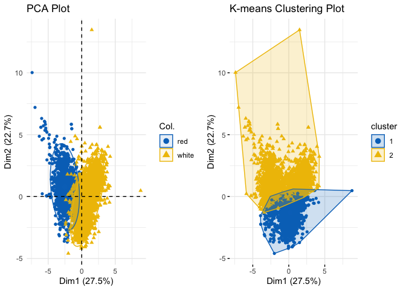
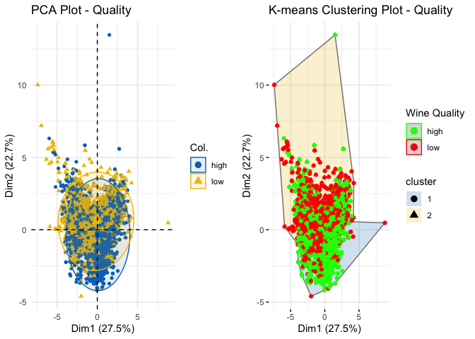
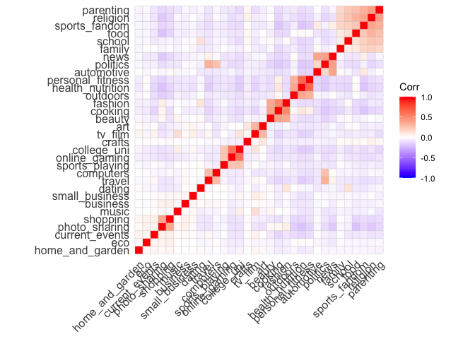
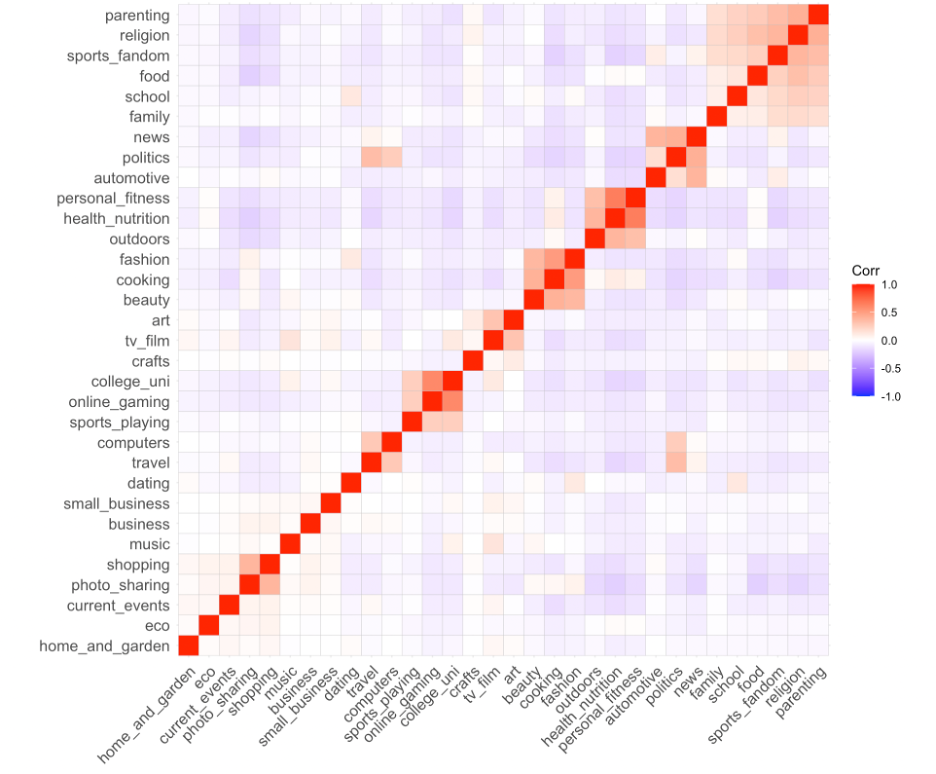
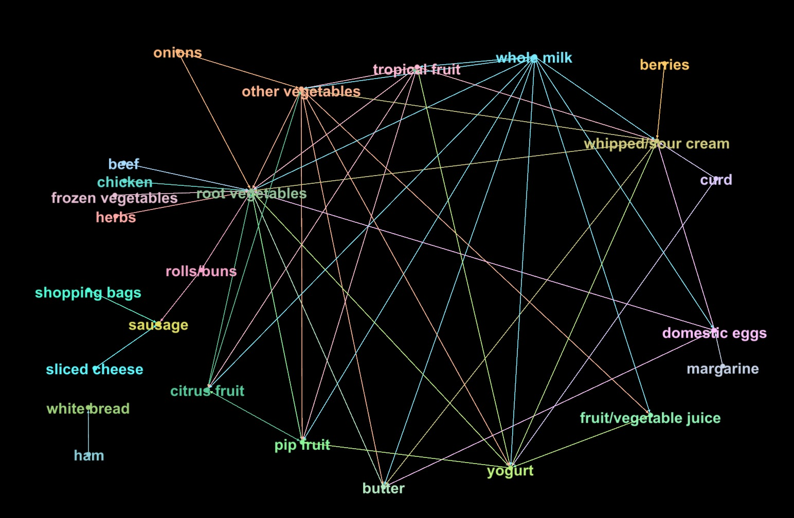

## Question 1: Clustering & PCA

*Run both PCA and a clustering algorithm of your choice on the 11
chemical properties (or suitable transformations thereof) and summarize
your results. Which dimensionality reduction technique makes more sense
to you for this data? Convince yourself (and me) that your chosen method
is easily capable of distinguishing the reds from the whites, using only
the “unsupervised” information contained in the data on chemical
properties. Does your unsupervised technique also seem capable of
distinguishing the higher from the lower quality wines?*

    ## Red vs. White

    # Scale the chemical properties
    scaled_chemical_properties <- scale(wine_data[1:11])

    ## PCA
    # Perform PCA
    pca_result <- prcomp(scaled_chemical_properties, scale=TRUE, rank=11)
    summary(pca_result)

    ## Importance of components:
    ##                           PC1    PC2    PC3     PC4     PC5     PC6     PC7
    ## Standard deviation     1.7407 1.5792 1.2475 0.98517 0.84845 0.77930 0.72330
    ## Proportion of Variance 0.2754 0.2267 0.1415 0.08823 0.06544 0.05521 0.04756
    ## Cumulative Proportion  0.2754 0.5021 0.6436 0.73187 0.79732 0.85253 0.90009
    ##                            PC8     PC9   PC10    PC11
    ## Standard deviation     0.70817 0.58054 0.4772 0.18119
    ## Proportion of Variance 0.04559 0.03064 0.0207 0.00298
    ## Cumulative Proportion  0.94568 0.97632 0.9970 1.00000

    ## Clustering
    # Run k-means clustering with the optimal number of clusters
    set.seed(123) # for reproducibility
    k_clusters <- 2 
    kmeans_result <- kmeans(scaled_chemical_properties, centers = k_clusters)

    # Visualize clustering results
    wine_data$cluster <- factor(kmeans_result$cluster)

    ## Comparison
    # First, create a PCA plot and store it
    pca_plot <- fviz_pca_ind(pca_result,
                             geom.ind = "point",
                             col.ind = wine_data$color, # color points by wine type
                             palette = "jco",
                             addEllipses = TRUE) +
      ggtitle("PCA Plot") +
      theme_minimal()

    # Then, create a clustering plot and store it
    clustering_plot <- fviz_cluster(kmeans_result, data = scaled_chemical_properties, geom = "point",
                                    ellipse.type = "convex", palette = "jco", ggtheme = theme_minimal()) +
      ggtitle("K-means Clustering Plot")

    # Finally, combine the plots using the gridExtra package
    grid.arrange(pca_plot, clustering_plot, ncol = 2)

Eyeballing these plots, both PCA and Clustering seem to do a pretty good
job of distinguishing the red wines from the whites, using only the
“unsupervised” information contained in the data on chemical properties.
PCA appears to perform better than clustering, since the area of overlap
is smaller.

In this case, PCA appears to be the more suitable dimensionality
reduction technique for the given data. The primary reason is that PCA
aims to capture the most significant variations in the data by
transforming the original variables into a new set of uncorrelated
variables (principal components). This helps in simplifying the dataset
while retaining most of the information.

Using PCA as the dimensionality reduction technique helps reveal the
underlying structure in the data more effectively, providing better
separation between groups (especially wine color) and making it easier
to analyze the relationships between the chemical properties of the
wines and their characteristics.

 

    ## Evaluation of models: Silhouette scoring
    # PCA
    # Perform PCA using prcomp() function
    pca_result_alt <- prcomp(scaled_chemical_properties)

    # Get the reduced data (scores) for the first two principal components
    reduced_data <- pca_result_alt$x[, 1:2]

    # Run k-means clustering on reduced data
    set.seed(123) # for reproducibility
    kmeans_result_pca <- kmeans(reduced_data, centers = k_clusters)

    # Calculate silhouette score for PCA
    silhouette_scores_pca <- silhouette(kmeans_result_pca$cluster, dist(reduced_data))

    # Calculate silhouette score for k-means clustering
    silhouette_scores <- silhouette(kmeans_result$cluster, dist(scaled_chemical_properties))

    # Calculate average silhouette scores
    silhouette_score_kmeans <- mean(silhouette_scores[, 3])
    silhouette_score_pca <- mean(silhouette_scores_pca[, 3])

    # Create a data frame with the silhouette scores
    silhouette_scores_df <- data.frame(Method = c("K-means Clustering", "PCA"),
                                       Silhouette_Score = c(silhouette_score_kmeans, silhouette_score_pca))

    # Create a kable with the silhouette scores
    kable(silhouette_scores_df, caption = "Average Silhouette Scores")

<table>
<caption>Average Silhouette Scores</caption>
<thead>
<tr class="header">
<th style="text-align: left;">Method</th>
<th style="text-align: right;">Silhouette_Score</th>
</tr>
</thead>
<tbody>
<tr class="odd">
<td style="text-align: left;">K-means Clustering</td>
<td style="text-align: right;">0.1618516</td>
</tr>
<tr class="even">
<td style="text-align: left;">PCA</td>
<td style="text-align: right;">0.3459587</td>
</tr>
</tbody>
</table>

Average Silhouette Scores

A silhouette score is a metric used to evaluate the quality of
clustering results by measuring the similarity of data points within
their assigned clusters compared to their dissimilarity with data points
in other clusters. The score ranges from -1 to 1, with higher values
indicating better-defined and well-separated clusters.

The silhouette scores indicate that PCA provides better separation
between the groups (wine color or quality) than k-means clustering. The
PCA method has a higher silhouette score of 0.346 compared to the
k-means clustering method with a score of 0.162. This confirms our
intuition that reducing the dimensionality of the dataset using PCA
captures the underlying structure of the data more effectively.

 

    ## Low vs. High Quality
    # Create a new variable for wine quality category
    wine_data$quality_category <- ifelse(wine_data$quality <= 5, "low", "high")

    ## PCA
    # PCA plot colored by wine quality
    pca_quality_plot <- fviz_pca_ind(pca_result,
                                     geom.ind = "point",
                                     col.ind = wine_data$quality_category, # color points by wine quality
                                     palette = "jco",
                                     addEllipses = TRUE) +
      ggtitle("PCA Plot - Quality") +
      theme_minimal()

    ## Clustering
    # K-means clustering plot colored by wine quality
    clustering_quality_plot <- fviz_cluster(kmeans_result, data = scaled_chemical_properties, geom = "point",
                                            ellipse.type = "convex", palette = "jco", ggtheme = theme_minimal(),
                                            stand = FALSE, # disable standardization for manual coloring
                                            axes = c(1, 2)) + # specify the axes you want to plot
      geom_point(aes(color = wine_data$quality_category)) + # color points by wine quality
      scale_color_manual(values = c("low" = "red", "high" = "green")) +
      labs(color = "Wine Quality") +
      ggtitle("K-means Clustering Plot - Quality")

    ## Scale for colour is already present.
    ## Adding another scale for colour, which will replace the existing scale.

    # Combine the plots using the gridExtra package
    grid.arrange(pca_quality_plot, clustering_quality_plot, ncol = 2)

Eyeballing the plots for both PCA and k-means clustering, it appears
that neither method is able to effectively distinguish between
high-quality and low-quality wines using only the chemical properties.
This result suggests that the chemical properties of the wines may not
have a strong linear relationship with the wine quality, or that the
quality ratings are influenced by additional factors beyond the chemical
composition. It is also possible that the perceived quality of wines is
a more complex and subjective attribute, which may not be adequately
captured by PCA or clustering methods.

 

## Question 2: Market segmentation

*Consider the data in social\_marketing.csv. This was data collected in
the course of a market-research study using followers of the Twitter
account of a large consumer drinks brand that shall remain
nameless—let’s call it “NutrientH20” just to have a label. The goal here
was for NutrientH20 to understand its social-media audience a little bit
better, so that it could hone its messaging a little more sharply.*

*…*

*Your task to is analyze this data as you see fit, and to prepare a
(short!) report for NutrientH20 that identifies any interesting market
segments that appear to stand out in their social-media audience. You
have complete freedom in deciding how to pre-process the data and how to
define “market segment.” (Is it a group of correlated interests? A
cluster? A principal component? Etc. You decide the answer to this
question—don’t ask me!) Just use the data to come up with some
interesting, well-supported insights about the audience and give your
client some insight as to how they might position their brand to
maximally appeal to each market segment.*

    # extract the values in the first column as row names
    rownames(social_marketing) <- social_marketing$X

    # remove the first column from the data frame, set the id as the labels of the rows
    social_marketing <- social_marketing[, -1]

    # remove unrelated / without useful information
    social_marketing <- social_marketing[, -c(1,5,35,36) ]

    #frequency of each word for an individual
    frequency = social_marketing/rowSums(social_marketing)

    #scaling
    frequency = scale(frequency, center=TRUE, scale=TRUE)

    #clustring
    #as we know that "elbow plot" is not helpful to find a suggestion for k, I directly tried Gap statistic
    # since running this code takes long time, I put the code here, but I do not run again.

    #gap=clusGap(x = frequency, FUNcluster = kmeans, K.max = 10, B = 30, nstart = 25)
    #plot(gap, main = "Gap statistic plot")

    #unfortunately, the plot doesnt have any local maximum!

    #we begin with k=8 (but we will revise it)

    #first I compare the performane of different types of hierarchical clustering: single, average, complete, ward.D2

    distances = dist(frequency, method = "euclidean")
    #hierarchical clustering 
    #single
    hcluster_single = hclust(distances, method = 'single')
    cluster_s = cutree(hcluster_single, k=8)
    summary(factor(cluster_s))

    ##    1    2    3    4    5    6    7    8 
    ## 7875    1    1    1    1    1    1    1

    #unbalanced size per clusters

    #average
    hcluster_average = hclust(distances, method = 'average')
    cluster_a = cutree(hcluster_average, k=8)
    summary(factor(cluster_a))

    ##    1    2    3    4    5    6    7    8 
    ## 7868    1    3    5    1    1    2    1

    #unbalanced size per clusters

    #complete
    hcluster_comp = hclust(distances, method = 'complete')
    cluster_c = cutree(hcluster_comp, k=8)
    summary(factor(cluster_c))

    ##    1    2    3    4    5    6    7    8 
    ## 7637   84  129   14    2    5    9    2

    #slightly better, but again unbalanced size per clusters

    #ward
    hcluster_ward = hclust(distances, method = 'ward.D2')
    cluster_w = cutree(hcluster_ward, k=8)
    summary(factor(cluster_w))

    ##    1    2    3    4    5    6    7    8 
    ## 1091 1236  356 2380 1030  850  636  303

    #it seems for this data set, "ward" method can result to balanced (size) groups.

    #although different methods apply different approaches for categorizing, I use "ward" to find "only" an intuition about different possible number of categories

    # Ward's linkage method with different k values
    hcluster_ward = hclust(distances, method = 'ward.D2')
    for (k in 4:10) {
      cluster_w = cutree(hcluster_ward, k=k)
      cat("k =", k, "\n")
      print(summary(factor(cluster_w)))
    }

    ## k = 4 
    ##    1    2    3    4 
    ## 1091 1236 4705  850 
    ## k = 5 
    ##    1    2    3    4    5 
    ## 1091 1236 3675 1030  850 
    ## k = 6 
    ##    1    2    3    4    5    6 
    ## 1091 1236 3039 1030  850  636 
    ## k = 7 
    ##    1    2    3    4    5    6    7 
    ## 1091 1236 2736 1030  850  636  303 
    ## k = 8 
    ##    1    2    3    4    5    6    7    8 
    ## 1091 1236  356 2380 1030  850  636  303 
    ## k = 9 
    ##    1    2    3    4    5    6    7    8    9 
    ## 1091 1236  356 2380  531  850  636  303  499 
    ## k = 10 
    ##    1    2    3    4    5    6    7    8    9   10 
    ## 1091 1236  356 1794  531  850  586  636  303  499

    #based on what I see for size of members of the groups for different k,  with k=6, I feel it makes a relative balanced members per group (I prefer less categories). 

    #now, we can continue with k++ method, given k=6
    clust_k = KMeans_rcpp(frequency, clusters=6, num_init=100)

    # Calculate the mean value of each column in frequency for each cluster assignment in clust_k
    clust_mean = aggregate(frequency, by=list(cluster=clust_k$cluster), mean)
    print(clust_mean)

    ##   cluster current_events      travel photo_sharing     tv_film sports_fandom
    ## 1       1     -0.1477763  0.84177187    -0.4513891 -0.14114039    0.07530597
    ## 2       2     -0.2623039 -0.23815510    -0.3209016 -0.01765828   -0.33863005
    ## 3       3     -0.1814326 -0.28961299    -0.4055759 -0.21848045    1.28603491
    ## 4       4      0.4737433  0.04225083     0.6610087  0.45112458   -0.21181817
    ## 5       5     -0.2345136 -0.27277735     0.2787192 -0.27708051   -0.42625012
    ## 6       6     -0.2434478 -0.28939653    -0.3877362 -0.26559447   -0.37267835
    ##     politics        food      family home_and_garden       music       news
    ## 1  1.6030181 -0.24389127 -0.08811082     -0.09609629 -0.17841284  1.4604691
    ## 2 -0.3654572 -0.26620618 -0.11523059     -0.14066524 -0.12372387 -0.3272167
    ## 3 -0.3981886  1.11208459  0.70276843     -0.11514730 -0.15171631 -0.2943746
    ## 4 -0.1892579 -0.25178580 -0.02656728      0.26825299  0.27608548 -0.2857093
    ## 5 -0.3872163 -0.42797680 -0.24823990     -0.12407748  0.07149393 -0.3070270
    ## 6 -0.3523582  0.08464669 -0.26082522     -0.12554868 -0.16283414 -0.2208251
    ##   online_gaming   shopping health_nutrition college_uni sports_playing
    ## 1    -0.2582578 -0.3335055       -0.4216789 -0.27367754    -0.18420530
    ## 2     2.5339482 -0.3586139       -0.3789909  2.42102360     1.06970201
    ## 3    -0.2369557 -0.3041414       -0.3760908 -0.31745631    -0.16106934
    ## 4    -0.2207776  0.6662011       -0.3967949 -0.05451256     0.01696524
    ## 5    -0.2184672 -0.1930107       -0.3196880 -0.26039486    -0.08305937
    ## 6    -0.2239583 -0.2797838        1.7022969 -0.34227625    -0.16615521
    ##      cooking         eco   computers    business    outdoors     crafts
    ## 1 -0.4060292 -0.17447106  0.65716689 -0.05117755 -0.01238066 -0.1731416
    ## 2 -0.3507555 -0.20747972 -0.21113502 -0.18650634 -0.26505824 -0.1849583
    ## 3 -0.3662882 -0.05069234 -0.12029907 -0.13073063 -0.25497139  0.1800121
    ## 4 -0.3668042  0.21094048 -0.05159242  0.26784579 -0.30882157  0.1941979
    ## 5  2.0486457 -0.20213638 -0.15915891 -0.06030863 -0.20177583 -0.1678261
    ## 6  0.1792177  0.06159801 -0.19524330 -0.16910513  0.97619897 -0.1347243
    ##    automotive         art   religion      beauty  parenting       dating
    ## 1  0.83197005 -0.19857110 -0.2451363 -0.28603120 -0.1400260 -0.046086884
    ## 2 -0.20283169  0.02221419 -0.3308543 -0.31447109 -0.3247530 -0.119633769
    ## 3 -0.12200094 -0.11705192  1.5608686  0.04373581  1.4369676 -0.144535044
    ## 4 -0.06696956  0.29380571 -0.2619699 -0.20206120 -0.2820007  0.134661767
    ## 5 -0.21193327 -0.12225105 -0.3215295  1.62403707 -0.2935631 -0.028888432
    ## 6 -0.29240189 -0.15160685 -0.3061108 -0.29739565 -0.2812699  0.009069963
    ##       school personal_fitness    fashion small_business
    ## 1 -0.2068343       -0.3934388 -0.3467544    -0.08321345
    ## 2 -0.3205182       -0.3582765 -0.2650579    -0.04153052
    ## 3  0.8915026       -0.3341374 -0.1997460    -0.08950507
    ## 4 -0.0471281       -0.3467862 -0.1753215     0.24146409
    ## 5 -0.0804560       -0.3223546  1.9042859    -0.08685353
    ## 6 -0.2895287        1.5523003 -0.2788277    -0.18114478

    # Convert the resulting means to a data frame
    results1 = as.data.frame(clust_mean)

    # transpose
    t_results1 <- t(results1)

    # get row and colnames in order
    colnames(t_results1) <- rownames(results1)
    rownames(t_results1) <- colnames(results1)

    # Removing cluster names
    t_results2 = t_results1[-1,]

    # Extract column names with the maximum value for each row in t_results2
    number_k = colnames(t_results2)[apply(t_results2,1,which.max)]
    # Combine row names and number_k into a matrix
    clus_features = cbind(rownames(t_results2),number_k)

    for (k in 1:6) {
      # Subset t_results2 based on number_k
      subset_results = t_results2[number_k == k, ]
      
      # Print the resulting subset to the console
      cat("Cluster", k, ":\n")
      print(subset_results)
    }

    ## Cluster 1 :
    ##                    1          2          3           4          5          6
    ## travel     0.8417719 -0.2381551 -0.2896130  0.04225083 -0.2727773 -0.2893965
    ## politics   1.6030181 -0.3654572 -0.3981886 -0.18925789 -0.3872163 -0.3523582
    ## news       1.4604691 -0.3272167 -0.2943746 -0.28570927 -0.3070270 -0.2208251
    ## computers  0.6571669 -0.2111350 -0.1202991 -0.05159242 -0.1591589 -0.1952433
    ## automotive 0.8319701 -0.2028317 -0.1220009 -0.06696956 -0.2119333 -0.2924019
    ## Cluster 2 :
    ##                         1        2          3           4           5
    ## online_gaming  -0.2582578 2.533948 -0.2369557 -0.22077760 -0.21846715
    ## college_uni    -0.2736775 2.421024 -0.3174563 -0.05451256 -0.26039486
    ## sports_playing -0.1842053 1.069702 -0.1610693  0.01696524 -0.08305937
    ##                         6
    ## online_gaming  -0.2239583
    ## college_uni    -0.3422763
    ## sports_playing -0.1661552
    ## Cluster 3 :
    ##                         1          2         3           4          5
    ## sports_fandom  0.07530597 -0.3386301 1.2860349 -0.21181817 -0.4262501
    ## food          -0.24389127 -0.2662062 1.1120846 -0.25178580 -0.4279768
    ## family        -0.08811082 -0.1152306 0.7027684 -0.02656728 -0.2482399
    ## religion      -0.24513634 -0.3308543 1.5608686 -0.26196995 -0.3215295
    ## parenting     -0.14002600 -0.3247530 1.4369676 -0.28200065 -0.2935631
    ## school        -0.20683433 -0.3205182 0.8915026 -0.04712810 -0.0804560
    ##                         6
    ## sports_fandom -0.37267835
    ## food           0.08464669
    ## family        -0.26082522
    ## religion      -0.30611078
    ## parenting     -0.28126991
    ## school        -0.28952870
    ## Cluster 4 :
    ##                           1           2           3         4           5
    ## current_events  -0.14777631 -0.26230389 -0.18143256 0.4737433 -0.23451358
    ## photo_sharing   -0.45138908 -0.32090157 -0.40557588 0.6610087  0.27871915
    ## tv_film         -0.14114039 -0.01765828 -0.21848045 0.4511246 -0.27708051
    ## home_and_garden -0.09609629 -0.14066524 -0.11514730 0.2682530 -0.12407748
    ## music           -0.17841284 -0.12372387 -0.15171631 0.2760855  0.07149393
    ## shopping        -0.33350553 -0.35861392 -0.30414135 0.6662011 -0.19301068
    ## eco             -0.17447106 -0.20747972 -0.05069234 0.2109405 -0.20213638
    ## business        -0.05117755 -0.18650634 -0.13073063 0.2678458 -0.06030863
    ## crafts          -0.17314160 -0.18495828  0.18001208 0.1941979 -0.16782613
    ## art             -0.19857110  0.02221419 -0.11705192 0.2938057 -0.12225105
    ## dating          -0.04608688 -0.11963377 -0.14453504 0.1346618 -0.02888843
    ## small_business  -0.08321345 -0.04153052 -0.08950507 0.2414641 -0.08685353
    ##                            6
    ## current_events  -0.243447804
    ## photo_sharing   -0.387736236
    ## tv_film         -0.265594470
    ## home_and_garden -0.125548684
    ## music           -0.162834141
    ## shopping        -0.279783823
    ## eco              0.061598006
    ## business        -0.169105131
    ## crafts          -0.134724269
    ## art             -0.151606852
    ## dating           0.009069963
    ## small_business  -0.181144783
    ## Cluster 5 :
    ##                  1          2           3          4        5          6
    ## cooking -0.4060292 -0.3507555 -0.36628824 -0.3668042 2.048646  0.1792177
    ## beauty  -0.2860312 -0.3144711  0.04373581 -0.2020612 1.624037 -0.2973957
    ## fashion -0.3467544 -0.2650579 -0.19974595 -0.1753215 1.904286 -0.2788277
    ## Cluster 6 :
    ##                            1          2          3          4          5
    ## health_nutrition -0.42167891 -0.3789909 -0.3760908 -0.3967949 -0.3196880
    ## outdoors         -0.01238066 -0.2650582 -0.2549714 -0.3088216 -0.2017758
    ## personal_fitness -0.39343883 -0.3582765 -0.3341374 -0.3467862 -0.3223546
    ##                         6
    ## health_nutrition 1.702297
    ## outdoors         0.976199
    ## personal_fitness 1.552300

    # Now we can check with correlation 
    cor(frequency)

    ##                  current_events       travel photo_sharing     tv_film
    ## current_events      1.000000000  0.028468064    0.06423939  0.05136097
    ## travel              0.028468064  1.000000000   -0.09313766  0.03100030
    ## photo_sharing       0.064239387 -0.093137663    1.00000000 -0.08525244
    ## tv_film             0.051360967  0.031000300   -0.08525244  1.00000000
    ## sports_fandom      -0.058397569 -0.114845229   -0.13876075 -0.07122862
    ## politics           -0.047146629  0.338755075   -0.12127858 -0.06254196
    ## food               -0.082176099 -0.088474954   -0.20328594 -0.04854915
    ## family             -0.005866944 -0.068434531   -0.02622956 -0.05641074
    ## home_and_garden     0.042752469 -0.022995497    0.02271448  0.04119514
    ## music               0.011433165 -0.040337465    0.02660996  0.13601618
    ## news               -0.065812423  0.057246410   -0.18224857 -0.03287032
    ## online_gaming      -0.077588721 -0.078134885   -0.09705433 -0.05242793
    ## shopping            0.067266315 -0.082735028    0.38121497 -0.06430007
    ## health_nutrition   -0.142310621 -0.167031454   -0.20398252 -0.14839104
    ## college_uni        -0.077705038 -0.064393436   -0.10064763  0.11273323
    ## sports_playing     -0.013703061 -0.040307323   -0.02902347  0.00299991
    ## cooking            -0.135906484 -0.143489164    0.03728037 -0.13793104
    ## eco                 0.036859956 -0.022781730    0.04793314 -0.03082063
    ## computers          -0.030688943  0.280855831   -0.04202015 -0.07868048
    ## business            0.017611337  0.026693114    0.06253710  0.01639808
    ## outdoors           -0.107718453 -0.082937268   -0.16170790 -0.09283647
    ## crafts              0.014223665 -0.020918362   -0.01251209  0.04139507
    ## automotive         -0.005643026 -0.084240559   -0.02670128 -0.06010442
    ## art                -0.007964070 -0.008347471   -0.10216839  0.30788969
    ## religion           -0.086847134 -0.099597421   -0.17811729 -0.05933522
    ## beauty             -0.067887469 -0.097437040    0.03084375 -0.04896949
    ## parenting          -0.079519311 -0.091645357   -0.12672961 -0.10722870
    ## dating             -0.038289843 -0.031722077   -0.08482901 -0.05725674
    ## school             -0.067544713 -0.084263817   -0.05007380 -0.06797958
    ## personal_fitness   -0.112724199 -0.135384848   -0.15414695 -0.13372605
    ## fashion            -0.092383993 -0.106460328    0.06500248 -0.09318577
    ## small_business      0.014505228 -0.002362312    0.01550669  0.07064576
    ##                  sports_fandom     politics         food       family
    ## current_events    -0.058397569 -0.047146629 -0.082176099 -0.005866944
    ## travel            -0.114845229  0.338755075 -0.088474954 -0.068434531
    ## photo_sharing     -0.138760753 -0.121278584 -0.203285937 -0.026229559
    ## tv_film           -0.071228616 -0.062541963 -0.048549146 -0.056410743
    ## sports_fandom      1.000000000 -0.047273298  0.237237594  0.181642901
    ## politics          -0.047273298  1.000000000 -0.118905892 -0.064179001
    ## food               0.237237594 -0.118905892  1.000000000  0.093836466
    ## family             0.181642901 -0.064179001  0.093836466  1.000000000
    ## home_and_garden   -0.034429015 -0.034058634 -0.030029076 -0.033618007
    ## music             -0.046262018 -0.081253068 -0.045044740 -0.037891629
    ## news               0.067529565  0.409872399 -0.084898778 -0.029053405
    ## online_gaming     -0.105520539 -0.121420281 -0.086292400 -0.039487391
    ## shopping          -0.110026876 -0.078115038 -0.140193103 -0.013780751
    ## health_nutrition  -0.188775453 -0.175322102  0.020410441 -0.133634070
    ## college_uni       -0.117727078 -0.123398869 -0.093913056 -0.061661837
    ## sports_playing    -0.066290326 -0.074181172 -0.058331460 -0.012293661
    ## cooking           -0.192948240 -0.182456424 -0.132883347 -0.129617047
    ## eco               -0.043932732 -0.052507977 -0.031796444 -0.010296411
    ## computers         -0.061785737  0.258930226 -0.047492861 -0.037068689
    ## business          -0.048370617 -0.006527927 -0.061677841 -0.005323812
    ## outdoors          -0.063051455 -0.050026746 -0.010294703 -0.063560149
    ## crafts             0.005243141 -0.054436382  0.032227265  0.005656199
    ## automotive         0.085787149  0.173227684 -0.093818272  0.019672593
    ## art               -0.073802007 -0.068851659 -0.006887569 -0.066585515
    ## religion           0.376804659 -0.128355445  0.326127250  0.192075201
    ## beauty            -0.040846874 -0.142796986 -0.058705890 -0.029151135
    ## parenting          0.337695738 -0.100044052  0.268865044  0.172114262
    ## dating            -0.083551368 -0.045829188 -0.068660616 -0.065456326
    ## school             0.198262899 -0.110056975  0.132135284  0.078836503
    ## personal_fitness  -0.156582937 -0.166602230  0.013325376 -0.123057066
    ## fashion           -0.129940063 -0.154385527 -0.124305605 -0.090886035
    ## small_business    -0.033854896 -0.018521037 -0.043276921 -0.034010471
    ##                  home_and_garden        music        news online_gaming
    ## current_events       0.042752469  0.011433165 -0.06581242  -0.077588721
    ## travel              -0.022995497 -0.040337465  0.05724641  -0.078134885
    ## photo_sharing        0.022714478  0.026609965 -0.18224857  -0.097054333
    ## tv_film              0.041195136  0.136016182 -0.03287032  -0.052427932
    ## sports_fandom       -0.034429015 -0.046262018  0.06752957  -0.105520539
    ## politics            -0.034058634 -0.081253068  0.40987240  -0.121420281
    ## food                -0.030029076 -0.045044740 -0.08489878  -0.086292400
    ## family              -0.033618007 -0.037891629 -0.02905341  -0.039487391
    ## home_and_garden      1.000000000 -0.005929082 -0.03366147  -0.047890278
    ## music               -0.005929082  1.000000000 -0.07611896  -0.073159796
    ## news                -0.033661470 -0.076118958  1.00000000  -0.092239005
    ## online_gaming       -0.047890278 -0.073159796 -0.09223901   1.000000000
    ## shopping             0.039801585  0.012932133 -0.13011626  -0.102526122
    ## health_nutrition    -0.069718839 -0.090122335 -0.11538807  -0.110207295
    ## college_uni         -0.042621060  0.073558183 -0.12192558   0.602052244
    ## sports_playing      -0.017423473 -0.012754384 -0.08733771   0.247616868
    ## cooking             -0.057416055 -0.004725654 -0.14095839  -0.099042964
    ## eco                  0.016519693 -0.001892796 -0.07150532  -0.057974593
    ## computers           -0.004921147 -0.035612106  0.01884781  -0.065444502
    ## business            -0.002806204  0.021283994 -0.05724678  -0.062809171
    ## outdoors            -0.031001531 -0.052865899  0.01404537  -0.076714679
    ## crafts              -0.004478867  0.004617022 -0.06193364  -0.056385628
    ## automotive          -0.002978845 -0.033369407  0.39379793  -0.042756232
    ## art                  0.016582390 -0.042735426 -0.03232778  -0.007470611
    ## religion            -0.040772671 -0.026298151 -0.10038148  -0.112182916
    ## beauty              -0.032649082  0.044282613 -0.09898143  -0.089125114
    ## parenting           -0.043860464 -0.075242562 -0.04153219  -0.092082259
    ## dating               0.017044783 -0.064223257 -0.03312582  -0.032361402
    ## school              -0.032234669 -0.052872417 -0.07850450  -0.092112811
    ## personal_fitness    -0.059561224 -0.085720564 -0.10713674  -0.102117410
    ## fashion             -0.047012443 -0.007813298 -0.12174041  -0.077377706
    ## small_business       0.004772345  0.029877197 -0.04170167  -0.029517409
    ##                     shopping health_nutrition  college_uni sports_playing
    ## current_events    0.06726632      -0.14231062 -0.077705038   -0.013703061
    ## travel           -0.08273503      -0.16703145 -0.064393436   -0.040307323
    ## photo_sharing     0.38121497      -0.20398252 -0.100647628   -0.029023474
    ## tv_film          -0.06430007      -0.14839104  0.112733230    0.002999910
    ## sports_fandom    -0.11002688      -0.18877545 -0.117727078   -0.066290326
    ## politics         -0.07811504      -0.17532210 -0.123398869   -0.074181172
    ## food             -0.14019310       0.02041044 -0.093913056   -0.058331460
    ## family           -0.01378075      -0.13363407 -0.061661837   -0.012293661
    ## home_and_garden   0.03980158      -0.06971884 -0.042621060   -0.017423473
    ## music             0.01293213      -0.09012233  0.073558183   -0.012754384
    ## news             -0.13011626      -0.11538807 -0.121925582   -0.087337709
    ## online_gaming    -0.10252612      -0.11020729  0.602052244    0.247616868
    ## shopping          1.00000000      -0.13839821 -0.077310577   -0.045221132
    ## health_nutrition -0.13839821       1.00000000 -0.168998875   -0.091461979
    ## college_uni      -0.07731058      -0.16899887  1.000000000    0.246362484
    ## sports_playing   -0.04522113      -0.09146198  0.246362484    1.000000000
    ## cooking          -0.10746078       0.09935600 -0.125025339   -0.060046265
    ## eco               0.06101417       0.02142524 -0.061266624   -0.044018199
    ## computers        -0.01887734      -0.10033688 -0.074907462   -0.055320707
    ## business          0.06399172      -0.08361502 -0.038195648   -0.013825320
    ## outdoors         -0.12853693       0.38201397 -0.107288348   -0.067316282
    ## crafts            0.01514045      -0.06051765 -0.058425953   -0.040126794
    ## automotive        0.01664226      -0.15168542 -0.080114935   -0.064245635
    ## art              -0.05531135      -0.08356860 -0.004269195   -0.041392310
    ## religion         -0.12629137      -0.13763499 -0.092482121   -0.048153678
    ## beauty           -0.08559033      -0.11794251 -0.096977375   -0.038221287
    ## parenting        -0.10666491      -0.12410896 -0.127790640   -0.072347117
    ## dating           -0.07672236      -0.02882254 -0.048805096    0.010752245
    ## school           -0.04348575      -0.13776377 -0.120665456   -0.036967004
    ## personal_fitness -0.10307284       0.65369942 -0.160700781   -0.080853605
    ## fashion          -0.04401612      -0.11693978 -0.080642456   -0.016270155
    ## small_business    0.03132252      -0.09601825  0.031376335    0.001893881
    ##                       cooking           eco    computers     business
    ## current_events   -0.135906484  0.0368599555 -0.030688943  0.017611337
    ## travel           -0.143489164 -0.0227817300  0.280855831  0.026693114
    ## photo_sharing     0.037280369  0.0479331421 -0.042020148  0.062537100
    ## tv_film          -0.137931037 -0.0308206271 -0.078680482  0.016398075
    ## sports_fandom    -0.192948240 -0.0439327318 -0.061785737 -0.048370617
    ## politics         -0.182456424 -0.0525079766  0.258930226 -0.006527927
    ## food             -0.132883347 -0.0317964440 -0.047492861 -0.061677841
    ## family           -0.129617047 -0.0102964111 -0.037068689 -0.005323812
    ## home_and_garden  -0.057416055  0.0165196935 -0.004921147 -0.002806204
    ## music            -0.004725654 -0.0018927958 -0.035612106  0.021283994
    ## news             -0.140958394 -0.0715053202  0.018847808 -0.057246783
    ## online_gaming    -0.099042964 -0.0579745928 -0.065444502 -0.062809171
    ## shopping         -0.107460776  0.0610141671 -0.018877338  0.063991716
    ## health_nutrition  0.099356002  0.0214252375 -0.100336878 -0.083615016
    ## college_uni      -0.125025339 -0.0612666238 -0.074907462 -0.038195648
    ## sports_playing   -0.060046265 -0.0440181987 -0.055320707 -0.013825320
    ## cooking           1.000000000 -0.0680588080 -0.086927353 -0.055936453
    ## eco              -0.068058808  1.0000000000 -0.010952687 -0.007856766
    ## computers        -0.086927353 -0.0109526874  1.000000000  0.020044797
    ## business         -0.055936453 -0.0078567665  0.020044797  1.000000000
    ## outdoors          0.033800847 -0.0144178782 -0.057257039 -0.065346393
    ## crafts           -0.089221659 -0.0066774736 -0.020869774 -0.009821270
    ## automotive       -0.120524762 -0.0251621002 -0.067495800 -0.017191935
    ## art              -0.057354161 -0.0264381439 -0.083564391  0.015084194
    ## religion         -0.141437224 -0.0312888616 -0.020937449 -0.053629587
    ## beauty            0.400448428 -0.0386537564 -0.056424722 -0.020684753
    ## parenting        -0.121695156 -0.0188679935 -0.034325395 -0.029064259
    ## dating           -0.064967144 -0.0290444272 -0.004583182  0.014360764
    ## school           -0.074265386 -0.0349616210 -0.042003416 -0.015973751
    ## personal_fitness  0.065621496  0.0069910456 -0.102102250 -0.070942351
    ## fashion           0.509397291 -0.0527349138 -0.060419970 -0.017242121
    ## small_business   -0.064029831 -0.0002992371 -0.011502986  0.036978181
    ##                       outdoors       crafts   automotive          art
    ## current_events   -0.1077184533  0.014223665 -0.005643026 -0.007964070
    ## travel           -0.0829372681 -0.020918362 -0.084240559 -0.008347471
    ## photo_sharing    -0.1617079038 -0.012512087 -0.026701281 -0.102168394
    ## tv_film          -0.0928364704  0.041395066 -0.060104419  0.307889694
    ## sports_fandom    -0.0630514553  0.005243141  0.085787149 -0.073802007
    ## politics         -0.0500267458 -0.054436382  0.173227684 -0.068851659
    ## food             -0.0102947029  0.032227265 -0.093818272 -0.006887569
    ## family           -0.0635601485  0.005656199  0.019672593 -0.066585515
    ## home_and_garden  -0.0310015309 -0.004478867 -0.002978845  0.016582390
    ## music            -0.0528658992  0.004617022 -0.033369407 -0.042735426
    ## news              0.0140453666 -0.061933640  0.393797931 -0.032327778
    ## online_gaming    -0.0767146789 -0.056385628 -0.042756232 -0.007470611
    ## shopping         -0.1285369315  0.015140446  0.016642256 -0.055311351
    ## health_nutrition  0.3820139668 -0.060517650 -0.151685415 -0.083568595
    ## college_uni      -0.1072883477 -0.058425953 -0.080114935 -0.004269195
    ## sports_playing   -0.0673162820 -0.040126794 -0.064245635 -0.041392310
    ## cooking           0.0338008473 -0.089221659 -0.120524762 -0.057354161
    ## eco              -0.0144178782 -0.006677474 -0.025162100 -0.026438144
    ## computers        -0.0572570386 -0.020869774 -0.067495800 -0.083564391
    ## business         -0.0653463933 -0.009821270 -0.017191935  0.015084194
    ## outdoors          1.0000000000 -0.062235499 -0.028794786 -0.083168152
    ## crafts           -0.0622354989  1.000000000 -0.042014824  0.098572146
    ## automotive       -0.0287947856 -0.042014824  1.000000000 -0.069699747
    ## art              -0.0831681522  0.098572146 -0.069699747  1.000000000
    ## religion         -0.1022983999  0.062124125 -0.046368635 -0.051772298
    ## beauty           -0.0712487771 -0.032869580 -0.075054933 -0.043219017
    ## parenting        -0.0654009025  0.032519028 -0.005046720 -0.062120247
    ## dating            0.0003196158  0.004245437 -0.066634338 -0.021821121
    ## school           -0.0929461385  0.032949166 -0.026000043 -0.020003627
    ## personal_fitness  0.3258562189 -0.059701126 -0.136476452 -0.081511310
    ## fashion          -0.0827118631 -0.051600902 -0.104162021 -0.023717837
    ## small_business   -0.0490163516 -0.005260375 -0.014539103  0.036765218
    ##                      religion       beauty   parenting        dating
    ## current_events   -0.086847134 -0.067887469 -0.07951931 -0.0382898431
    ## travel           -0.099597421 -0.097437040 -0.09164536 -0.0317220766
    ## photo_sharing    -0.178117290  0.030843749 -0.12672961 -0.0848290111
    ## tv_film          -0.059335217 -0.048969490 -0.10722870 -0.0572567434
    ## sports_fandom     0.376804659 -0.040846874  0.33769574 -0.0835513683
    ## politics         -0.128355445 -0.142796986 -0.10004405 -0.0458291882
    ## food              0.326127250 -0.058705890  0.26886504 -0.0686606158
    ## family            0.192075201 -0.029151135  0.17211426 -0.0654563264
    ## home_and_garden  -0.040772671 -0.032649082 -0.04386046  0.0170447831
    ## music            -0.026298151  0.044282613 -0.07524256 -0.0642232573
    ## news             -0.100381484 -0.098981430 -0.04153219 -0.0331258195
    ## online_gaming    -0.112182916 -0.089125114 -0.09208226 -0.0323614018
    ## shopping         -0.126291366 -0.085590326 -0.10666491 -0.0767223555
    ## health_nutrition -0.137634993 -0.117942512 -0.12410896 -0.0288225440
    ## college_uni      -0.092482121 -0.096977375 -0.12779064 -0.0488050958
    ## sports_playing   -0.048153678 -0.038221287 -0.07234712  0.0107522451
    ## cooking          -0.141437224  0.400448428 -0.12169516 -0.0649671437
    ## eco              -0.031288862 -0.038653756 -0.01886799 -0.0290444272
    ## computers        -0.020937449 -0.056424722 -0.03432540 -0.0045831820
    ## business         -0.053629587 -0.020684753 -0.02906426  0.0143607645
    ## outdoors         -0.102298400 -0.071248777 -0.06540090  0.0003196158
    ## crafts            0.062124125 -0.032869580  0.03251903  0.0042454366
    ## automotive       -0.046368635 -0.075054933 -0.00504672 -0.0666343381
    ## art              -0.051772298 -0.043219017 -0.06212025 -0.0218211209
    ## religion          1.000000000 -0.004423195  0.41050223 -0.0455732760
    ## beauty           -0.004423195  1.000000000 -0.01681500  0.0185957602
    ## parenting         0.410502234 -0.016814996  1.00000000 -0.0294147220
    ## dating           -0.045573276  0.018595760 -0.02941472  1.0000000000
    ## school            0.248913561  0.023818053  0.22992511  0.1193837280
    ## personal_fitness -0.121749211 -0.121390079 -0.09982867 -0.0334670528
    ## fashion          -0.071128227  0.371244015 -0.08327159  0.1092826571
    ## small_business   -0.012273473 -0.007187826 -0.05085417  0.0052767214
    ##                       school personal_fitness      fashion small_business
    ## current_events   -0.06754471     -0.112724199 -0.092383993   0.0145052277
    ## travel           -0.08426382     -0.135384848 -0.106460328  -0.0023623122
    ## photo_sharing    -0.05007380     -0.154146950  0.065002479   0.0155066879
    ## tv_film          -0.06797958     -0.133726047 -0.093185770   0.0706457609
    ## sports_fandom     0.19826290     -0.156582937 -0.129940063  -0.0338548964
    ## politics         -0.11005697     -0.166602230 -0.154385527  -0.0185210366
    ## food              0.13213528      0.013325376 -0.124305605  -0.0432769215
    ## family            0.07883650     -0.123057066 -0.090886035  -0.0340104713
    ## home_and_garden  -0.03223467     -0.059561224 -0.047012443   0.0047723451
    ## music            -0.05287242     -0.085720564 -0.007813298   0.0298771971
    ## news             -0.07850450     -0.107136738 -0.121740411  -0.0417016732
    ## online_gaming    -0.09211281     -0.102117410 -0.077377706  -0.0295174089
    ## shopping         -0.04348575     -0.103072843 -0.044016118   0.0313225207
    ## health_nutrition -0.13776377      0.653699418 -0.116939781  -0.0960182539
    ## college_uni      -0.12066546     -0.160700781 -0.080642456   0.0313763345
    ## sports_playing   -0.03696700     -0.080853605 -0.016270155   0.0018938805
    ## cooking          -0.07426539      0.065621496  0.509397291  -0.0640298310
    ## eco              -0.03496162      0.006991046 -0.052734914  -0.0002992371
    ## computers        -0.04200342     -0.102102250 -0.060419970  -0.0115029860
    ## business         -0.01597375     -0.070942351 -0.017242121   0.0369781813
    ## outdoors         -0.09294614      0.325856219 -0.082711863  -0.0490163516
    ## crafts            0.03294917     -0.059701126 -0.051600902  -0.0052603753
    ## automotive       -0.02600004     -0.136476452 -0.104162021  -0.0145391028
    ## art              -0.02000363     -0.081511310 -0.023717837   0.0367652177
    ## religion          0.24891356     -0.121749211 -0.071128227  -0.0122734731
    ## beauty            0.02381805     -0.121390079  0.371244015  -0.0071878262
    ## parenting         0.22992511     -0.099828674 -0.083271592  -0.0508541655
    ## dating            0.11938373     -0.033467053  0.109282657   0.0052767214
    ## school            1.00000000     -0.117254814  0.020587968  -0.0184140528
    ## personal_fitness -0.11725481      1.000000000 -0.109516109  -0.0797735165
    ## fashion           0.02058797     -0.109516109  1.000000000  -0.0218318320
    ## small_business   -0.01841405     -0.079773517 -0.021831832   1.0000000000

    ggcorrplot::ggcorrplot(cor(frequency), hc.order = TRUE)

    #the result of our model is very close to what we see in this plot :)

### Introduction

Market Segmentation has always been the first step in any product
launch, campaign, or personalized recommendation, which needs reliable
data. The data in social\_marketing.csv was collected in the course of a
market-research study using followers of the Twitter account of a large
consumer brand -call it “NutrientH20”. The goal here was for NutrientH20
to understand its social-media audience a little bit better so that it
could hone its messaging a little more sharply.

### Data

Background: The advertising firm that runs NutrientH20’s
online-advertising campaigns took a sample of the brand’s Twitter
followers. They collected every Twitter post (“tweet”) by each of those
followers over a seven-day period in June 2014. Every post was examined
by a human annotator contracted through Amazon’s Mechanical Turk
service.

Each tweet was categorized based on its content using a pre-specified
scheme of 36 different categories, each representing a broad area of
interest (e.g. politics, sports, family, etc.) Annotators were allowed
to classify a post as belonging to more than one category.

Cleaning: This data includes 36 tweet categories for 7882 users, where
each cell represents how many times each user has posted a tweet that
can be tagged to that category. But there are some categories in which
their content doesn’t include useful information, which are: “chatter”,
“uncategorized”, “spam” (i.e. unsolicited advertising), and “adult”
(posts that are pornographic or otherwise explicit). So, we should
remove these categories from our data.

Like any problem where the columns are similar items with values as the
frequency of occurrence (typical text analytics base data), we should
calculate the term frequencies as % of tweets tagged to a category per
user. This normalizes for the difference in the number of tweets per
user, giving us an intuition of the weightage of a category in the tweet
profile for the user. Of course, since the first row in the data set is
a random id for each user, to have only frequencies of categories for
normalizing, we define the id as the labels of each row. And finally, we
modified the data based on “canter” and “scale”.

### Modeling

For finding the segments, we use the clustering method. Clustering will
help us put our individual customers in separate groups based on
similarities in their tweeting patterns. To begin, we tried to find an
ideal number of clusters. As we know that the “elbow plot” is not
helpful to find a suggestion for k, we tried Gap statistic for k&lt;=10,
however, this plot doesn’t have any local maximum in this interval. So,
we (randomly) begin with k=8, but I will revise it.

I compare the performance of different types of hierarchical clustering:
single, average, complete, ward.D2 (‘ward.D2’ is a variant of Ward’s
linkage method used in hierarchical clustering. In Ward’s linkage
method, at each step of the clustering process, the two clusters that
minimize the increase in the sum of squared distances within the merged
cluster are merged. In the ‘ward.D2’ variant, the increase in variance
is used instead of the sum of squared distances to determine the optimal
merge. This can be more computationally efficient than the original
Ward’s method when dealing with large datasets. The result of clustering
is also more robust to outliers.)

The results of clustering through the three common methods (single,
average, complete) do not yield acceptable clusters, because as you can
see in the outputs, the number of members of each cluster in these
methods is unbalanced. But the ‘ward.D2’ method gives more balanced
categories, so, we use this method.

Although different methods apply different approaches for clustering, we
use “ward” to find “only” an intuition about the different possible
number of clusters (k). We tried k=4:10 (and you can see the results),
based on what we see for the size of clusters for different k, with k=6,
we feel it makes relatively balanced members per group (we prefer to
have fewer categories, so 6 is the min acceptable number).

To apply our idea for the clustering in this question, we prefer using
KNN++ . Based on the result of the previous part, we apply k=6 as the
number of clusters. Then, for each cluster, we calculate the average
frequency for each word. In order to cluster categories, we transpose
the result, so now we can see for each cluster (row), what is the
average frequency of each category. To find categories to clusters, our
idea is to attribute the maximum value for each row as its cluster. For
example, for “current\_events”, the number of the 4th row is the
highest, so we attribute it to cluster \#4. Based on this method, the
members of clusters are:

Cluster 1: travel, politics, news, computers, automotive Cluster 2:
online\_gaming, college\_uni, sports\_playing, Cluster 3:
sports\_fandom, food, family, religion, parenting, school Cluster 4:
current\_events, photo\_sharing, tv\_film, home\_and\_garden, music,
shopping, eco, business, crafts, art, dating, small\_business Cluster 5:
cooking, beauty, fashion Cluster 6: health\_nutrition, outdoors,
personal\_fitness

To see the performance of this clustering, we can see the correlation
between categories.

    knitr::include_graphics("/Users/jack/Documents/GitHub/Data-Mining-Statistical-Learning/Exercise 4/clusters.png")

We can check our clusters with this plot: Cluster 1 is the combination
of two squares on the graph, the interesting point is that these two
squares have a relatively high correlation with each other based on the
plot! Cluster 2 exactly matches the square at the center of the plot,
both include three categories! Cluster 3 exactly matches the biggest
square on the diagonal, both include six categories! Cluster 4 is the
biggest cluster, and it includes all of the separated categories which
are on the bottom of the plot! Cluster 5 exactly matches the fourth
square on the plot, both include three categories! Cluster 6 exactly
matches the third square on the plot, both include three categories!

### Conclusion

As we see, the performance of our clustering method is great! So, we can
confirm these clusters, and make any marketing plan based on these
clusters. Each of these clusters has a common feature that can be
addressed for the marketing plan, however, we think there is not a high
correlation within cluster 4 members, so they can ignore this cluster.
On the other hand, regarding limitation, they maybe decide to focus on
one group/cluster. If we want to prioritize the clusters, cluster 3 is
the first suggestion, since it includes more related categories, so it
can target relatively a big portion of the customers, which they tweeted
about “sports\_fandom”, “food”, “family”, “religion”, “parenting”,
“school”. All of these categories could be known as being more
family-oriented in nature, and NutrientH20 could benefit through an
increase in sales if it marketed itself as a family-oriented company.

If they want to work on the other groups, we can give them a clue about
each cluster feature, and they can work on the interesting issues for
this kind of customer: Cluster 1 includes people who are interested in
traveling and being aware of their environment! If they want to work on
cluster 2, they should target college students. We mentioned cluster 3
as the main group, and cluster 4 as a cluster with miscellaneous
categories. If they want to work on cluster 5, women can be their main
target. If they want to work on cluster 6, they should target people who
care about their health, and advertise the effects of their product on
people’s health.

 

## Question 3: Association rules for grocery purchases

*Revisit the notes on association rule mining and the R example on music
playlists: playlists.R and playlists.csv. Then use the data on grocery
purchases in groceries.txt and find some interesting association rules
for these shopping baskets. The data file is a list of shopping baskets:
one person’s basket for each row, with multiple items per row separated
by commas – you’ll have to cobble together a few utilities for
processing this into the format expected by the “arules” package. Pick
your own thresholds for lift and confidence; just be clear what these
thresholds are and how you picked them. Do your discovered item sets
make sense? Present your discoveries in an interesting and concise way.*

    library(arules)

    ## 
    ## Attaching package: 'arules'

    ## The following objects are masked from 'package:mosaic':
    ## 
    ##     inspect, lhs, rhs

    ## The following object is masked from 'package:dplyr':
    ## 
    ##     recode

    ## The following objects are masked from 'package:base':
    ## 
    ##     abbreviate, write

    library(arulesViz)

    #convert raw data into list of lists
    groceries <- apply(groceriesRaw, 1, function(x) as.vector(as.character(x[x != ""])))
    rm(groceriesRaw)

    ## Cast this variable as a special arules "transactions" class.
    grocTrans = as(groceries, "transactions")
    summary(grocTrans)

    ## transactions as itemMatrix in sparse format with
    ##  15295 rows (elements/itemsets/transactions) and
    ##  169 columns (items) and a density of 0.0167758 
    ## 
    ## most frequent items:
    ##       whole milk other vegetables       rolls/buns             soda 
    ##             2513             1903             1809             1715 
    ##           yogurt          (Other) 
    ##             1372            34051 
    ## 
    ## element (itemset/transaction) length distribution:
    ## sizes
    ##    1    2    3    4 
    ## 3485 2630 2102 7078 
    ## 
    ##    Min. 1st Qu.  Median    Mean 3rd Qu.    Max. 
    ##   1.000   2.000   3.000   2.835   4.000   4.000 
    ## 
    ## includes extended item information - examples:
    ##             labels
    ## 1 abrasive cleaner
    ## 2 artif. sweetener
    ## 3   baby cosmetics

    grocRules = apriori(grocTrans, 
                         parameter=list(support=.005, confidence=.19, maxlen=5))

    ## Apriori
    ## 
    ## Parameter specification:
    ##  confidence minval smax arem  aval originalSupport maxtime support minlen
    ##        0.19    0.1    1 none FALSE            TRUE       5   0.005      1
    ##  maxlen target  ext
    ##       5  rules TRUE
    ## 
    ## Algorithmic control:
    ##  filter tree heap memopt load sort verbose
    ##     0.1 TRUE TRUE  FALSE TRUE    2    TRUE
    ## 
    ## Absolute minimum support count: 76 
    ## 
    ## set item appearances ...[0 item(s)] done [0.00s].
    ## set transactions ...[169 item(s), 15295 transaction(s)] done [0.00s].
    ## sorting and recoding items ... [101 item(s)] done [0.00s].
    ## creating transaction tree ... done [0.00s].
    ## checking subsets of size 1 2 3 done [0.00s].
    ## writing ... [50 rule(s)] done [0.00s].
    ## creating S4 object  ... done [0.00s].

    # Look at the output... so many rules!
    inspect(grocRules)

    ##      lhs                                    rhs                support    
    ## [1]  {butter milk}                       => {whole milk}       0.005034325
    ## [2]  {onions}                            => {root vegetables}  0.005295848
    ## [3]  {onions}                            => {other vegetables} 0.007453416
    ## [4]  {onions}                            => {whole milk}       0.005361229
    ## [5]  {berries}                           => {other vegetables} 0.005165087
    ## [6]  {berries}                           => {whole milk}       0.005230467
    ## [7]  {hamburger meat}                    => {other vegetables} 0.006211180
    ## [8]  {hamburger meat}                    => {whole milk}       0.005818895
    ## [9]  {dessert}                           => {whole milk}       0.006603465
    ## [10] {cream cheese }                     => {yogurt}           0.005034325
    ## [11] {chicken}                           => {other vegetables} 0.007976463
    ## [12] {chicken}                           => {whole milk}       0.006341942
    ## [13] {beef}                              => {root vegetables}  0.008695652
    ## [14] {beef}                              => {other vegetables} 0.008303367
    ## [15] {beef}                              => {whole milk}       0.008172605
    ## [16] {curd}                              => {yogurt}           0.007649559
    ## [17] {curd}                              => {other vegetables} 0.007061131
    ## [18] {curd}                              => {whole milk}       0.012618503
    ## [19] {butter}                            => {other vegetables} 0.008237986
    ## [20] {butter}                            => {whole milk}       0.014383786
    ## [21] {pork}                              => {other vegetables} 0.009284080
    ## [22] {pork}                              => {whole milk}       0.008695652
    ## [23] {frankfurter}                       => {whole milk}       0.008237986
    ## [24] {domestic eggs}                     => {rolls/buns}       0.008172605
    ## [25] {domestic eggs}                     => {whole milk}       0.008172605
    ## [26] {fruit/vegetable juice}             => {soda}             0.009349461
    ## [27] {whipped/sour cream}                => {yogurt}           0.009741746
    ## [28] {whipped/sour cream}                => {whole milk}       0.011441648
    ## [29] {pip fruit}                         => {tropical fruit}   0.012683884
    ## [30] {pip fruit}                         => {other vegetables} 0.010918601
    ## [31] {pip fruit}                         => {whole milk}       0.012553122
    ## [32] {citrus fruit}                      => {tropical fruit}   0.012487741
    ## [33] {citrus fruit}                      => {other vegetables} 0.012814645
    ## [34] {citrus fruit}                      => {whole milk}       0.012814645
    ## [35] {sausage}                           => {other vegetables} 0.012618503
    ## [36] {sausage}                           => {whole milk}       0.012553122
    ## [37] {bottled water}                     => {soda}             0.014645309
    ## [38] {tropical fruit}                    => {other vegetables} 0.015495260
    ## [39] {tropical fruit}                    => {whole milk}       0.018306636
    ## [40] {root vegetables}                   => {other vegetables} 0.025367767
    ## [41] {other vegetables}                  => {root vegetables}  0.025367767
    ## [42] {root vegetables}                   => {whole milk}       0.022621772
    ## [43] {yogurt}                            => {whole milk}       0.024256293
    ## [44] {other vegetables}                  => {whole milk}       0.040863027
    ## [45] {whole milk}                        => {other vegetables} 0.040863027
    ## [46] {other vegetables, root vegetables} => {whole milk}       0.008172605
    ## [47] {root vegetables, whole milk}       => {other vegetables} 0.008172605
    ## [48] {other vegetables, whole milk}      => {root vegetables}  0.008172605
    ## [49] {other vegetables, yogurt}          => {whole milk}       0.006341942
    ## [50] {whole milk, yogurt}                => {other vegetables} 0.006341942
    ##      confidence coverage   lift     count
    ## [1]  0.2800000  0.01797973 1.704178  77  
    ## [2]  0.2655738  0.01994116 3.789133  81  
    ## [3]  0.3737705  0.01994116 3.004109 114  
    ## [4]  0.2688525  0.01994116 1.636330  82  
    ## [5]  0.2415902  0.02137954 1.941735  79  
    ## [6]  0.2446483  0.02137954 1.489016  80  
    ## [7]  0.2905199  0.02137954 2.334998  95  
    ## [8]  0.2721713  0.02137954 1.656530  89  
    ## [9]  0.2767123  0.02386401 1.684168 101  
    ## [10] 0.1974359  0.02549853 2.201007  77  
    ## [11] 0.2890995  0.02759072 2.323582 122  
    ## [12] 0.2298578  0.02759072 1.398995  97  
    ## [13] 0.2577519  0.03373652 3.677533 133  
    ## [14] 0.2461240  0.03373652 1.978175 127  
    ## [15] 0.2422481  0.03373652 1.474407 125  
    ## [16] 0.2232824  0.03425956 2.489144 117  
    ## [17] 0.2061069  0.03425956 1.656545 108  
    ## [18] 0.3683206  0.03425956 2.241729 193  
    ## [19] 0.2311927  0.03563256 1.858167 126  
    ## [20] 0.4036697  0.03563256 2.456876 220  
    ## [21] 0.2504409  0.03707094 2.012871 142  
    ## [22] 0.2345679  0.03707094 1.427663 133  
    ## [23] 0.2172414  0.03792089 1.322207 126  
    ## [24] 0.2003205  0.04079765 1.693699 125  
    ## [25] 0.2003205  0.04079765 1.219221 125  
    ## [26] 0.2011252  0.04648578 1.793708 143  
    ## [27] 0.2113475  0.04609349 2.356094 149  
    ## [28] 0.2482270  0.04609349 1.510796 175  
    ## [29] 0.2607527  0.04864335 3.864547 194  
    ## [30] 0.2244624  0.04864335 1.804074 167  
    ## [31] 0.2580645  0.04864335 1.570671 192  
    ## [32] 0.2349323  0.05315463 3.481870 191  
    ## [33] 0.2410824  0.05315463 1.937654 196  
    ## [34] 0.2410824  0.05315463 1.467312 196  
    ## [35] 0.2088745  0.06041190 1.678789 193  
    ## [36] 0.2077922  0.06041190 1.264696 192  
    ## [37] 0.2060718  0.07106898 1.837824 224  
    ## [38] 0.2296512  0.06747303 1.845777 237  
    ## [39] 0.2713178  0.06747303 1.651336 280  
    ## [40] 0.3619403  0.07008826 2.909026 388  
    ## [41] 0.2038886  0.12441975 2.909026 388  
    ## [42] 0.3227612  0.07008826 1.964438 346  
    ## [43] 0.2704082  0.08970252 1.645799 371  
    ## [44] 0.3284288  0.12441975 1.998933 625  
    ## [45] 0.2487067  0.16430206 1.998933 625  
    ## [46] 0.3221649  0.02536777 1.960809 125  
    ## [47] 0.3612717  0.02262177 2.903652 125  
    ## [48] 0.2000000  0.04086303 2.853545 125  
    ## [49] 0.3991770  0.01588754 2.429531  97  
    ## [50] 0.2614555  0.02425629 2.101399  97

    inspect(subset(grocRules, subset=lift > 3 & confidence > 0.19))

    ##     lhs               rhs                support     confidence coverage  
    ## [1] {onions}       => {root vegetables}  0.005295848 0.2655738  0.01994116
    ## [2] {onions}       => {other vegetables} 0.007453416 0.3737705  0.01994116
    ## [3] {beef}         => {root vegetables}  0.008695652 0.2577519  0.03373652
    ## [4] {pip fruit}    => {tropical fruit}   0.012683884 0.2607527  0.04864335
    ## [5] {citrus fruit} => {tropical fruit}   0.012487741 0.2349323  0.05315463
    ##     lift     count
    ## [1] 3.789133  81  
    ## [2] 3.004109 114  
    ## [3] 3.677533 133  
    ## [4] 3.864547 194  
    ## [5] 3.481870 191

    grocRules_graph = associations2igraph(subset(grocRules, lift>3), associationsAsNodes = FALSE)
    igraph::write_graph(grocRules_graph, file='groceries.graphml', format = "graphml")

For our confidence threshold we chose 0.19. This is just slightly below
the confidence measure for the rule we found between ham and white
bread, which we believe to be a good baseline for the idea of
association rules in grocery store baskets. For lift, we chose three,
which left us with 66 rules when combined with the confidence threshold.
We chose this relatively high value for lift because we believe that the
interesting information here lies in the predictive power of seeing a
given item in a basket. Lower thresholds for lift started to clutter the
data with rules which we believe were not very interesting.

    knitr::include_graphics("/Users/jack/Documents/GitHub/Data-Mining-Statistical-Learning/Exercise 4/association_map.jpeg")

Here we can see the remaining rules, with connections colored by the
starting node (for example, in the rule between ham and white bread in
the bottom left, the blue coloring denotes that the expected value of
having white bread in a basket is higher given that we already know
there is ham in the basket). These directional relationships are not
particularly important because the relative associations are the same,
but they do shed some light on which item in a pairing is more common.

We can see some reasonable rules here (berries and whipped cream, white
bread and ham, sausage and sliced cheese), which leads us to believe
that the association metrics were well chosen. One of the more
interesting rules on the list is the apparent connection between
shopping bags and sausage. Our tentative theory to explain this is that
it may capture people going out on a picnic or other more active outing
where sausage is a common snack and bags are needed.

We were slightly disappointed with the structure of the given data
having some items that I do not believe are very similar lumped
together. “whipped/sour cream” is a good example of this. Despite their
names, we don’t think anyone would be happy to interchange their whipped
cream with sour cream instead, and we believe that this ultimately
muddles the association rules we derived for those items.
