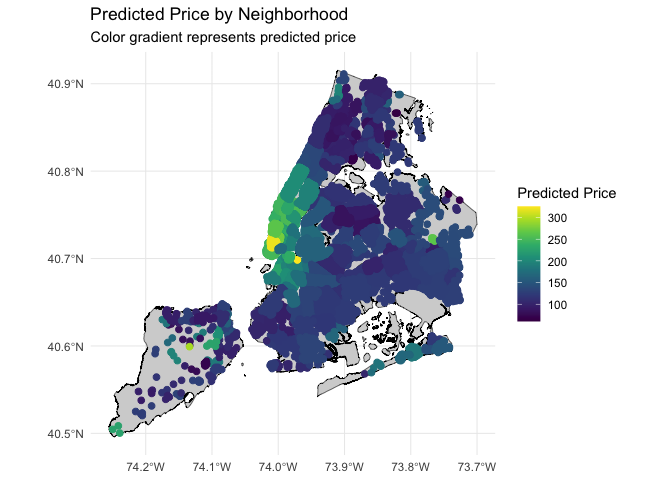

## Abstract: summarize your question, your methods, your results, and your main conclusions in a few hundred words or less.

 

## Introduction: Introduce the question you’re trying to answer at a reasonable level of detail. Give background and motivation for why it’s important.

 

## Methods: Describe your data set and the methods you will use to analyze it.

 

## Results: Tables, figures, and text that illustrate your findings. Keep the focus on the numbers here. You will interpret your results in the next section.

    ####Data Cleaning
    #remove unrelated columns
    NY_BNB <- NY_BNB[, -c(2,3,4,5,8,9,10,11,12,14,15,16,17,18,19,20,21,22,23,25,26,28,36,43,44,45,46,47,48,49,50,51,56,58,59,60,61,69,71,72,73,74)]

    #NY_BNB2 that contains only the rows of the original data frame NY_BNB
    #that do not have any missing values.
    NY_BNB2 <- NY_BNB[complete.cases(NY_BNB), ]

    #change $price to integer
    NY_BNB2$price <- as.integer(gsub("[,$]", "", NY_BNB2$price))

    #change "f,t" format to 0 and 1
    NY_BNB2$host_identity_verified <- ifelse(NY_BNB2$host_identity_verified == "t", 1, 0)
    NY_BNB2$instant_bookable <- ifelse(NY_BNB2$instant_bookable == "t", 1, 0)

    #Assumptions based on the general information:
     # only 50% of guests write review, so we multiply "reviews_per_month" by 2 to find the monthly number of guests
      #average length of stay in NY=3 nights
    #In different models, we see different assumptions for these variable; what we selected are the average of them
    #and we define them as variables to show they are changeable
    pr_review = 0.5 
    avg_stay_per_guestNY=3

    NY_BNB2 <-NY_BNB2%>%
      mutate( occupancy = reviews_per_month * avg_stay_per_guestNY * (1/pr_review) / 30)

    #although this is the closest overall model, some quantities of "occupancy" go upper than 1, we should modify:
    NY_BNB2$occupancy <- ifelse(NY_BNB2$occupancy > 1, 1, NY_BNB2$occupancy)

    # yearly revenue - multiply price * occupancy * 365
    NY_BNB2 <-NY_BNB2%>%
      mutate(yearly_revenue = 365*price*occupancy)

    # Creating dummies:
    NY_BNB2 = NY_BNB2 %>%
      mutate(shared_room = ifelse(room_type == "Shared room", 1, 0))
    NY_BNB2 = NY_BNB2 %>%
      mutate(private_room = ifelse(room_type == "Private room", 1, 0))
    NY_BNB2 = NY_BNB2 %>%
      mutate (entire_home = ifelse(room_type == "Entire home/apt", 1, 0))
    NY_BNB2 = NY_BNB2 %>%
      mutate (hotel_room = ifelse(room_type == "Hotel room", 1, 0))

    # Calculate the mean occupancy rate per neighborhood
    neighborhood_occupancy <- NY_BNB2 %>%
      group_by(neighbourhood_cleansed) %>%
      summarize(mean_occupancy = mean(occupancy, na.rm = TRUE))

    NY_BNB2 <- merge(NY_BNB2, neighborhood_occupancy, by = "neighbourhood_cleansed")
    ####the end of Data Cleaning

    ## Understanding the Data
    # Room Type
    ggplot(NY_BNB2, aes(x = room_type)) +
      geom_bar() +
      labs(x = "Room Type", y = "Frequency") 

    # Neighborhood
    ggplot(NY_BNB2, aes(x = neighbourhood_group_cleansed)) +
      geom_bar() +
      labs(x = "Neighborhood", y = "Frequency") 

    # Review Scores
    ggplot(NY_BNB2, aes(x = review_scores_rating))+
      geom_histogram() +
      labs(x = "Review Scores", y = "Frequency") 

    ## `stat_bin()` using `bins = 30`. Pick better value with `binwidth`.

    # Number of Reviews
    ggplot(NY_BNB2, aes(x = number_of_reviews))+
      geom_histogram(bins = 50) +
      labs(x = "Number of Reviews", y = "Frequency")

    # Occupancy
    ggplot(NY_BNB2, aes(x = occupancy))+
      geom_histogram(bins = 50) +
      labs(x = "Occupancy Rate", y = "Frequency")

    # Log Yearly Revenue
    ggplot(NY_BNB2, aes(x = log(yearly_revenue)))+
      geom_histogram(bins = 50) +
      labs(x = "Log Yearly Revenue", y = "Frequency")

    ## Understanding Price

    # Filter the data to the price range between 0 and 1000 USD
    filtered_data <- NY_BNB2[NY_BNB2$price >= 0 & NY_BNB2$price <= 1000, ]

    # How many data points did we remove for the filtered price dataset?
    total_observations <- nrow(NY_BNB2)
    filtered_observations <- nrow(filtered_data)
    percentage_filtered <- (total_observations - filtered_observations) / total_observations * 100
    cat("Percentage of filtered observations:", percentage_filtered, "%\n")

    ## Percentage of filtered observations: 0.6951444 %

    # We only lost ~0.7% of observations.

    # Calculate the mean price per neighborhood
    neighborhood_price <- filtered_data %>%
      group_by(neighbourhood_cleansed) %>%
      summarize(mean_price = mean(price, na.rm = TRUE))

    filtered_data <- merge(filtered_data, neighborhood_price, by = "neighbourhood_cleansed")

    # Create a histogram using ggplot2
    ggplot(filtered_data, aes(x = price)) +
      geom_histogram(binwidth = 10, color = "black", fill = "blue") +
      labs(title = "Histogram of Price Values (0 - 1000 USD)", x = "Price", y = "Frequency")

    # Boxplot by neighborhood:
    ggplot(filtered_data, aes(x = neighbourhood_group_cleansed, y = price)) +
      geom_boxplot(color = "black", fill = "blue") +
      labs(title = "Boxplot of Price by Neighborhood Group", x = "Neighborhood Group", y = "Price")

    # Price by neighborhood
    median_prices_neighborhood <- NY_BNB2 %>%
      group_by(neighbourhood_group_cleansed) %>%
      summarize(median_price = median(price))

    print(median_prices_neighborhood)

    ## # A tibble: 5 × 2
    ##   neighbourhood_group_cleansed median_price
    ##   <chr>                               <dbl>
    ## 1 Bronx                                  86
    ## 2 Brooklyn                              118
    ## 3 Manhattan                             156
    ## 4 Queens                                 90
    ## 5 Staten Island                         100

    # Yearly revenue by neighborhood
    median_revenue_neighborhood <- NY_BNB2 %>%
      group_by(neighbourhood_group_cleansed) %>%
      summarize(median_revenue = median(yearly_revenue))

    print(median_revenue_neighborhood)

    ## # A tibble: 5 × 2
    ##   neighbourhood_group_cleansed median_revenue
    ##   <chr>                                 <dbl>
    ## 1 Bronx                                 6491.
    ## 2 Brooklyn                              5261.
    ## 3 Manhattan                             4726.
    ## 4 Queens                                6970.
    ## 5 Staten Island                         8503.

    # Price by room type
    median_prices_room_type <- NY_BNB2 %>%
      group_by(room_type) %>%
      summarize(median_price = median(price))

    print(median_prices_room_type)

    ## # A tibble: 4 × 2
    ##   room_type       median_price
    ##   <chr>                  <dbl>
    ## 1 Entire home/apt          170
    ## 2 Hotel room               244
    ## 3 Private room              72
    ## 4 Shared room               54

    # Price by number of reviews, price under 1000
    ggplot(filtered_data, aes(x = price, y = number_of_reviews)) +
      geom_point() +
      labs(title = "Scatterplot of Price by Number of Reviews", x = "Price", y = "Number of Reviews")

    # Price by review score, price under 1000
    ggplot(filtered_data, aes(x = price, y = review_scores_rating)) +
      geom_point() +
      labs(title = "Scatterplot of Price by Review Score", x = "Price", y = "Review Score")

    # Price by occupancy rate, price under 1000
    ggplot(filtered_data, aes(x = price, y = occupancy)) +
      geom_point() +
      labs(title = "Scatterplot of Price by Occupancy", x = "Price", y = "Occupancy")

    # Occupancy rate by review score
    ggplot(filtered_data, aes(x = occupancy, y = review_scores_rating)) +
      geom_point() +
      labs(title = "Scatterplot of Occupancy by Review Score", x = "Occupancy", y = "Review Score")

    ## Predicting Occupancy
    ############## the below codes have to be modified
    set.seed(1)
    NY_BNB2_split =  initial_split(NY_BNB2, prop=0.8)
    NY_BNB2_train = training(NY_BNB2_split)
    NY_BNB2_test  = testing(NY_BNB2_split)

    model <- lm(occupancy ~ review_scores_rating + price+bedrooms+neighbourhood_group_cleansed+property_type, data = NY_BNB2_train)

    # Convert property_type to a factor with the same levels as in the training data set
    NY_BNB2_test$property_type <- factor(NY_BNB2_test$property_type, levels = levels(NY_BNB2$property_type))

    # Calculate RMSE using modelr::rmse()
    modelr::rmse(model, NY_BNB2_test)

    ## [1] NaN

    # fit a single tree
    BNB.tree = rpart(occupancy ~ review_scores_rating + price+bedrooms+accommodates+host_identity_verified,
                           data=NY_BNB2_train, control = rpart.control(cp = 0.00001))
    modelr::rmse(BNB.tree, NY_BNB2_test)

    ## [1] 0.2488372

    # boosted model
    boost = gbm(occupancy ~ latitude + longitude + host_identity_verified + accommodates + bedrooms + price + number_of_reviews + review_scores_rating + shared_room + private_room + entire_home + hotel_room, data=NY_BNB2, distribution = "gaussian", interaction.depth=6, n.trees=2000, shrinkage=.05, cv.folds = 2)
    modelr::rmse(boost, NY_BNB2_test)

    ## Using 1193 trees...

    ## [1] 0.1791089

    # PCA ?

    # Clustering ?

    #add predictions to data
    NY_BNB2 = NY_BNB2 %>%
      mutate(occupancy_boost_pred = predict(boost, n.trees = 1182))

    # Calculate the mean predicted occupancy rate per neighborhood
    neighborhood_pred_occupancy <- NY_BNB2 %>%
      group_by(neighbourhood_cleansed) %>%
      summarize(mean_predicted_occupancy = mean(occupancy_boost_pred, na.rm = TRUE))
    # Merge the data frames by the common column 'neighbourhood_cleansed'
    NY_BNB2 <- merge(NY_BNB2, neighborhood_pred_occupancy, by = "neighbourhood_cleansed")

    #create error measurements
    NY_BNB2 <- NY_BNB2 %>%
      mutate("resid" = abs(mean_predicted_occupancy - mean_occupancy))%>%
      mutate("percentErr" = resid/mean_occupancy)

    # Filter outliers for better mapping
    NY_BNB3 <- NY_BNB2[NY_BNB2$percentErr >= 0 & NY_BNB2$percentErr <= 5, ]

    ## Predicting Price ($0-1000)
    set.seed(1)
    filtered_data_split =  initial_split(filtered_data, prop=0.8)
    filtered_data_train = training(filtered_data_split)
    filtered_data_test  = testing(filtered_data_split)

    model1 <- lm(price ~ review_scores_rating + occupancy+bedrooms+neighbourhood_group_cleansed+property_type, data = filtered_data_train)

    # fit a single tree
    BNB.tree1 = rpart(price ~ review_scores_rating + occupancy+bedrooms+accommodates+host_identity_verified,
                           data=filtered_data_train, control = rpart.control(cp = 0.00001))
    modelr::rmse(BNB.tree1, filtered_data_test)

    ## [1] 114.1128

    # boosted model
    boost1 = gbm(price ~ latitude + longitude + host_identity_verified + accommodates + bedrooms + occupancy + number_of_reviews + review_scores_rating + shared_room + private_room + entire_home + hotel_room, data=filtered_data, distribution = "gaussian", interaction.depth=6, n.trees=1000, shrinkage=.05, cv.folds = 2)
    modelr::rmse(boost1, filtered_data_test)

    ## Using 857 trees...

    ## [1] 77.98834

    #add predictions to data
    filtered_data = filtered_data %>%
      mutate(price_boost1_pred = predict(boost1, n.trees = 692))

    # Calculate the mean predicted price per neighborhood
    neighborhood_pred_price <- filtered_data %>%
      group_by(neighbourhood_cleansed) %>%
      summarize(mean_predicted_price = mean(price_boost1_pred, na.rm = TRUE))
    # Merge the data frames by the common column 'neighbourhood_cleansed'
    filtered_data <- merge(filtered_data, neighborhood_pred_price, by = "neighbourhood_cleansed")

    #create error measurements
    filtered_data <- filtered_data %>%
      mutate("resid1" = abs(mean_predicted_price - mean_price))%>%
      mutate("percentErr1" = resid1/mean_price)

    # Filter outliers for better mapping
    filtered_data1 <- filtered_data[filtered_data$percentErr1 >= 0 & filtered_data$percentErr1 <= 5, ]

    ## Predicting Occupancy with Text

    ## Geography of Price and Occupancy
    library(plotly)

    ## 
    ## Attaching package: 'plotly'

    ## The following object is masked from 'package:ggmap':
    ## 
    ##     wind

    ## The following object is masked from 'package:mosaic':
    ## 
    ##     do

    ## The following object is masked from 'package:igraph':
    ## 
    ##     groups

    ## The following object is masked from 'package:ggplot2':
    ## 
    ##     last_plot

    ## The following object is masked from 'package:stats':
    ## 
    ##     filter

    ## The following object is masked from 'package:graphics':
    ## 
    ##     layout

    NY_BNB_sf <- st_as_sf(NY_BNB3, coords = c("longitude", "latitude"), crs = 4326)
    filtered_data1_sf <- st_as_sf(filtered_data1, coords = c("longitude", "latitude"), crs = 4326)

    geojson_file <- "/Users/jack/Documents/GitHub/Data-Mining-Statistical-Learning/Final Project/Borough_Boundaries.geojson"

    # Read the GeoJSON file
    nyc_shapefile <- st_read(geojson_file)

    ## Reading layer `Borough_Boundaries' from data source 
    ##   `/Users/jack/Documents/GitHub/Data-Mining-Statistical-Learning/Final Project/Borough_Boundaries.geojson' 
    ##   using driver `GeoJSON'
    ## Simple feature collection with 5 features and 4 fields
    ## Geometry type: MULTIPOLYGON
    ## Dimension:     XY
    ## Bounding box:  xmin: -74.25559 ymin: 40.49613 xmax: -73.70001 ymax: 40.91553
    ## Geodetic CRS:  WGS 84

    nyc_shapefile1 <- nyc_shapefile %>%
      st_transform(crs = st_crs(NY_BNB_sf))
    nyc_shapefile2 <- nyc_shapefile %>%
      st_transform(crs = st_crs(filtered_data1_sf))

    # Predicted Occupancy by neighborhood
    ggplot() +
      geom_sf(data = nyc_shapefile1, fill = "lightgray", color = "black", size = 0.2) +
      geom_sf(data = NY_BNB_sf, aes(color = mean_predicted_occupancy), size = 2) +
      scale_color_gradientn(colours = viridisLite::viridis(10), name = "Predicted Occupancy Rate") +
      theme_minimal() +
      labs(title = "Predicted Occupancy Rates by Neighborhood",
           subtitle = "Color gradient represents predicted occupancy rates",
           color = "Predicted Occupancy Rate")

    # True Occupancy by Neighborhood
    ggplot() +
      geom_sf(data = nyc_shapefile1, fill = "lightgray", color = "black", size = 0.2) +
      geom_sf(data = NY_BNB_sf, aes(color = mean_occupancy), size = 2) +
      scale_color_gradientn(colours = viridisLite::viridis(10), name = "True Occupancy Rate") +
      theme_minimal() +
      labs(title = "True Occupancy Rates by Neighborhood",
           subtitle = "Color gradient represents true occupancy rates",
           color = "True Occupancy Rate")

    # Residual Error of Occupancy
    ggplot() +
      geom_sf(data = nyc_shapefile1, fill = "lightgray", color = "black", size = 0.2) +
      geom_sf(data = NY_BNB_sf, aes(color = 100*percentErr), size = 2) +
      scale_color_gradientn(colours = viridisLite::plasma(10), name = "Residual Error Rate") +
      theme_minimal() +
      labs(title = "Residual Error Rate - Occupancy",
           subtitle = "Color gradient represents residual error rates",
           color = "Residual Error Rate")

    ## Mapping Price
    # Predicted Price by Neighborhood
    ggplot() +
      geom_sf(data = nyc_shapefile2, fill = "lightgray", color = "black", size = 0.2) +
      geom_sf(data = filtered_data1_sf, aes(color = mean_predicted_price), size = 2) +
      scale_color_gradientn(colours = viridisLite::viridis(10), name = "Predicted Price") +
      theme_minimal() +
      labs(title = "Predicted Price by Neighborhood",
           subtitle = "Color gradient represents predicted price",
           color = "Predicted Price")

    # True Price by Neighborhood
    ggplot() +
      geom_sf(data = nyc_shapefile2, fill = "lightgray", color = "black", size = 0.2) +
      geom_sf(data = filtered_data1_sf, aes(color = mean_price), size = 2) +
      scale_color_gradientn(colours = viridisLite::viridis(10), name = "True Price") +
      theme_minimal() +
      labs(title = "True Price by Neighborhood",
           subtitle = "Color gradient represents true price",
           color = "True Price")

    # Residual Error of Price
    ggplot() +
      geom_sf(data = nyc_shapefile2, fill = "lightgray", color = "black", size = 0.2) +
      geom_sf(data = filtered_data1_sf, aes(color = 100*percentErr1), size = 2) +
      scale_color_gradientn(colours = viridisLite::plasma(10), name = "Residual Error Rate") +
      theme_minimal() +
      labs(title = "Residual Error Rate - Price",
           subtitle = "Color gradient represents residual error rates",
           color = "Residual Error Rate")

 

## Conclusion: Interpret what you found. What are the main lessons we should take away from your report?
