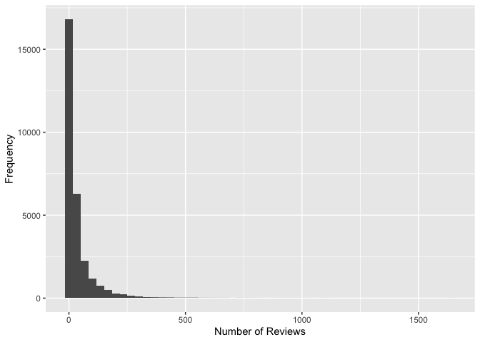
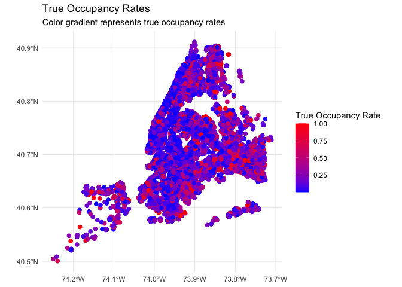

    ####Data Cleaning
    #remove unrelated columns
    NY_BNB <- NY_BNB[, -c(2,3,4,5,8,9,10,11,12,14,15,16,17,18,19,20,21,22,23,25,26,28,36,43,44,45,46,47,48,49,50,51,56,58,59,60,61,69,71,72,73,74)]

    #NY_BNB2 that contains only the rows of the original data frame NY_BNB
    #that do not have any missing values.
    NY_BNB2 <- NY_BNB[complete.cases(NY_BNB), ]

    #change $price to integer
    NY_BNB2$price <- as.integer(gsub("[,$]", "", NY_BNB2$price))

    #change "f,t" format to 0 and 1
    NY_BNB2$host_identity_verified <- ifelse(NY_BNB2$host_identity_verified == "t", 1, 0)
    NY_BNB2$instant_bookable <- ifelse(NY_BNB2$instant_bookable == "t", 1, 0)

    #Assumptions based on the general information:
     # only 50% of guests write review, so we multiply "reviews_per_month" by 2 to find the monthly number of guests
      #average length of stay in NY=3 nights
    #In different models, we see different assumptions for these variable; what we selected are the average of them
    #and we define them as variables to show they are changeable
    pr_review = 0.5 
    avg_stay_per_guestNY=3

    NY_BNB2 <-NY_BNB2%>%
      mutate( occupancy = reviews_per_month * avg_stay_per_guestNY * (1/pr_review) / 30)

    #although this is the closest overall model, some quantities of "occupancy" go upper than 1, we should modify:
    NY_BNB2$occupancy <- ifelse(NY_BNB2$occupancy > 1, 1, NY_BNB2$occupancy)

    # Creating dummies:
    NY_BNB2 = NY_BNB2 %>%
      mutate(shared_room = ifelse(room_type == "Shared room", 1, 0))
    NY_BNB2 = NY_BNB2 %>%
      mutate(private_room = ifelse(room_type == "Private room", 1, 0))
    NY_BNB2 = NY_BNB2 %>%
      mutate (entire_home = ifelse(room_type == "Entire home/apt", 1, 0))
    NY_BNB2 = NY_BNB2 %>%
      mutate (hotel_room = ifelse(room_type == "Hotel room", 1, 0))
    ####the end of Data Cleaning

    view(NY_BNB2)

    ## Understanding Price

    # Create a histogram using ggplot2
    ggplot(NY_BNB2, aes(x = price)) +
      geom_histogram(binwidth = 10, color = "black", fill = "blue") +
      labs(title = "Histogram of Price Values", x = "Price", y = "Frequency")

    # Filter the data to the price range between 0 and 1000 USD
    filtered_data <- NY_BNB2[NY_BNB2$price >= 0 & NY_BNB2$price <= 1000, ]

    # Create a histogram using ggplot2
    ggplot(filtered_data, aes(x = price)) +
      geom_histogram(binwidth = 10, color = "black", fill = "blue") +
      labs(title = "Histogram of Price Values (0 - 1000 USD)", x = "Price", y = "Frequency")

    # Boxplot by neighborhood:
    ggplot(NY_BNB2, aes(x = neighbourhood_group_cleansed, y = price)) +
      geom_boxplot(color = "black", fill = "blue") +
      labs(title = "Boxplot of Price by Neighborhood Group", x = "Neighborhood Group", y = "Price")

    # Price by neighborhood
    median_prices_neighborhood <- NY_BNB2 %>%
      group_by(neighbourhood_group_cleansed) %>%
      summarize(median_price = median(price))

    print(median_prices_neighborhood)

    ## # A tibble: 5 × 2
    ##   neighbourhood_group_cleansed median_price
    ##   <chr>                               <dbl>
    ## 1 Bronx                                  86
    ## 2 Brooklyn                              118
    ## 3 Manhattan                             156
    ## 4 Queens                                 90
    ## 5 Staten Island                         100

    # Price by room type
    median_prices_room_type <- NY_BNB2 %>%
      group_by(room_type) %>%
      summarize(median_price = median(price))

    print(median_prices_room_type)

    ## # A tibble: 4 × 2
    ##   room_type       median_price
    ##   <chr>                  <dbl>
    ## 1 Entire home/apt          170
    ## 2 Hotel room               244
    ## 3 Private room              72
    ## 4 Shared room               54

    # Price by number of reviews, price under 1000
    ggplot(filtered_data, aes(x = price, y = number_of_reviews)) +
      geom_point() +
      labs(title = "Scatterplot of Price by Number of Reviews", x = "Price", y = "Number of Reviews")

    # Price by occupancy rate, price under 1000
    ggplot(filtered_data, aes(x = price, y = occupancy)) +
      geom_point() +
      labs(title = "Scatterplot of Price by Occupancy", x = "Price", y = "Occupancy")

    ## Predicting Occupancy
    ############## the below codes have to be modified
    set.seed(1)
    NY_BNB2_split =  initial_split(NY_BNB2, prop=0.8)
    NY_BNB2_train = training(NY_BNB2_split)
    NY_BNB2_test  = testing(NY_BNB2_split)

    model <- lm(occupancy ~ review_scores_rating + price+bedrooms+neighbourhood_group_cleansed+property_type, data = NY_BNB2_train)

    # Convert property_type to a factor with the same levels as in the training data set
    NY_BNB2_test$property_type <- factor(NY_BNB2_test$property_type, levels = levels(NY_BNB2$property_type))

    # Calculate RMSE using modelr::rmse()
    modelr::rmse(model, NY_BNB2_test)

    ## [1] NaN

    # View the model summary
    summary(model)        

    ## 
    ## Call:
    ## lm(formula = occupancy ~ review_scores_rating + price + bedrooms + 
    ##     neighbourhood_group_cleansed + property_type, data = NY_BNB2_train)
    ## 
    ## Residuals:
    ##     Min      1Q  Median      3Q     Max 
    ## -0.4682 -0.1767 -0.1013  0.1121  0.8654 
    ## 
    ## Coefficients:
    ##                                                   Estimate Std. Error t value
    ## (Intercept)                                      1.536e-01  2.554e-01   0.602
    ## review_scores_rating                             4.539e-02  3.552e-03  12.780
    ## price                                            1.538e-06  1.790e-06   0.859
    ## bedrooms                                         1.549e-02  2.549e-03   6.076
    ## neighbourhood_group_cleansedBrooklyn            -7.125e-02  8.458e-03  -8.424
    ## neighbourhood_group_cleansedManhattan           -9.889e-02  8.612e-03 -11.483
    ## neighbourhood_group_cleansedQueens              -9.261e-03  8.945e-03  -1.035
    ## neighbourhood_group_cleansedStaten Island       -3.045e-02  1.759e-02  -1.731
    ## property_typeCamper/RV                           1.432e-01  2.940e-01   0.487
    ## property_typeCasa particular                    -3.044e-03  2.636e-01  -0.012
    ## property_typeCave                               -2.984e-01  3.601e-01  -0.829
    ## property_typeEntire bungalow                    -2.458e-02  2.643e-01  -0.093
    ## property_typeEntire condo                       -9.659e-02  2.548e-01  -0.379
    ## property_typeEntire cottage                      1.307e-01  2.750e-01   0.475
    ## property_typeEntire guest suite                  8.519e-02  2.552e-01   0.334
    ## property_typeEntire guesthouse                   5.648e-02  2.572e-01   0.220
    ## property_typeEntire home                        -2.996e-02  2.548e-01  -0.118
    ## property_typeEntire loft                        -9.391e-02  2.549e-01  -0.368
    ## property_typeEntire place                       -5.150e-02  2.587e-01  -0.199
    ## property_typeEntire rental unit                 -9.496e-02  2.546e-01  -0.373
    ## property_typeEntire serviced apartment          -1.001e-01  2.553e-01  -0.392
    ## property_typeEntire townhouse                   -7.781e-02  2.549e-01  -0.305
    ## property_typeEntire vacation home                8.879e-02  2.575e-01   0.345
    ## property_typeEntire villa                       -1.203e-01  2.723e-01  -0.442
    ## property_typeFloor                              -1.795e-01  2.750e-01  -0.653
    ## property_typeHouseboat                           6.498e-03  2.790e-01   0.023
    ## property_typeLighthouse                         -3.572e-01  3.601e-01  -0.992
    ## property_typePrivate room                       -5.211e-02  2.595e-01  -0.201
    ## property_typePrivate room in bed and breakfast   5.827e-02  2.573e-01   0.226
    ## property_typePrivate room in bungalow            1.110e-01  2.701e-01   0.411
    ## property_typePrivate room in casa particular    -3.042e-02  2.569e-01  -0.118
    ## property_typePrivate room in condo              -7.431e-02  2.550e-01  -0.291
    ## property_typePrivate room in earthen home       -2.882e-01  2.940e-01  -0.980
    ## property_typePrivate room in farm stay           4.194e-02  3.122e-01   0.134
    ## property_typePrivate room in guest suite        -1.903e-02  2.563e-01  -0.074
    ## property_typePrivate room in guesthouse         -1.218e-01  2.604e-01  -0.468
    ## property_typePrivate room in home               -9.717e-02  2.547e-01  -0.381
    ## property_typePrivate room in hostel             -1.353e-01  2.751e-01  -0.492
    ## property_typePrivate room in houseboat          -1.548e-01  3.118e-01  -0.496
    ## property_typePrivate room in loft               -1.257e-01  2.554e-01  -0.492
    ## property_typePrivate room in rental unit        -1.186e-01  2.546e-01  -0.466
    ## property_typePrivate room in resort             -2.552e-01  2.651e-01  -0.963
    ## property_typePrivate room in serviced apartment -4.503e-03  2.573e-01  -0.018
    ## property_typePrivate room in tent               -2.451e-01  3.601e-01  -0.681
    ## property_typePrivate room in tower               1.239e-01  3.602e-01   0.344
    ## property_typePrivate room in townhouse          -1.067e-01  2.548e-01  -0.419
    ## property_typePrivate room in vacation home      -1.486e-01  2.847e-01  -0.522
    ## property_typePrivate room in villa              -2.560e-01  2.750e-01  -0.931
    ## property_typeRoom in aparthotel                  1.349e-01  2.625e-01   0.514
    ## property_typeRoom in boutique hotel             -5.200e-02  2.554e-01  -0.204
    ## property_typeRoom in hotel                       2.136e-02  2.551e-01   0.084
    ## property_typeRoom in resort                     -2.442e-01  3.601e-01  -0.678
    ## property_typeRoom in serviced apartment         -2.402e-01  2.684e-01  -0.895
    ## property_typeShared room in bungalow            -3.148e-01  3.601e-01  -0.874
    ## property_typeShared room in casa particular     -1.681e-01  3.602e-01  -0.467
    ## property_typeShared room in condo               -1.548e-01  2.650e-01  -0.584
    ## property_typeShared room in guesthouse          -1.004e-01  3.119e-01  -0.322
    ## property_typeShared room in home                -9.022e-02  2.585e-01  -0.349
    ## property_typeShared room in loft                -9.677e-02  2.613e-01  -0.370
    ## property_typeShared room in rental unit         -1.308e-01  2.552e-01  -0.513
    ## property_typeShared room in serviced apartment  -2.724e-01  2.847e-01  -0.957
    ## property_typeShared room in townhouse           -1.894e-01  2.750e-01  -0.689
    ## property_typeShared room in vacation home       -3.120e-01  3.601e-01  -0.866
    ## property_typeTiny home                           3.347e-01  2.750e-01   1.217
    ##                                                 Pr(>|t|)    
    ## (Intercept)                                       0.5475    
    ## review_scores_rating                             < 2e-16 ***
    ## price                                             0.3903    
    ## bedrooms                                        1.25e-09 ***
    ## neighbourhood_group_cleansedBrooklyn             < 2e-16 ***
    ## neighbourhood_group_cleansedManhattan            < 2e-16 ***
    ## neighbourhood_group_cleansedQueens                0.3005    
    ## neighbourhood_group_cleansedStaten Island         0.0834 .  
    ## property_typeCamper/RV                            0.6262    
    ## property_typeCasa particular                      0.9908    
    ## property_typeCave                                 0.4072    
    ## property_typeEntire bungalow                      0.9259    
    ## property_typeEntire condo                         0.7046    
    ## property_typeEntire cottage                       0.6346    
    ## property_typeEntire guest suite                   0.7385    
    ## property_typeEntire guesthouse                    0.8262    
    ## property_typeEntire home                          0.9064    
    ## property_typeEntire loft                          0.7126    
    ## property_typeEntire place                         0.8422    
    ## property_typeEntire rental unit                   0.7092    
    ## property_typeEntire serviced apartment            0.6951    
    ## property_typeEntire townhouse                     0.7602    
    ## property_typeEntire vacation home                 0.7302    
    ## property_typeEntire villa                         0.6586    
    ## property_typeFloor                                0.5139    
    ## property_typeHouseboat                            0.9814    
    ## property_typeLighthouse                           0.3213    
    ## property_typePrivate room                         0.8408    
    ## property_typePrivate room in bed and breakfast    0.8208    
    ## property_typePrivate room in bungalow             0.6812    
    ## property_typePrivate room in casa particular      0.9057    
    ## property_typePrivate room in condo                0.7707    
    ## property_typePrivate room in earthen home         0.3270    
    ## property_typePrivate room in farm stay            0.8931    
    ## property_typePrivate room in guest suite          0.9408    
    ## property_typePrivate room in guesthouse           0.6399    
    ## property_typePrivate room in home                 0.7029    
    ## property_typePrivate room in hostel               0.6229    
    ## property_typePrivate room in houseboat            0.6196    
    ## property_typePrivate room in loft                 0.6226    
    ## property_typePrivate room in rental unit          0.6413    
    ## property_typePrivate room in resort               0.3356    
    ## property_typePrivate room in serviced apartment   0.9860    
    ## property_typePrivate room in tent                 0.4962    
    ## property_typePrivate room in tower                0.7309    
    ## property_typePrivate room in townhouse            0.6753    
    ## property_typePrivate room in vacation home        0.6018    
    ## property_typePrivate room in villa                0.3520    
    ## property_typeRoom in aparthotel                   0.6074    
    ## property_typeRoom in boutique hotel               0.8386    
    ## property_typeRoom in hotel                        0.9333    
    ## property_typeRoom in resort                       0.4978    
    ## property_typeRoom in serviced apartment           0.3709    
    ## property_typeShared room in bungalow              0.3819    
    ## property_typeShared room in casa particular       0.6408    
    ## property_typeShared room in condo                 0.5592    
    ## property_typeShared room in guesthouse            0.7474    
    ## property_typeShared room in home                  0.7271    
    ## property_typeShared room in loft                  0.7111    
    ## property_typeShared room in rental unit           0.6083    
    ## property_typeShared room in serviced apartment    0.3387    
    ## property_typeShared room in townhouse             0.4911    
    ## property_typeShared room in vacation home         0.3863    
    ## property_typeTiny home                            0.2237    
    ## ---
    ## Signif. codes:  0 '***' 0.001 '**' 0.01 '*' 0.05 '.' 0.1 ' ' 1
    ## 
    ## Residual standard error: 0.2546 on 22952 degrees of freedom
    ## Multiple R-squared:  0.05378,    Adjusted R-squared:  0.05118 
    ## F-statistic: 20.71 on 63 and 22952 DF,  p-value: < 2.2e-16

    modelr::rmse(model, NY_BNB2_test)

    ## [1] NaN

    # fit a single tree
    BNB.tree = rpart(occupancy ~ review_scores_rating + price+bedrooms+accommodates+host_identity_verified,
                           data=NY_BNB2_train, control = rpart.control(cp = 0.00001))
    modelr::rmse(BNB.tree, NY_BNB2_test)

    ## [1] 0.2473033

    # boosted model
    boost = gbm(occupancy ~ latitude + longitude + host_identity_verified + accommodates + bedrooms + price + number_of_reviews + review_scores_rating + shared_room + private_room + entire_home + hotel_room, data=NY_BNB2, distribution = "gaussian", interaction.depth=6, n.trees=5000, shrinkage=.05, cv.folds = 2)
    modelr::rmse(boost, NY_BNB2_test)

    ## Using 1182 trees...

    ## [1] 0.1762218

    #add predictions to data
    NY_BNB2 = NY_BNB2 %>%
      mutate(occupancy_boost_pred = predict(boost, n.trees = 1400))

    #create error measurements
    NY_BNB2 <- NY_BNB2 %>%
      mutate("resid" = abs(occupancy_boost_pred - occupancy))%>%
      mutate("percentErr" = resid/occupancy)

    ## Predicting Price ($0-1000)
    set.seed(1)
    filtered_data_split =  initial_split(filtered_data, prop=0.8)
    filtered_data_train = training(filtered_data_split)
    filtered_data_test  = testing(filtered_data_split)

    model1 <- lm(price ~ review_scores_rating + occupancy+bedrooms+neighbourhood_group_cleansed+property_type, data = filtered_data_train)

    # fit a single tree
    BNB.tree1 = rpart(price ~ review_scores_rating + occupancy+bedrooms+accommodates+host_identity_verified,
                           data=filtered_data_train, control = rpart.control(cp = 0.00001))
    modelr::rmse(BNB.tree1, filtered_data_test)

    ## [1] 111.8626

    # boosted model
    boost1 = gbm(price ~ latitude + longitude + host_identity_verified + accommodates + bedrooms + occupancy + number_of_reviews + review_scores_rating + shared_room + private_room + entire_home + hotel_room, data=filtered_data, distribution = "gaussian", interaction.depth=6, n.trees=5000, shrinkage=.05, cv.folds = 2)
    modelr::rmse(boost1, filtered_data_test)

    ## Using 692 trees...

    ## [1] 78.6502

    #add predictions to data
    filtered_data = filtered_data %>%
      mutate(price_boost1_pred = predict(boost1, n.trees = 692))

    #create error measurements
    filtered_data <- filtered_data %>%
      mutate("resid1" = abs(price_boost1_pred - price))%>%
      mutate("percentErr1" = resid1/price)

    # Filter outliers for better mapping
    filtered_data1 <- filtered_data[filtered_data$percentErr1 >= 0 & filtered_data$percentErr1 <= 2, ]

    ## Predicting Occupancy with Text

    ## Geography of Price and Occupancy
    library(plotly)

    ## 
    ## Attaching package: 'plotly'

    ## The following object is masked from 'package:ggmap':
    ## 
    ##     wind

    ## The following object is masked from 'package:mosaic':
    ## 
    ##     do

    ## The following object is masked from 'package:igraph':
    ## 
    ##     groups

    ## The following object is masked from 'package:ggplot2':
    ## 
    ##     last_plot

    ## The following object is masked from 'package:stats':
    ## 
    ##     filter

    ## The following object is masked from 'package:graphics':
    ## 
    ##     layout

    NY_BNB2_sf <- st_as_sf(NY_BNB2, coords = c("longitude", "latitude"), crs = 4326)
    filtered_data1_sf <- st_as_sf(filtered_data1, coords = c("longitude", "latitude"), crs = 4326)

    # Predicted Occupancy
    ggplot() +
      geom_sf(data = NY_BNB2_sf, aes(color = occupancy_boost_pred), size = 2) +
      scale_color_gradient(low = "blue", high = "red") +
      labs(title = "Predicted Occupancy Rates",
           subtitle = "Color gradient represents predicted occupancy rates",
           color = "Predicted Occupancy Rate") +
      theme_minimal()

    # True Occupancy
    ggplot() +
      geom_sf(data = NY_BNB2_sf, aes(color = occupancy), size = 2) +
      scale_color_gradient(low = "blue", high = "red") +
      labs(title = "True Occupancy Rates",
           subtitle = "Color gradient represents true occupancy rates",
           color = "True Occupancy Rate") +
      theme_minimal()

    # Residual Error of Occupancy
    ggplot() +
      geom_sf(data = NY_BNB2_sf, aes(color = 100*percentErr), size = 2) +
      scale_color_gradient(low = "yellow", high = "purple") +
      labs(title = "Residual Error Rate - Occupancy",
           subtitle = "Color gradient represents residual error rates",
           color = "Residual Error Rate") +
      theme_minimal()

    ## Mapping Price
    # Predicted Price
    ggplot() +
      geom_sf(data = filtered_data1_sf, aes(color = price_boost1_pred), size = 2) +
      scale_color_gradient(low = "blue", high = "red") +
      labs(title = "Predicted Price",
           subtitle = "Color gradient represents predicted price",
           color = "Predicted Price") +
      theme_minimal()

    # True Price
    ggplot() +
      geom_sf(data = filtered_data1_sf, aes(color = price), size = 2) +
      scale_color_gradient(low = "blue", high = "red") +
      labs(title = "True Price",
           subtitle = "Color gradient represents true price",
           color = "True Price") +
      theme_minimal()

    # Residual Error of Price
    ggplot() +
      geom_sf(data = filtered_data1_sf, aes(color = 100*percentErr1), size = 2) +
      scale_color_gradient(low = "yellow", high = "purple") +
      labs(title = "Residual Error Rate - Price",
           subtitle = "Color gradient represents residual error rates",
           color = "Residual Error Rate") +
      theme_minimal()

