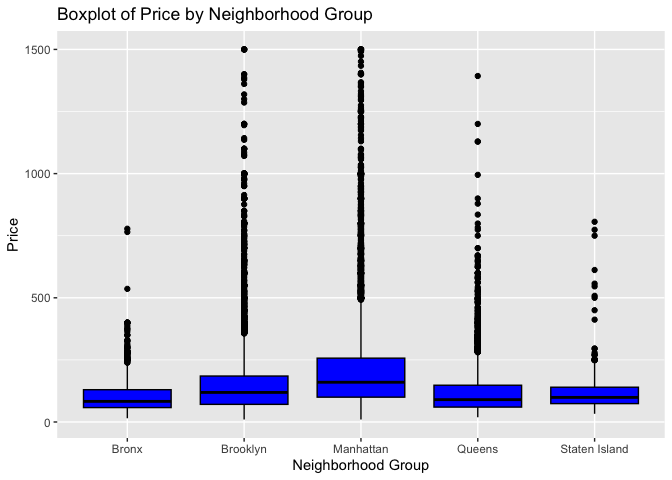
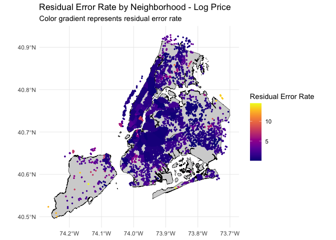

## Abstract: summarize your question, your methods, your results, and your main conclusions in a few hundred words or less.

 

## Introduction: Introduce the question you’re trying to answer at a reasonable level of detail. Give background and motivation for why it’s important.

The rise of the sharing economy has transformed the way people travel
and seek accommodations. Platforms such as Airbnb have gained popularity
by allowing property owners to rent out their homes or rooms to
travelers, offering an alternative to traditional hotels. New York City,
being one of the world’s most visited cities, has experienced
significant growth in its Airbnb market. Accurate prediction of Airbnb
prices is essential for hosts to optimize their revenue and for
travelers to make informed decisions when selecting accommodations. This
project aims to examine the factors connected to Airbnb prices in New
York City, focusing on the role of spatial features.

In this project, we employ machine learning techniques, including LASSO
regression, random forest, and gradient boosting, to predict Airbnb
prices based on a comprehensive set of variables. We leverage clustering
algorithms, ie. DBSCAN, to capture spatial patterns in the data and map
predicted vs. actual prices. By doing so, we aim to enhance our
understanding of the factors driving Airbnb prices in New York City and
provide valuable insights for hosts and travelers alike.

 

## Methods: Describe your data set and the methods you will use to analyze it.

 

## Results: Tables, figures, and text that illustrate your findings. Keep the focus on the numbers here. You will interpret your results in the next section.

    ## Percentage of filtered observations: 0.4023678 %

    ## # A tibble: 5 × 2
    ##   neighbourhood_group_cleansed median_price
    ##   <chr>                               <dbl>
    ## 1 Bronx                                  83
    ## 2 Brooklyn                              119
    ## 3 Manhattan                             160
    ## 4 Queens                                 90
    ## 5 Staten Island                          99

    ## # A tibble: 4 × 2
    ##   room_type       median_price
    ##   <chr>                  <dbl>
    ## 1 Entire home/apt          177
    ## 2 Hotel room               307
    ## 3 Private room              75
    ## 4 Shared room               60

    ## # A tibble: 4 × 2
    ##   season median_price
    ##   <chr>         <dbl>
    ## 1 fall            128
    ## 2 spring          120
    ## 3 summer          121
    ## 4 winter          130

    ## [1] 0.4309089

    ## [1] 0.4422697

    ## [1] 0.3267469

    ## [1] 0.336413

<table>
<caption>RMSE of each model (log price)</caption>
<thead>
<tr class="header">
<th style="text-align: left;">model</th>
<th style="text-align: right;">RMSE</th>
</tr>
</thead>
<tbody>
<tr class="odd">
<td style="text-align: left;">lm2</td>
<td style="text-align: right;">0.4814699</td>
</tr>
<tr class="even">
<td style="text-align: left;">lm_lasso1</td>
<td style="text-align: right;">0.4309089</td>
</tr>
<tr class="odd">
<td style="text-align: left;">BNB.tree1</td>
<td style="text-align: right;">0.4422697</td>
</tr>
<tr class="even">
<td style="text-align: left;">BNB.forest1</td>
<td style="text-align: right;">0.3267469</td>
</tr>
<tr class="odd">
<td style="text-align: left;">BNB.boost1</td>
<td style="text-align: right;">0.3364130</td>
</tr>
</tbody>
</table>

RMSE of each model (log price)

    ## Reading layer `Borough_Boundaries' from data source 
    ##   `/Users/jack/Documents/GitHub/Data-Mining-Statistical-Learning/Final Project/Borough_Boundaries.geojson' 
    ##   using driver `GeoJSON'
    ## Simple feature collection with 5 features and 4 fields
    ## Geometry type: MULTIPOLYGON
    ## Dimension:     XY
    ## Bounding box:  xmin: -74.25559 ymin: 40.49613 xmax: -73.70001 ymax: 40.91553
    ## Geodetic CRS:  WGS 84

 

## Conclusion: Interpret what you found. What are the main lessons we should take away from your report?
