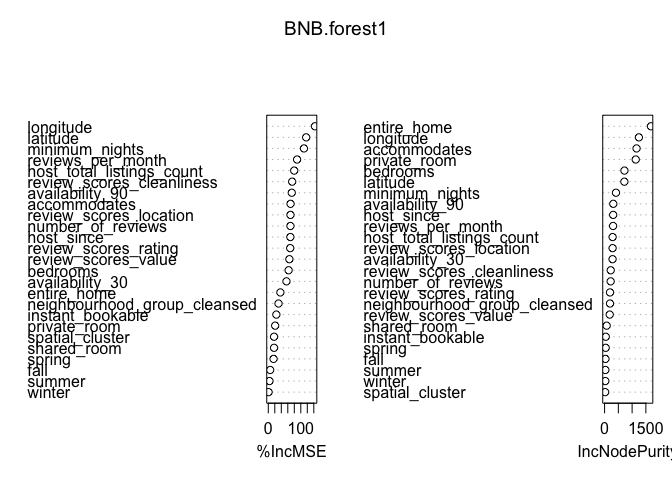
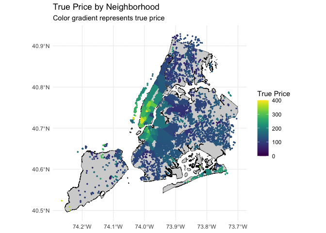

## Abstract:

*summarize your question, your methods, your results, and your main
conclusions in a few hundred words or less.*

 

## Introduction:

*Introduce the question you’re trying to answer at a reasonable level of
detail. Give background and motivation for why it’s important.*

The rise of the sharing economy has transformed the way people travel
and seek accommodations. Platforms such as Airbnb have gained popularity
by allowing property owners to rent out their homes or rooms to
travelers, offering an alternative to traditional hotels. New York City,
being one of the world’s most visited cities, has experienced
significant growth in its Airbnb market. Accurate prediction of Airbnb
prices is essential for hosts to optimize their revenue and for
travelers to make informed decisions when selecting accommodations. This
project aims to examine the factors connected to Airbnb prices in New
York City, focusing on the role of spatial features.

In this project, we employ machine learning techniques, including LASSO
regression, random forest, and gradient boosting, to predict Airbnb
prices based on a comprehensive set of variables. We leverage clustering
algorithms, ie. DBSCAN, to capture spatial patterns in the data and map
predicted vs. actual prices. By doing so, we aim to enhance our
understanding of the factors driving Airbnb prices in New York City and
provide valuable insights for hosts and travelers alike.

 

## Methods:

*Describe your data set and the methods you will use to analyze it.*

### Data

We have four datasets that we’ve combined into one. Each dataset
contains the entire set of scraped NYC AirBnB listings at the following
dates: June 15, 2022; September 15, 2022; December 15, 2022; and March
15, 2023. The data contain 70+ variables and more than 160,000 total
observations (roughly 40,000 per quarter). These data come from
InsideAirbnb: <http://insideairbnb.com/get-the-data/>.

We made some important modifications to the dataset in order to meet our
needs: - Creating dummy variables for each season (June is summer,
September is fall, December is winter, and March is spring), depending
on which initial dataset the observation came from. - Modifying the
host\_since variable to provide a number of years since the start of the
host’s presence on AirBnB. - Removing roughly half the columns which we
did not use in our analysis. - Dropping all observations with
host\_since &lt; 1 year. This ensures that all the listings come from
hosts who have been on the platform for at least one year, helping to
ease concerns about seasonal effects. - Dropping all observations with
NA values in any of the fields. Among other effects, this ensures that
our dataset includes only listings with at least one review,
host-provided descriptions, and complete information about amenities,
bedrooms, etc. - Manipulating variables to be easier to work with,
e.g. adding dummy variables for room\_type and changing f/t format to
0/1. - Filtering price outliers (those over $1500, roughly 0.4% of our
dataset).

We then took a random sample of 25% of the cleaned data to use for our
analysis. This sample still has over 25,000 observations of 42
variables. Reducing the dataset via random selection makes it easier to
work with computationally while not sacrificing much accuracy,
especially since we are working with full data on all of NYC’s AirBnBs.

The most important reason we combined the four datasets into one is that
it gives us a snapshot of seasonality. We only have price data for the
dates that each dataset was scraped (6/15/22, 9/15/22, 12/15/22, and
3/15/23). One limitation of our dataset is that we don’t have daily
price data for a year; this would have been desired in order to uncover
seasonal trends and variation with more fidelity. However, quarterly
price data provides a rough proxy of seasonal price trends. As our
results will show, season is not a particularly important predictor of
NYC AirBnB prices.

One other important note about our dataset is that we are treating each
listing as unique, despite the fact that many of the listings are run by
the same hosts in each period. The reason for this approach is that many
of the variables we use as predictors can change from one quarter to the
next; e.g., review scores, availability data, and number of reviews,
among many more. Hence, it makes more sense to treat each observation as
unique, rather than simply extracting the seasonal prices for each
listing and attaching them to one of the seasonal datasets.

The below plots give a sense of some of the important variables in this
dataset, including frequency of listings of each room type and in each
borough, and the distribution of review scores (heavily right-skewed).

 

### Approach

 

## Results:

*Tables, figures, and text that illustrate your findings. Keep the focus
on the numbers here. You will interpret your results in the next
section.*

### Preliminary Analysis of Price:

<table>
<thead>
<tr class="header">
<th style="text-align: left;">neighbourhood_group_cleansed</th>
<th style="text-align: right;">median_price</th>
</tr>
</thead>
<tbody>
<tr class="odd">
<td style="text-align: left;">Bronx</td>
<td style="text-align: right;">83</td>
</tr>
<tr class="even">
<td style="text-align: left;">Brooklyn</td>
<td style="text-align: right;">119</td>
</tr>
<tr class="odd">
<td style="text-align: left;">Manhattan</td>
<td style="text-align: right;">160</td>
</tr>
<tr class="even">
<td style="text-align: left;">Queens</td>
<td style="text-align: right;">90</td>
</tr>
<tr class="odd">
<td style="text-align: left;">Staten Island</td>
<td style="text-align: right;">99</td>
</tr>
</tbody>
</table>

<table>
<thead>
<tr class="header">
<th style="text-align: left;">room_type</th>
<th style="text-align: right;">median_price</th>
</tr>
</thead>
<tbody>
<tr class="odd">
<td style="text-align: left;">Entire home/apt</td>
<td style="text-align: right;">177</td>
</tr>
<tr class="even">
<td style="text-align: left;">Hotel room</td>
<td style="text-align: right;">307</td>
</tr>
<tr class="odd">
<td style="text-align: left;">Private room</td>
<td style="text-align: right;">75</td>
</tr>
<tr class="even">
<td style="text-align: left;">Shared room</td>
<td style="text-align: right;">60</td>
</tr>
</tbody>
</table>

<table>
<thead>
<tr class="header">
<th style="text-align: left;">season</th>
<th style="text-align: right;">median_price</th>
</tr>
</thead>
<tbody>
<tr class="odd">
<td style="text-align: left;">fall</td>
<td style="text-align: right;">128</td>
</tr>
<tr class="even">
<td style="text-align: left;">spring</td>
<td style="text-align: right;">120</td>
</tr>
<tr class="odd">
<td style="text-align: left;">summer</td>
<td style="text-align: right;">121</td>
</tr>
<tr class="even">
<td style="text-align: left;">winter</td>
<td style="text-align: right;">130</td>
</tr>
</tbody>
</table>

### Building a Prediction Model

<table>
<caption>RMSE of each model (log price)</caption>
<thead>
<tr class="header">
<th style="text-align: left;">model</th>
<th style="text-align: right;">RMSE</th>
</tr>
</thead>
<tbody>
<tr class="odd">
<td style="text-align: left;">lm2</td>
<td style="text-align: right;">0.4814699</td>
</tr>
<tr class="even">
<td style="text-align: left;">lm_lasso1</td>
<td style="text-align: right;">0.4309089</td>
</tr>
<tr class="odd">
<td style="text-align: left;">BNB.tree1</td>
<td style="text-align: right;">0.4422697</td>
</tr>
<tr class="even">
<td style="text-align: left;">BNB.forest1</td>
<td style="text-align: right;">0.3267469</td>
</tr>
<tr class="odd">
<td style="text-align: left;">BNB.boost1</td>
<td style="text-align: right;">0.3364130</td>
</tr>
</tbody>
</table>

RMSE of each model (log price)

 

### Mapping

    ## Reading layer `Borough_Boundaries' from data source 
    ##   `/Users/jack/Documents/GitHub/Data-Mining-Statistical-Learning/Final Project/Borough_Boundaries.geojson' 
    ##   using driver `GeoJSON'
    ## Simple feature collection with 5 features and 4 fields
    ## Geometry type: MULTIPOLYGON
    ## Dimension:     XY
    ## Bounding box:  xmin: -74.25559 ymin: 40.49613 xmax: -73.70001 ymax: 40.91553
    ## Geodetic CRS:  WGS 84

 

## Conclusion: Interpret what you found. What are the main lessons we should take away from your report?
