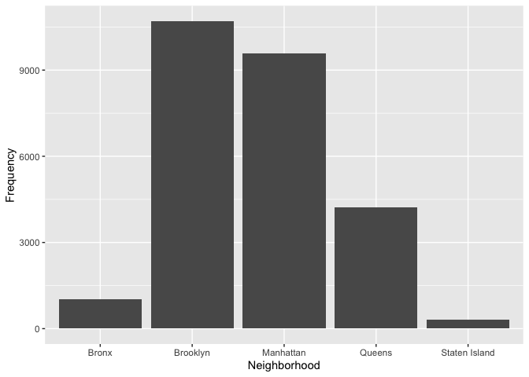
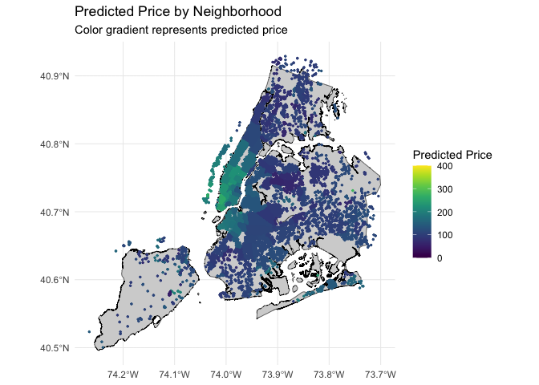

## Abstract: summarize your question, your methods, your results, and your main conclusions in a few hundred words or less.

 

## Introduction: Introduce the question you’re trying to answer at a reasonable level of detail. Give background and motivation for why it’s important.

 

## Methods: Describe your data set and the methods you will use to analyze it.

 

## Results: Tables, figures, and text that illustrate your findings. Keep the focus on the numbers here. You will interpret your results in the next section.

    ####Data Cleaning
    NY_Spring <- NY_Spring %>%
      mutate(spring = 1) %>%
      mutate(summer = 0) %>%
      mutate(fall = 0) %>%
      mutate(winter = 0)

    #change the format
    NY_Spring$host_since <- as.Date(NY_Spring$host_since, format = "%Y-%m-%d")
    Data_collection_d <- as.Date("2023-03-15")
    #since how many years ago he/she has been a host:
    NY_Spring$host_since <- as.numeric(difftime(Data_collection_d, NY_Spring$host_since, units = "days")) / 365.25

    NY_Summer <- NY_Summer %>%
      mutate(spring = 0) %>%
      mutate(summer = 1) %>%
      mutate(fall = 0) %>%
      mutate(winter = 0)

    #change the format
    NY_Summer$host_since <- as.Date(NY_Summer$host_since, format = "%m/%d/%y")
    Data_collection_d <- as.Date("2022-06-15")
    #since how many years ago he/she has been a host:
    NY_Summer$host_since <- as.numeric(difftime(Data_collection_d, NY_Summer$host_since, units = "days")) / 365.25

    NY_Fall <- NY_Fall %>%
      mutate(spring = 0) %>%
      mutate(summer = 0) %>%
      mutate(fall = 1) %>%
      mutate(winter = 0)

    #change the format
    NY_Fall$host_since <- as.Date(NY_Fall$host_since, format = "%Y-%m-%d")
    Data_collection_d <- as.Date("2022-09-15")
    #since how many years ago he/she has been a host:
    NY_Fall$host_since <- as.numeric(difftime(Data_collection_d, NY_Fall$host_since, units = "days")) / 365.25

    NY_Winter <- NY_Winter %>%
      mutate(spring = 0) %>%
      mutate(summer = 0) %>%
      mutate(fall = 0) %>%
      mutate(winter = 1)

    #change the format
    NY_Winter$host_since <- as.Date(NY_Winter$host_since, format = "%Y-%m-%d")
    Data_collection_d <- as.Date("2022-12-15")
    #since how many years ago he/she has been a host:
    NY_Winter$host_since <- as.numeric(difftime(Data_collection_d, NY_Winter$host_since, units = "days")) / 365.25

    #merging seasons
    NY_BNB <- rbind(NY_Spring, NY_Summer, NY_Fall, NY_Winter)

    write.csv(NY_BNB, file = "/Users/jack/Documents/GitHub/Data-Mining-Statistical-Learning/Final Project/merged_data.csv", row.names = FALSE)

    #remove unrelated columns
    NY_BNB <- NY_BNB[, -c(2,3,4,5,8,9,10,11,12,14,15,16,17,18,19,20,21,22,23,25,26,28,33,36,43,44,45,46,47,48,49,50,51,56,58,59,60,61,69,71,72,73,74)]

    #NY_BNB2 that contains only the rows of the original data frame NY_BNB
    #that do not have any missing values.
    NY_BNB2 <- NY_BNB[complete.cases(NY_BNB), ]

    #change $price to integer
    NY_BNB2$price <- as.integer(gsub("[,$]", "", NY_BNB2$price))
    NY_BNB2 = NY_BNB2 %>%
      mutate(log_price = log(price))

    #change "f,t" format to 0 and 1
    NY_BNB2$host_identity_verified <- ifelse(NY_BNB2$host_identity_verified == "t", 1, 0)
    NY_BNB2$instant_bookable <- ifelse(NY_BNB2$instant_bookable == "t", 1, 0)

    #drop if host_since <=1
    NY_BNB2 = NY_BNB2 %>%
      filter(host_since >= 1)

    # Creating dummies:
    NY_BNB2 = NY_BNB2 %>%
      mutate(shared_room = ifelse(room_type == "Shared room", 1, 0))
    NY_BNB2 = NY_BNB2 %>%
      mutate(private_room = ifelse(room_type == "Private room", 1, 0))
    NY_BNB2 = NY_BNB2 %>%
      mutate (entire_home = ifelse(room_type == "Entire home/apt", 1, 0))
    NY_BNB2 = NY_BNB2 %>%
      mutate (hotel_room = ifelse(room_type == "Hotel room", 1, 0))

    # Random sample:
    set.seed(1)
    NY_reduced <- NY_BNB2 %>%
      sample_frac(0.25)

    view(NY_reduced)
    ####the end of Data Cleaning

    ## Understanding the Data
    # Room Type
    ggplot(NY_reduced, aes(x = room_type)) +
      geom_bar() +
      labs(x = "Room Type", y = "Frequency") 

    # Neighborhood
    ggplot(NY_reduced, aes(x = neighbourhood_group_cleansed)) +
      geom_bar() +
      labs(x = "Neighborhood", y = "Frequency") 

    # Review Scores
    ggplot(NY_reduced, aes(x = review_scores_rating))+
      geom_histogram() +
      labs(x = "Review Scores", y = "Frequency") 

    ## `stat_bin()` using `bins = 30`. Pick better value with `binwidth`.

    ## Understanding Price

    # Filter the data to the price range between 0 and 1500 USD
    filtered_data <- NY_reduced[NY_reduced$price >= 0 & NY_reduced$price <= 1500, ]

    # How many data points did we remove for the filtered price dataset?
    total_observations <- nrow(NY_reduced)
    filtered_observations <- nrow(filtered_data)
    percentage_filtered <- (total_observations - filtered_observations) / total_observations * 100
    cat("Percentage of filtered observations:", percentage_filtered, "%\n")

    ## Percentage of filtered observations: 0.4023678 %

    # We only lost ~0.4% of observations.

    # Calculate the mean price per neighborhood
    neighborhood_price <- filtered_data %>%
      group_by(neighbourhood_cleansed) %>%
      summarize(neighborhood_price = mean(price, na.rm = TRUE))

    filtered_data <- merge(filtered_data, neighborhood_price, by = "neighbourhood_cleansed")

    # Create a histogram using ggplot2
    ggplot(filtered_data, aes(x = price)) +
      geom_histogram(binwidth = 10, color = "black", fill = "blue") +
      labs(title = "Histogram of Price Values (0 - 1500 USD)", x = "Price", y = "Frequency")

    # Boxplot by neighborhood:
    ggplot(filtered_data, aes(x = neighbourhood_group_cleansed, y = price)) +
      geom_boxplot(color = "black", fill = "blue") +
      labs(title = "Boxplot of Price by Neighborhood Group", x = "Neighborhood Group", y = "Price")

    # Price by neighborhood
    median_prices_neighborhood <- filtered_data %>%
      group_by(neighbourhood_group_cleansed) %>%
      summarize(median_price = median(price))

    print(median_prices_neighborhood)

    ## # A tibble: 5 × 2
    ##   neighbourhood_group_cleansed median_price
    ##   <chr>                               <dbl>
    ## 1 Bronx                                  83
    ## 2 Brooklyn                              119
    ## 3 Manhattan                             160
    ## 4 Queens                                 90
    ## 5 Staten Island                          99

    # Price by room type
    median_prices_room_type <- NY_reduced %>%
      group_by(room_type) %>%
      summarize(median_price = median(price))

    print(median_prices_room_type)

    ## # A tibble: 4 × 2
    ##   room_type       median_price
    ##   <chr>                  <dbl>
    ## 1 Entire home/apt          177
    ## 2 Hotel room               307
    ## 3 Private room              75
    ## 4 Shared room               60

    # Price by season
    # Compute the mean price for each season
    median_price_by_season <- NY_reduced %>%
      gather(season, flag, spring:winter) %>%
      filter(flag == 1) %>%
      group_by(season) %>%
      summarise(median_price = median(price, na.rm = TRUE))

    print(median_price_by_season)

    ## # A tibble: 4 × 2
    ##   season median_price
    ##   <chr>         <dbl>
    ## 1 fall            128
    ## 2 spring          120
    ## 3 summer          121
    ## 4 winter          130

    # Price by review score, price under 1500
    ggplot(filtered_data, aes(x = price, y = review_scores_rating)) +
      geom_point() +
      labs(title = "Scatterplot of Price by Review Score", x = "Price", y = "Review Score")

    ## Predicting Price ($0-1500)
    set.seed(2)
    filtered_data_split = initial_split(filtered_data, prop=0.8)
    filtered_data_train = training(filtered_data_split)
    filtered_data_test  = testing(filtered_data_split)

    lm2 <- lm(log_price ~ latitude*longitude + review_scores_rating + bedrooms + neighbourhood_group_cleansed + entire_home + shared_room + private_room, data = filtered_data_train)

    #LASSO
    # create your own numeric feature matrix.
    x1 = sparse.model.matrix(log_price ~ .-1 - price, data=filtered_data) # do -1 to drop intercept!
    y1 = filtered_data$price

    # fit a single lasso
    set.seed(2) # Set seed for reproducibility
    lasso1 = gamlr(x1, y1, family="gaussian", penalty.factor=1)

    # the coefficients at the AIC-optimizing value
    scbeta1 = coef(lasso1)
    scbeta1_nonzero <- which(scbeta1 != 0, arr.ind = TRUE)
    # That's a lot of features...

    # Linear Model, (some) LASSO features
    lm_lasso1 <- lm(log_price ~ latitude*longitude + host_since + neighbourhood_group_cleansed + host_total_listings_count + accommodates + bedrooms + minimum_nights + availability_30 + availability_90 + number_of_reviews + review_scores_cleanliness + reviews_per_month + review_scores_location + review_scores_value + review_scores_rating + instant_bookable + entire_home + shared_room + private_room + spring + summer + fall, data = filtered_data_train)
    modelr::rmse(lm_lasso1, filtered_data_test)

    ## [1] 0.431419

    # random tree
    BNB.tree1 = rpart(log_price ~ host_since + neighbourhood_group_cleansed + host_total_listings_count + accommodates + bedrooms + minimum_nights + availability_30 + availability_90 + number_of_reviews + review_scores_cleanliness + reviews_per_month + review_scores_location + review_scores_value + review_scores_rating + instant_bookable + entire_home + shared_room + private_room + spring + summer + fall + winter,
                           data=filtered_data_train, control = rpart.control(cp = 0.00001))
    modelr::rmse(BNB.tree1, filtered_data_test)

    ## [1] 0.4426774

    # random forest
    BNB.forest1 = randomForest(log_price ~ latitude*longitude + host_since + neighbourhood_group_cleansed + host_total_listings_count + accommodates + bedrooms + minimum_nights + availability_30 + availability_90 + reviews_per_month + review_scores_location + number_of_reviews + review_scores_cleanliness + review_scores_value + review_scores_rating + instant_bookable + entire_home + shared_room + private_room + spring + summer + fall + winter, data=filtered_data_train, importance=TRUE)
    modelr::rmse(BNB.forest1, filtered_data_test)

    ## [1] 0.3270478

    # boosted model
    BNB.boost1 = gbm(log_price ~ latitude*longitude + host_since + host_total_listings_count + accommodates + bedrooms + minimum_nights + availability_30 + availability_90 + review_scores_cleanliness + number_of_reviews + reviews_per_month + review_scores_location + review_scores_value + review_scores_rating + instant_bookable + entire_home + shared_room + private_room + spring + summer + fall + winter, data=filtered_data_train, distribution = "gaussian", interaction.depth=6, n.trees=5000, shrinkage=.05, cv.folds = 2)
    modelr::rmse(BNB.boost1, filtered_data_test)

    ## Using 3566 trees...

    ## [1] 0.3347233

    # Root mean squared error - log price
    RMSE3 = tibble("model" = c("lm2", "lm_lasso1", "BNB.tree1", "BNB.forest1", "BNB.boost1"), "RMSE" = c(rmse(lm2, filtered_data_test), rmse(lm_lasso1, filtered_data_test), rmse(BNB.tree1, filtered_data_test), rmse(BNB.forest1, filtered_data_test), rmse(BNB.boost1, filtered_data_test)))

    ## Using 3566 trees...

    RMSE3.1 = kable(RMSE3, caption = "RMSE of each model (log price)")
    RMSE3.1

<table>
<caption>RMSE of each model (log price)</caption>
<thead>
<tr class="header">
<th style="text-align: left;">model</th>
<th style="text-align: right;">RMSE</th>
</tr>
</thead>
<tbody>
<tr class="odd">
<td style="text-align: left;">lm2</td>
<td style="text-align: right;">0.4814699</td>
</tr>
<tr class="even">
<td style="text-align: left;">lm_lasso1</td>
<td style="text-align: right;">0.4314190</td>
</tr>
<tr class="odd">
<td style="text-align: left;">BNB.tree1</td>
<td style="text-align: right;">0.4426774</td>
</tr>
<tr class="even">
<td style="text-align: left;">BNB.forest1</td>
<td style="text-align: right;">0.3270478</td>
</tr>
<tr class="odd">
<td style="text-align: left;">BNB.boost1</td>
<td style="text-align: right;">0.3347233</td>
</tr>
</tbody>
</table>

RMSE of each model (log price)

    # Variable Importance:
    varImpPlot(BNB.forest1) # Create a variable importance plot

    # Price:
    # get predicted values for all listings
    forest1 = randomForest(log_price ~ latitude*longitude + host_since + neighbourhood_group_cleansed + host_total_listings_count + accommodates + bedrooms + minimum_nights + availability_30 + availability_90 + reviews_per_month + review_scores_location + number_of_reviews + review_scores_cleanliness + review_scores_value + review_scores_rating + instant_bookable + entire_home + shared_room + private_room + spring + summer + fall + winter, data=filtered_data, importance=TRUE)

    #add predictions to data
    filtered_data = filtered_data %>%
      mutate(price_forest1_pred = predict(forest1))

    # Calculate the mean predicted log price per neighborhood
    neighborhood_pred_price <- filtered_data %>%
      group_by(neighbourhood_cleansed) %>%
      summarize(neighborhood_predicted_price = mean(price_forest1_pred, na.rm = TRUE))

    # Merge the data frames by the common column 'neighbourhood_cleansed'
    filtered_data <- merge(filtered_data, neighborhood_pred_price, by = "neighbourhood_cleansed")

    # Convert back from log
    filtered_data = filtered_data %>%
      mutate(neighborhood_pred_price_conv = exp(neighborhood_predicted_price))

    # create log price per neighborhood
    neighborhood_log_price <- filtered_data %>%
      group_by(neighbourhood_cleansed) %>%
      summarize(neighborhood_log_price = mean(log_price, na.rm = TRUE))

    filtered_data <- merge(filtered_data, neighborhood_log_price, by = "neighbourhood_cleansed")

    #create error measurements
    filtered_data <- filtered_data %>%
      mutate("resid1" = abs(neighborhood_predicted_price - neighborhood_log_price))%>%
      mutate("percentErr1" = resid1/neighborhood_log_price)

    ## Geography of Price
    library(plotly)

    ## 
    ## Attaching package: 'plotly'

    ## The following object is masked from 'package:ggmap':
    ## 
    ##     wind

    ## The following object is masked from 'package:mosaic':
    ## 
    ##     do

    ## The following object is masked from 'package:igraph':
    ## 
    ##     groups

    ## The following object is masked from 'package:ggplot2':
    ## 
    ##     last_plot

    ## The following object is masked from 'package:stats':
    ## 
    ##     filter

    ## The following object is masked from 'package:graphics':
    ## 
    ##     layout

    filtered_data_sf <- st_as_sf(filtered_data, coords = c("longitude", "latitude"), crs = 4326)

    geojson_file <- "/Users/jack/Documents/GitHub/Data-Mining-Statistical-Learning/Final Project/Borough_Boundaries.geojson"

    # Read the GeoJSON file
    nyc_shapefile <- st_read(geojson_file)

    ## Reading layer `Borough_Boundaries' from data source 
    ##   `/Users/jack/Documents/GitHub/Data-Mining-Statistical-Learning/Final Project/Borough_Boundaries.geojson' 
    ##   using driver `GeoJSON'
    ## Simple feature collection with 5 features and 4 fields
    ## Geometry type: MULTIPOLYGON
    ## Dimension:     XY
    ## Bounding box:  xmin: -74.25559 ymin: 40.49613 xmax: -73.70001 ymax: 40.91553
    ## Geodetic CRS:  WGS 84

    nyc_shapefile2 <- nyc_shapefile %>%
      st_transform(crs = st_crs(filtered_data_sf))

    ## Mapping Price
    # Predicted Price by Neighborhood
    ggplot() +
      geom_sf(data = nyc_shapefile2, fill = "lightgray", color = "black", size = 0.2) +
      geom_sf(data = filtered_data_sf, aes(color = neighborhood_pred_price_conv), size = .5) +
      scale_color_gradientn(colours = viridisLite::viridis(10),
                            limits = c(0, 350),
                            name = "Predicted Price") +
      theme_minimal() +
      labs(title = "Predicted Price by Neighborhood",
           subtitle = "Color gradient represents predicted price",
           color = "Predicted Price")

    # True Price by Neighborhood
    ggplot() +
      geom_sf(data = nyc_shapefile2, fill = "lightgray", color = "black", size = 0.2) +
      geom_sf(data = filtered_data_sf, aes(color = neighborhood_price), size = .5) +
      scale_color_gradientn(colours = viridisLite::viridis(10),
                            limits = c(0, 350),
                            name = "True Price") +
      theme_minimal() +
      labs(title = "True Price by Neighborhood",
           subtitle = "Color gradient represents true price",
           color = "True Price")

    # Residual Error of Price
    ggplot() +
      geom_sf(data = nyc_shapefile2, fill = "lightgray", color = "black", size = 0.2) +
      geom_sf(data = filtered_data_sf, aes(color = 100*percentErr1), size = .5) +
      scale_color_gradientn(colours = viridisLite::plasma(10), 
                            limits = c(0, 100),
                            name = "Residual Error Rate") +
      theme_minimal() +
      labs(title = "Residual Error Rate - Price",
           subtitle = "Color gradient represents residual error rates",
           color = "Residual Error Rate")

 

## Conclusion: Interpret what you found. What are the main lessons we should take away from your report?
